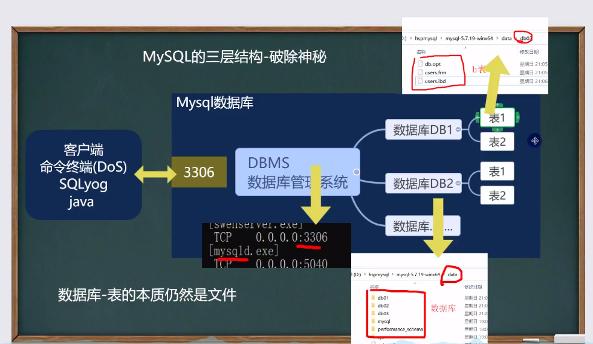

# 数据库




### 数据库相关概念

1. DB：数据库，保存一组有组织的数据的容器
2. DBMS：数据库管理系统，又称为数据库软件（产品，用于管理DB中的数据
3. SOL：结构化查询语言，用于和DBMS通信的语言

### 数据库存储数据的特点

1. 将数据存放到表中，表再放到库中
2. 一个数据库中可以有多个表，每个表都有一个的名字，用来表示自己，表明具有唯一性
3. 表具有一些特性，这些特性定义了数据在表中如何存储，类似java中的“类”设计。
4. 表由列组成，我们也称为字段。所有表都是由一个或多个列组成的，每一列；类似java中的“属性”
5. 表中的数据是按行存储的，每一行类似于java中的“对象”。

### mysql服务启动和停止

​	方式一：计算机-右击管理-服务

​	方式二：通过管理员身份运行

​	net start 服务器 （启动服务）

​	net stop 服务名 （停止服务）

### mysql服务的登录和退出

方式一：通过mysql自带的客户端（只限于root用户）

方式二：通过windows自带的客户端

- 登录：
  - mysql [-h主机名 -p端口号 ] -u用户名 -p密码
- 退出：
  - exit或ctrl+c


### MYSQL的常见命令

1查看当前所有的数据库

```sql
show databases；
```

2.打开指定的库

```sql
use 库名；
```

3.查看当前库的所有表

```sql
show tables；
```

4.查看其他库的所有表

```sql
show tables from 库名；
```

5.创建表

```sql
create table 表名（

​	列名 列类型，

​	列名 列类型，

​	。。。 

）;
```

6.查看表结构

```sql
desc 表名；
```

7.查看服务器的版本

```sql
方式一：登录到mysql服务端
delect version （）；
方式二：没有登录到mysql服务端
mysql --version
或
mysql --V(大写)
```


### MYSQL的语法规范

1. 不区分大小写，但建议关键字大写，表名、列名小写

2. 每条命令最好用分号结尾

3. 每条命令根据需要，可以进行缩进 或换行

4. 注释

   1. ```sql
      单行注释：#注释文字
      单行注释：-- 注释文字
      多行注释：/*注释文字*/
      ```
      


### SQL语句的分类

- DDL：数据定义语句【create 表，库...】
- DML:数据操作语句【增加，修改，删除】
- DQL:数据查询语句【select】
- DCL:数据控制语句【管理数据库】


#### 创建数据库

- ```sql
  #使用指令创建数据库
  CREATE DATABASE t1(库名);
  #删除数据库指令;
  DORP DATBASE 库名;
  
  #创建一个使用utf8字符集的t2(库名)；
  CREATE DATABASE t2(库名) CHARACTER SET utf8]
  
  #创建一个使用uft8字符集，并带校对规则的库名3数据库
  CREATE DATABASE t3(库名) CHARACTER SET utf8 COLLATE utf8_bin
  #校对规则 utf8_bin 区分大小 默认utf8_general_ci 不区分大小写
  
  #下面是一条查询的sql，select 查询 * 表示所有字段 FROM表示从哪个表
  #WHERE 从哪个字段 NAME = 'tom' 查询名字是tom
  SELECT * FROM 库名 WHERE NAME = 'tom'
  ```
  
  


#### 查询数据库

- ```sql
  #查看当前数据库服务器中的所有数据库
  SHOW DATABASES
  #查看其他的数据库定义信息
  SHOW CREATE DATABASE '库名'
  #说明 在创建数据库的表的时候，为了规避关键字，可以使用反引号解决
  
  #删除创建的数据库
  DROP DATABASE 库名
  ```


#### 备份恢复数据库

- ```sql
  #备份数据库（注意：在DOS执行）命令行
  	mysqldump -u 用户名 -p -B 数据库1 数据库2 数据库3 数据库n > 文件名.sql
  	
  #恢复数据库（注意：进入Mysql命令行再执行）
  	Source 文件名.sql
  	
  #备份部分数据库
  	mysqldump -u 用户名 -p密码 数据库1 数据库2 数据库3 数据库n > 文件名.sql
  ```


#### 创建表

- ```sql
  CREATE TABLE tble_name(表名)
  (
  	field1（列名） datatype（数据类型）,
      field2 datatype,
      field3 datatype,
  )
  
  #character set 字符集 collate 校对规则 engine 存储引擎
  #field：指定列名 datatype：指定列类型（字段类型）
  #character set：如不指定则为所在数据库字符集
  #collate：如不指定则为所在数据库校对规则
  #engine：引擎
  ```


### MYSQL常用数据类型


- 数据类型

  - 数值类型
    - 整型
      - tintint【1个字节】
      - smallint【2个字节】
      - mediumint【3个字节】
      - ==int【4个字节】==
      - bigint【8个字节】
    - 小数类型
      - float【单精度 4个字节】
      - ==double 【双精度 8个字节】==
      - ==decimal【M,D】【大小不确定】==
  - 文本类型（字符串类型）
    - ==char 0-255==
    - ==varchar 0-65535==
    - ==text 0~2^16-1==
    - longtext 0~2^32-1
  - 二进制数据类型
    - blob【0~2^16-1】
    - longblob【0~2^32-1】
  - 日期类型
    - date 【日期 年月日】
    - time 【时间 时分秒】
    - ==datetime 【年月日 时分秒 YYYY-MM-DD HH:mm:ss】==
    - ==timestamp【时间戳】==
    - year【年】

- 数值型（bit）的使用

  - ```sql
    数值型（bit）的使用
    1.基本使用
    mysql> create table t02(num bit(8));
    mysql> insert into t02(1,3)
    mysql> insert into t20 values(2,65);
    
    2.细节说明bit.sql
    -- bit字段显示时，按照位的方式显示
    -- 查询的时候仍然可以用使用 添加的数值
    -- 如果一个值只有0,1 可以考虑使用bit(1),可以节约空间
    -- 位类型。M指定位数，默认值1，范围1-64
    
    ```

- 数值型（小数）的基本使用

  - ```sql
    #数值型（小数）的基本使用
    1.FLOAT/DOUBLE[UNSIGNED]
    Float 单精度浮点数，Double 双精度
    
    2.DECIMAL[M,D][UNSIGNED]
    
    #可以支持更加精确的小数位。M是小数位数（精度）的总数，D是小数点（标度）
    #如果D是0.则值没有小数点或分数部分。M最大65，D最大是30。如果D被省略，默认是0。如果M被省略，默认是10。
    #建议：如果希望小数的精度高，推荐使用decimal
    ```

- 字符串的基本使用

  - ```sql
    CHAR(size)
    #固定长度字符串 最大255字符
    VARCHAR(size) 0~65535
    #可变长字符串 最大65532字节 【utf8的编码最大21844字符 1-3个字节用于记录大小】
    -- 如果表的编码是 utf8 varchar(size) size = (65535-3) / 3 = 21844
    -- 如果表的编码是 gbk varchar(size) size = (65535-3) / 2 = 32766
    
    字符串的使用细节
    1.
    	#char(4) 这个4表示字符数（最大255），不是字节数，不管是中文还是字母都是放四个，按字符计算
    #varchar(4) 这个4表示字符数，不管是字母还是中文都以定义好的表的编码来存放数据 
    	#不管是 中文还是英文字母，都是最多存放4个，是按照字符来存放的
    	
    2.
    	char(4)是定长（固定的大小），就是说，即使你插入了’aa‘，也会占用 分配的4个字符的空间
    	varchar(4)是变长，就是说，如果你插入了’aa‘，实际占用空间大小并不是4个字符，而是按照实际占用空间来分配（说明：varchar本身还需要占用1-3个字节来记录存放内容的长度） L（实际数据大小）+(1~3)字节
    	
    3.
    	什么时候时候使用char和varchar
            如果是定长，使用char，否则varchar
            查询速度：char > varchar
    	
    4.
    	在存放文本时，也可以使用Text数据类型，可以将TEXT数据类型视为VARCHAR数据类型，注意TEXT不能有默认值，大小0~1^16字节
    如果希望存放更多字符，可以选择
    	MEDIUMTEXT 0-2^24 或者 LONGTEXT 0-2^32
    ```

- 日期类型的基本使用

  - ```SQL
    (例：)
        CREATE TABLE birthday(
        	t1 DATE,
            t2 DATETIME,
            t3 TIMESTAMP NOT UPDATE
            CURRENT_TIMESTAMP ON UPDATE
            CURRENT_TIMESTAMP); #此段语句的作用是在更新一条记录的时候会自动更新第三条字段
    
          在·  mysql> INSERT INTO birthday(t1,t2)
            VALUES('2002-11-11','2022-11-11 10:10:10')
    ```
    
    

- 定义一个无符号整数

  - ```sql
    create table t10(id tinyint);//默认是有符号的
    create table t11(id tinyint unsigned);无符号的
    ```


#### 修改表

- ```sql
  #使用ALTER TABLE语句追加，修改，或删除列的语法
  #添加列
  ALTER TABLE tablename
  ADD （column datatype,column datatype);	
  
  #修改列
  ALTER TABLE tablename
  MODIFY	(column datatype ,column datatype)
  
  #删除列
  ALTER TABLE tablename
  DROP	column;
  #查看表的结构：
  desc 表名	-- 可以查看表的列
  
  #修改表名：
  Rename table 表名 to 新表名
  #修改表字符集
  alter table 表名 character set 字符集；
  ```

  

### 数据库CRUD语句

1. Insert语句 （添加数据）

   1. ```sql
      #使用INSERT语句向表中插入数据
      INSERT INTO table_name (列名1 数据类型，列名2 数据类型,...)
      	VALUES	(value1,value2,...);
      
      #说明insert语句的细节
      -- 1.插入的数据应与字段的数据类型相同
      
      -- 2.数据的长度用在列的规定范围内，例如：不能将一个长度为80的字符串加入到长度为40的列中。
      
      -- 3.在values中列出的数据位置必须与被加入的列的排列位置相对应。
      
      -- 4.字符和日期型数据应薄包含在单引号中。
      
      -- 5.列可以差入空值[前提是该字段允许为空]，insert table values(NULL)
      
      -- 6.可以用insert into tab_name（列名..） values (),(),() 形式添加多条记录
      
      -- 7.如果是给表中的所有字段添加数据，可以不写前面的字段名称
      
      -- 8.默认值的使用，当不给某个字段值时，如果有默认值就会添加默认值，否则报错
      	-- 如果某个列 没有指定 not null，那么当添加数据时，没有给定值，则会默认给null
      	--  如果希望指定某个值得默认值，可以在创建表时指定
      			例：CREATE TABLE 表名（
      					列名1 类型1，
      					列名2 类型2，
      					列名3 类型3 NOT NULL DEFAULT 100(此值随意指定)）； 
      ```
      
      

2. Update语句 （更新数据）

   1. 

   2. 

      

3. Delete语句 （删除数据）

   1. ```sql
      delete from ta1_name
      	WHERE where_definition(在定义);
      	
      #使用细节
      1.如果不使用where子句，将删除表中所有数据。
      
      2.Delete语句不能删除某一列的值（可使用update设为null或者''）
      	#可以使用alter table employee
      	DROP column 列名;	
      
      3.使用table语句仅删除记录，不能删除表本身。如要删除表，使用drop table语句。drop table 表名;
      ```
      
      

4. ==Select语句 （查找数据）==

   1. ```SQL
      SELECT语句基本语法格式：
      	SELECT [ALL | DISTINCT] * | 列名1[,列名2,...,列名n]
      	FROM 表名
      	[WHERE条件表达式]
      	[GROUP BY 列名 [ASC | DESC] [HAVING 条件表达式]]
      	[ORDER BY 列名 [ASC | DESC],...]
      	[LIMIT [OFFSET] 记录数];
      
      -- SELECT子句：表示从表中查询指定的列，当使用‘*’时，用于显示表中的所有列；关键字INSTINCT为可选参数，用于去重
      
      -- 子句：表示查询的数据源，可以是表或是视图。
      
      -- WHERE子句：用于指定查询筛选条件
      
      -- GROUP BY子句：用于将查询结果集按指定的列进行分组，其中HAVING为可选参数，用于对分组后的结果进行筛选
      
      -- LIMIT子句：用于限制查结果集的行数。参数OFFSET为1时，表示查询结果从第二条记录开始，记录数则表示结果集中包含的记录条数
      ```
   
      
   
   2. （单表查询）
   
      1. ```sql
         #基本语法
         SELECT DISTINCT * column1,column2,column3..
         	FROM table_name
         	
         #注意事项
         Select指定查询哪些列的数据 -- (select后面只能根分组函数和group by的列)
         column指定列名
         
         *号代表查询所有列
         
         From指定查询哪张表
         
         DISTINCT可选，指显示结果时，是否去掉重复数据（去重，指的是去掉所有列相同的值）
         
         ```
         
      2. ```sql
         #使用表达式对查询的列进行运算
         SELECT 列名1 表达式1,列名2 表达式2,...
         	FROM tablename;
         	
         #在select语句中可使用as语句
         SELECT columnname as 别名 from 表名;
         ```
   
      3. 在where子句中经常使用的运算符
   
         1. 
   
      4. ```sql
         #使用order by 子句排序查询结果。
         SELECT column1（列名），column2，column3..
         	FROM table
         	order by column asc/desc,...
         	或者 order by 列名 limit（限制查询的条件）
         
         1.Order by指定排序的列，排序的列既可以是表中的列名，也可以是select语句后指定的列名
         
         2.Asc升序[默认]、Desc降序
         
         3.ORDER BY子句应位于SELECT语句的结尾
         
         ```
   
   3. ==（mysql表查询--加强）==
   
      1. 使用where子句
   
         1. 
   
      2. 使用order by语句
   
         1. 
         2. 
   
      3. 分页查询
   
         1. 
   
         2. ```sql
            公式：
            	SELECT * FROM emp
            		ORDER BY empno
            		LIKE 每页显示记录数 * （第几页-1），每页显示记录数
            ```
   
      4. 数据分组的总结
   
         1. 
   
   4. ==mysql多表查询==
   
      1. 笛卡尔集（多表笛卡尔集）
   
         1. 
   
         2. ```sql
            # 补充：
            	当我们需要指定显示某个表的列时，需要 表.列表
            ```
   
      2. ```sql
         #说明：多表查询是指基于两个和两个以上的表查询。
         -- 注意：多表查询的条件不能少于表的个数-1，否则会出现笛卡尔集
         ```
   
   
   
   
   - 子查询（嵌套查询）
   
     ```sql
     子查询可以不仅可以嵌套在SELECT语句中，还可以嵌套在INSERT语句、UPEATE语句或DELETE语句中。
     
     #子查询的执行过程：
     	执行子查询语句 -> 将返回结果作为外层查询的过滤条件 -> 执行外查询
      
     #子查询中通常要用到比较运算符、IN、ANY及EXISTS等关键字
     
     1.使用比较运算符的子查询
     	语法：
     		WHERE 表达式 比较运算符 (子查询)
     		
     2.使用IN关键字的子查询
     	语法：
     		WHERE 表达式 [NOT] IN (子查询)
     		
     3.使用ANY、SOME或ALL关键字的子查询
     	语法：
     		WHERE 表达式 比较运算符{ANY|SOME|ALL} (子查询)
     		
     AND和SOME -- 表示外层的表达式只要与子查询结果集中的值由一个匹配为TRUE就返回外层查询的结果
     
     ALL -- 表示外层查询的表达式要与子查询的结果集中的所有值比较，且比较结果都为TRUE时才会返回外层查询的结果
     
     -- 注意：ANY、SOME或ALL运算符必须与比较运算符一起使用
     ```
   
     
   
   - 常用运算符
   
     ```sql
     逻辑运算符：
     	AND -- 逻辑与
     	OR -- 逻辑或
     
     BETWEEN AND运算符
     	用于限制查询数据的范围
     	语法：
     		WHERE 表达式 [NOT] BETWEEN 初始值 AND 终止值
     
     IN运算符：
     	与BETWEEN AND运算符类似，用于限制查询的范围
     	语法：
     		WHERE 表达式 [NOT] IN (值1，值2，...,值N)
     		
     LIKE运算符
     	用于查询条件只能提供不完全的部分信息时，实现字符串的模糊查询
     	语法：
     		WHERE 列名 [NOT] LIKE '字符串' [ESCAPE '转义字符']
     		补充：（ESCAPE的作用是当用户要查询的数据本身含有通配符时，可以使用该选项对通配符进行转义）
     ```
   
   - 其他子查询
   
     - ==子查询临时表==
   
       - 其中temp为临时表名
   
   - 多列子查询
   
     - 语法：
   
       ```sql
       SELECT * 
       	FROM 表名
       	WHERE (列名1，列名2，列名3) = (
           	SELECT 列名1，列名2，列名3 -- 注意：此处列名顺序应与上面列名对应
               FROM 表名
       		.....
           )
       	
       ```
   
   - 在from子句中使用子查询 
   
     - 
   
     - ```sql
       # 还有一种写法 表.* 表示将该表所有列都显示出来，可以简化sql语句
       
       # 在多表查询中，当多个表的列不重复时，才可以直接写列名
       
       如下图：
       ```
   
       - 

### 函数

- 合计/统计函数 - count （聚合函数）

  - ==聚合函数不能用where函数作为条件==

  - 

    ```sql
    #统计函数
    	#Count 返回行的总数
        Select count(*)/count(列名) from table_name
            WHERE where_dafinition（在哪里完成） -- 可选
    	
    		#count(*)和count(列)的区别
    		#解释：count(*)返回满足条件的记录的行数
    		#count(列)：统计满足条件的某列有多少个，但是会排除 为null
    	
    #合计函数
    	 - sum
        #Sum函数返回满足where条件的行的和 - 一般使用在数值列
        Sum sum(列名),sum(列名),... from tablename
            WHERE where_dafinition(在哪里完成)
    
        #注意：sum仅对数值起作用，否则会报错。
        #注意：对多列求和，“，”号不能少。
        
        - avg
        #AVG函数返回满足where条件的一列的平均值
        Select avg（列名），avg（列名） from tablename
        	WHERE where_definition
        	
        - Max/min
        #Max/min函数返回满足where条件的一列的最大/最小值
        Select max（列名） from tablename
        	[WHERE where_definition]
    ```

- 分组

  - ```sql
    #使用group by 子句对列进行分组 [先创建测试]
    SELECT column1,column2,column3.. FROM table
    	group by column
    
    #使用having子句对分组后的结果进行过滤
    SELECT column1,column2,column3..
    	FROM table
    	group by column having ...
    ```
    
  - where和having的区别

    - ```sql
      1.执行的时机不一样:where是分组之前进行限定，不满足where条件，则不参与分组，而having是分组之后对结果进行过滤
      
      2.可判断的条件不一样:where不能对聚合函数进行判断，having可以。
      
      3.where是数据从磁盘读入内存的时候进行判断， 而having是磁盘读入内存后再判断。
      
      4..where不可以使用字段的别名，但是having可以。
      
      5.Where和Having的作用对象不同：WHERE 子句作用于表和视图，HAVING 子句作用于组。
      ```

      

- 字符串相关函数

  - ```sql
    CHARSET(str)	-- 返回字符串函数
    
    CONCAT(string2,...)	-- 连接字串
    
    INSTR(string,substring)	-- 返回substring在string中出现的位置，没有返回0
    
    UCASE(string2)	-- 转换成大写
    
    LCASE(string2)	-- 转换成小写
    
    LEFT(string2,length)	--从string2中的左边起取length个字符
    
    LENGTH(string)	-- string长度[按照字节]
    
    REPLACE (str,search_str,replace_str)	
    -- 在str中用replace_str替换成search_str
    
    STRCMP(string1,string2)	-- 逐字符比较两字串大小
    
    SUBSTRING (str，position,length)	-- 从str的position开始[从1开始计算]，取length个字符
    
    LTRIM(string2) RTRIM(string2)	-- 大除前端或后端空格
    trim
    ```

- 数学相关函数

  - ```sql
    ABS(num)	-- 绝对值
    
    BIN(decumal_number)	-- 十进制转二进制
    
    CEILING(number2)	-- 向上取整，得到比num2大的最小整数
    
    CONY(number2,from_basc,to_basc)	-- 进制转换（从什么进制转换成什么进制）
    
    FLOOR(number2)	-- 向下取整，得到比num2小的最大整数
    
    FROMAT(number,decimal_places)	-- 保留小数位数
    
    HEX(DeclmaINumber)	-- 转十六进制
    
    LEAST(number,number2,...)	-- 求最小值
    
    MOD(numerator,denominator)	-- 求余
    
    RAND(seed)	-- RAND(seed) 其范围为0<=v<=1.0时间日期相关函数
    
    FLOOR(number) -- 忽略余数
    
    ROUND(number) -- 将数值四舍五入
    ```

- 时间日期相关函数

  - ```sql
    DATE_ADD(date2,INTERVAL d_valued(值)_type(时间类型))	-- 在dete2中加上日期或时间
    
    DATE_SUB(date2,INTERVAL d_valued_type)	-- 在date上减去一个时间
    
    DATEDIFF(date1,date2)	-- 两个日期差（结果是天）
    
    DATE(datetime)	-- 返回datetime的日期部分
    /*
    以上细节说明
    1.	DATE_ADD()中的 interval后面可以使 year minute second day等
    2.	DATE_SUB()中的 interval后面还可以是 year minute second hour day等
    3.	DATEDIFF(date1,date2)得到的是天数，而且是date1-date2的天数，因此可以取负数
    4.	以上四个函数的日期类型可以使date，datetime或者 timestamp
    */
    
    CURRENT_DATE()	-- 当前日期
    
    CURRENT_TIME()	-- 当前时间
    
    TIMEDIFF(date1,date2)	-- 两个时间差（多少个小时多少分钟多少秒）
    
    NOW()	-- 当前时间
    
    YEAR/Month/DATE(datetime)	-- 年月日
    
    FROM_UNIXTIME()	-- 返回的是1970-1-1到现在的秒数
    
    LAST_DAY(日期)：-可返回该日期所在月份的最后一天
    
    FROM_UNIXTIME()	-- 可以把一个unix_timestamp 秒数[时间戳]，转成指定格式的日期
    	-- 例：select from_unixtime(1618483100,'%Y-%m-%d %h:%i:%s') from dual;
    	-- %Y-%m-%d	格式是规定好的，表示年月日
    	-- 意义：在开发中，可以存放一个整数，然后表示时间，通过FROM_UNIXTIME转换
    
    ```

- 加密函数

  - ```sql
    -- USER()	查询用户
    -- 可以查看登录到mysql的有哪些用户，以及登录的IP
    SELECT USER() FROM DUAL;-- 用户@IP地址
    
    -- DATAVASE()	查询当前使用数据库名称
    SELECT DATABASE();
    
    -- 为字符串算出一个 MD5 32的字符串，（用户密码）加密
     MDS(str)
     -- root 密码是 用户自定义密码 -> 加密md5 -> 在数据库中存放的是加密后的密码
     
     
    PASSWORD(str)	-- 加密函数，MYSQL数据库的用户密码就是 PASSWORD函数加密
    select * from mysql.user	-- 从原文密码str 计算并返回密码字符串，通常用于对mysql数据库的用户密码加密
    
    ```

- 流程控制函数

  - ```sql
    IF(expr1,expr2,expr3) -- 说明：如果判断是否为NULL 要使用 is null，判断不为空 使用 is not
    # 如果expr1为True，则返回expr2 否则返回expr3
    
    IFNULL(expr1，expr2)
    # 如果expr1不为空NULL,则返回expr1，否则返回expr2
    
    SELECT CASE WHEN expr1 THEN expr2 WHEN expr3 THEN expr4 WHEN expr1 THEN expr2 ELSE expr5 END;[类似多重分支]
    # 解析：如果expr1为TRUE,则返回expr2，如果expr2为t，返回expr4，否则返回expr5
    ```


####  自连接

- 自连接的特点
  - 把同一张表当做两张表使用
  - 需要给表取别名，格式：表名 表别名
  - 列名不明确，可以指定列的别名 格式：列名 as 列的别名

#### 表的复制和去重

- 自我复制
  - 
  
- 去重
  - 例：
  
    - 
  
    

##### 合并查询

- union all（语法）

- union（语法）


#### mysql表外连接

- ```sql
  -- 左连接语法
  select..from 表1 left join 表2 on 条件[表1：就是左表 表2：就是右表]
  
  -- 右连接语法
  select..from 表1 right join 表2 on 条件[表1：就是左表 表2：就是右表]
  ```


#### mysql约束

基本介绍：==约束==用于确保数据库的数据满足特定的商业规则

约束即：约束我们添加数据的规则

约束包括：not null（不为空）、unique（唯一）、primary key（主键）、foreign key（外键）、check

- primary key（主键）：

  - ```sql
    #主键的指定方式 有两种
    1.直接在字段名后指定：字段名 primary key
    2.在表定义最后写primary key(列名)
    
    #一张表最多只能有一个主键，但可以是复合主键
    
    -- 使用desc 表名，可以看到primary key的情况
    ```

  - 复合主键的演示

    - 

- unique（唯一）

  - 语法

    - 

  - ```sql
    #unique使用细节
    
    	 1.如果没有指定not null，则unique字段可以有多个unique
    	如果一个列(也叫字段)，是unique not null 使用效果类似primary key
    ```

- 外键（foreign key）

  - ```sql
    #用于定义主表和从表之间的关系:
    	-- 外键约束要定义在从表上，主表则必须具有主键约束或是unique约束，当定义外键约束后，要求外键列数据必须在主表的主键列存在或是为null（学生/班级 图示）
    
    FOREIGN KEY(本表字段名) REFERENCES
    主表名(主键名)
    ```

  - 

  - 

  - 细节说明

    ```sql
    -- 外键指向的表的字段，要求是primary key 或者是unique
    
    -- 表的类型是innodb，这样的表才支持外键
    
    -- 外键字段的类型要和主键字段的类型一致（长度可以不同）
    
    -- 外键字段的值，必须在主键字段中出现过，或者为NULL[前提是外键字段必须为NULL]
    
    -- 一旦建立主外键的关系，数据不能随意删除了
    ```
    

- check

  ```sql
  check用于强制行数据必须满足的条件，
  	基本语法：
  		列名 类型 check (check条件)
  ```


- 自增长

  ```sql
  语法：
  	字段名 整型 primary key auto_increment
  
  添加自增长的字段方式：
  	insert into xxx (字段1，字段2....)values(null,'值'....);
  	insert into xxx (字段2......)values('值1','值2'......);
  	insert into xxx values(null,'值1',......)
  	
  自增长使用细节
  1.一般来说自增长是和primary key配合使用的
  
  2.自增长也可以单独使用[但是需要配合一个unique]
  
  3.自增长修饰的字段为整数型的（虽然小数也可以但是非常少用）
  
  4.自增长默认从1开始，也可以通过如下命令修改
  	alter table 表名auto_increment = 新的开始值 
  
  5.如果添加数据时，给自增长字段（列）指定的有值，则以指定的值为准，
  -- 如果指定了自增长，一般来说，就按照自增长的规则来添加数据
  ```


#### 索引

- 索引的介绍：用于提高数据库性能，提高查询速度

- 索引原理

- 索引的类型

  ```sql
  1.主键索引，主键自动的为主索引（类型Primary）
  2.唯一索引（UNIQUE）
  3.普通索引（INDEX）
  4.全文索引（FULLTTEXT）[适用于MyISAM]
    一般开发，不使用mysql自带的全文索引，而是使用：全文搜索 Solr 和 ElasticSearch（ES）
   
  ```
  
- 索引的使用

  - 添加索引

    ```sql
    -- 创建索引
    CREATE TABLE 表名(
        列名 数据类型...);
       
    -- 查询表是否有索引
    SHOW INDEXES FROM 表名;
    
    -- 添加索引
    -- 添加唯一索引
    CREATE UNIQUE INDEX 索引名称 ON 表名 (列名);
    
    -- 添加普通索引方式1
    CREATE INDEX 索引名称 ON 表名 (列名);
    -- 添加普通索引方式2
    ALTER TABLE 表名 ADD INDEX (索引名称) (列名);
    
    -- 如何选择
    -- 1.如果某列的值，是不会重复的，则优先考虑使用unique索引，否则使用普通索引
    
    -- 添加主键索引
    方式1：
        CREATE TABLE 表名 (
            id INT PRIMARY key,
            ......
        )
    方式2：
    ①	CREATE TABLE 表名 (
            id INT,
            ......); 
    ②    ALTER TABLE 表名 ADD PRIMARY KEY (列名);
    ```

  - 删除索引

    ```sql
    -- 删除索引
    DROP INDEX (要删除的索引名称) ON 表名
    
    -- 删除主键索引
    ALTER TABLE 表名 DROP PRIMARY KEY
    
    -- 修改索引
    	先删除，在添加新的索引
    	
    -- 查询索引
    -- 1.方式
    SHOW INDEX FROM 表名;
    -- 2.方式
    SHOW INDEXES FROM 表名
    -- 3.方式
    SHOW KEYS FROM 表名
    -- 4.方式
    DESC 表名
    ```

  - 索引小结

    ```sql
    #哪些列上适合使用索引
    1、较频繁的作为查询条件字段应该创建索引
    例：select * from emp where empno = 1
    
    2、唯一性太差的字段不适合单独创建索引，即使平凡作为查询条件
    例：select * from emp where sex = '男'
    
    3、更新非常频繁的字段不适合创建索引
    
    4、不会出现在where子句中字段不该创建
    ```


#### ==事物（重难点）==

- 什么是事物

  - 事物用于保证数据的一致性，它由==一组相关的dml语句组成==，该组的dml语句要么全部成功，要么全部失败。如：转账就要用到事物来处理，用以保证数据的一致性。

- 事物和锁

  - 当指定事物操作时（dml语句），mysql会在表上加锁，防止其他用户改表的数据。这对于用户来说是非常重要的

- mysql数据库控制台事物的几个重要操作（基本操作）

  ```sql
  1. start transaction -- 开始一个事物
  2. savepoint 保存点名 -- 设置保存点
  3. rollback to 保存点名 -- 回退事物
  4. rollback -- 回退全部事物
  5. commit -- 提交事物，所有的操作生效，不能回退
  ```

- 回退事物

  - 在介绍回退事物前，先介绍一下保存点（savepoint），保存点是事物中的点，用于取消部分事物，当结束事物时，通过指定保存点可以回退到指定的点

- 提交事物

  - 使用commit语句可以提交事物，当执行了commit语句后，会确认事物的变化、结束事物、删除保存点、释放锁，数据生效。当使用commit语句结束事物后，其他会话[其他连接]将可以查看到事物变化后的新数据[所有事物就正式生效]

- 事物的细节

  ```sql
  1、如果不开始事物，默认情况下，dml操作时自动提交的，不能回滚
  2、如果开始一个事物，你没有创建保存点，可以先执行rollback，默认就是回退到你事物开始的状态
  3、你也可以在这个事物中（还没有提交时），创建多个保存点。
  比如：savepoint aaa; 执行dml，savepoint bbb；
  4、可以在事物没有提交前，选择回退到哪个保存点
  5、mysql的事物机制需要innodb的存储引擎才可以使用，myisam不好使
  6、开始一个事物有两种方式：
  	方式一：start transaction
  	方式二：set autocommit=off
  ```

- 事物的隔离级别

  - 概念：Mysql隔离级别定义了**事务与事务之间的隔离程度**
  
  - 
  
  - 多个连接，开启事物操作数据库中数据时，数据库系统要负责隔离操作，以保证各个连接在获取数据时的准确性。
  
  - 如果不考虑隔离性，可能会引发以下问题：
    1. ==脏读==
    2. ==不可重复读==
    3. ==幻读==
  
  - ==脏读（dirty read）==：当一个事物读取另一个事物尚未提交的修改列时，产生脏读
  
  - ==不可重复读（nonrepeatable read）==：同一查询在同一事物中多次进行，由于其他提交事务所做的修改或删除，每次返回不同的结果集，此时发生不可重复读。
  
  - ==幻读（phanton read）==：同一查询在同一事物中多次进行，由于其他提交事物所做的插入操作，每次返回不同的结果集，此时发生幻读。
  
  - ```sql
    -- 查看当前会话隔离级别 （某一个用户的隔离级别）
    select @@tx_isolation
    MYSQL 8.0 版本：select @@transaction_isolation
    -- 查看系统当前隔离级别 （所有用户的隔离级别）
    select @@global.tx_isolation;
    MYSQL 8.0 版本：select @@global.transaction_isolation;
    
    -- 设置当前会话隔离级别
    set session transaction isolation level [你设置的级别]
    -- 设置系统当前隔离级别
    set global transaction isolation level [你设置的级别]
    
    -- mysql默认的事物隔离级别是repeatable read，一般情况下，没有特殊要求，，没有必要修改（因为该级别可以满足绝大部分项目需求）
    ```
  
  - 全局修改
  
  - 事物的acid特性

    - ==原子性（Atomicioty）==
      - 原子性是指事务是一个不可分割的工作单位，事物中的操作要么都发生，要么都不发生。
    - ==一致性（Consistency==
      - 事物必须使数据库从一个一致性状态变换到另外一个一致性状态
    - ==隔离性（Isolation）==
      - 事物的隔离性是多个用户并发访问数据库时，数据库为每一个用户开启的事务，不能被其他事务的操作数据所干扰
    - ==持久性（Isolation）==
      - 持久性是指一个事务一旦被提交，它对数据库中数据的改变就是永久性的，接下来即使数据库发生故障也不应该对其有任何影响


#### mysql表类型和存储引擎

- 基本介绍

  1. MYSQL的表类型由存储引擎（Storage Engines）决定，主要包括MYISAM、innoDB、Memory等。
  2. MYSQL数据表主要支持六种类型，分别是：CSV、Memory、ARCHIVE、MRG MYISAM、MYISAM、InnoBDB。
  3. 这六种又分为两类，一类是“事物安全型”（transaction-safe），比如：innoDB；其余都属于第二类，称为“非事物安全型”（non-transaction-safe）[myisam和memory]。

- ```sql
  -- show engine
  -- 查看引擎
  
  -- innodb存储引擎
  -- 1. 支持事物 2. 支持外键 3. 支持行级锁
  
  -- myisam 存储引擎
  -- 1. 添加速度快 2. 不支持外键和事物 3. 支持表级锁
  
  -- memory 存储引擎
  -- 1. 数据存储在内存中[关闭了Mysql服务，数据丢失，但是表结构还在]
  -- 2. 执行速度很快(没有IO读写) 3. 默认支持索引(hash表)
  ```

  

- 主要的存储引擎/表类型特点

  - 

- 重点的存储引擎细节说明

  1. MYSQL不支持事物、也不支持外键，但其访问速度快，对事物完整性没有要求
  2. InnoDB存储引擎提供了具有提交、回滚和崩溃恢复能力的事物安全。但比起MYISAM存储引擎，InnoDB写的处理效率差一些并且会占有更多的磁盘空间以保留数据和索引。
  3. MEMORY存储引擎使用存在内存中的内容来创建表。每个MEMORY表只实际对应一个磁盘文件。MEMORY类型的表访问非常快，因为它的数据是放在内容中的，并且默认使用HASH索引。但是一旦服务关闭，表的数据就会丢失掉，表的结构还在

- 如何选择表的存储引擎

  1. 如果不需要事物，处理的只是基本的CRUD操作，选MYISAM
  2. 如果需要支持事物，选择InnoDB.
  3. Memory 存储引擎就是将数据存储在内存中，由于没有磁盘I./O的等待，速度极快。但由于是内存存储引擎，所做的任何修改在服务器重启后都将消失。（经典用法 ==用户的在线状态().==）


#### 视图

- 基本原理

- 基本概念：视图是一个虚拟表，其内容由查询定义。同真实的表一样，视图包含列，==其数据来自对应的真实表==(基表)

- 对视图的总结

  1. 视图是根据基表（可以是多个基表）来创建的 视图是虚拟的表
  2. 视图也有列，数据来自基表
  3. 通过视图可以修改基表的数据
  4. 基表的改变，也会影响到视图的数据

- 视图的基本使用

  ```sql
  1.create view 视图名 as select语句
  2.alter view 视图名 as select语句
  3.SHOW CREATE VIEW 视图名
  4.drop view 视图名1,视图名2
  ```

- 视图的细节

  ```sql
  -- 1. 创建视图后，到数据库去看，对应视图只有一个视图结构文件（形式：视图名.frm）
  -- 2. 数据的数据变化会影响到基表，基表的数据变化也会影响到视图[insert update delete]
  
  -- 修改基本表，会影响视图
  
  -- 3.视图中可以再使用视图
  ```

- 视图最佳实践

  1. ==安全==。一些数据表有着重要的信息。有些字段是保密的，不能让用户直接看到。这时就可以创建一个视图，在这张视图中只保留一部分字段。这样用户就可以查询自己需要的字段，不能查看保密的字段。
  2. ==性能==。关系数据库的数据常常会分表存储，使用外键建立这些表之间的关系。这时，数据库查询通常会用到链接（**JOIN**）。这样做不但麻烦，效率相对也比较低。如果建立一个视图，将相关的表和字段组合在一起，就可以避免使用**JOIN**查询数据。
  3. ==灵活==。如果系统中有一张旧的表，这张表由于设计的问题，即将被废弃。然而，很多应用都是基于这样表，不易修改。这时就可以建立一张视图，视图中的数据直接映射到**新建**的表。这样，就可以少做很多改动，也达到了升级数据表的目的


#### 管理

- Mysql用户

  - mysql中的用户，都存储在系统数据库mysql中 user 表中
  - 其中user表的重要字段说明：
    1. host：允许登录的“位置”，localhost表示该用户只允许本机登录，也可以指定ip地址，比如：192.168.1.100
    2. user： 用户名；
    3. authentication_string: 密码，是通过mysql的password（函数）加密之后的密码

- 用户账户管理

  ```sql
  1.创建用户
  create user '用户名'@'允许登录位置' identified by '密码' -- 说明：创建用户，同时指定密码
  
  2.删除用户
  drop user '用户名'@'允许登录的位置'';
  
  3.修改用户密码
  -- mysql8.0操作：
  ALTER USER '用户名'@'允许登录的位置' IDENTIFIED WITH mysql_native_password BY '修改后的密码'; 
  
  -- mysql5.7操作
  set password for '用户名'@'允许登录的位置' = password('修改后的密码')
  
  4.修改用户名称
  RENAME USER old_user to new_user,[old_user to new_user];...
  ```

- 权限管理

  - 不同的数据库用户，操作的库和表不同

  - 权限是指登录到MYSQL服务器的用户，能够对数据库对象执行何种操作的规则集合。

  - MYSQL中的权限类型以及语法
  
    ```sql
    1.全局层级：使用ON*.*语法赋予权限
    2.数据库层级：
    	使用ON db_name.*语法赋予权限
    3.表层级：
    	ON db_name.tbl_name语法赋予权限
    4.列层级：
    	SELECT(col1,col2)、INSERT(col1,col2)和UPDATE(col1,col2...)语法授予权限
    2.存储过程、函数级：
    	execute on procedure 或 execute on function语法授予权限
    ```
  
- 给用户授权

  ```sql
  基本语法：
  grant 权限列表 on 库.对象名 to  '用户名'@'登录位置' [identified by '密码']
  
  说明：
  1.权限列表，多个权限用逗号分开
  grant select on......
  grant select,delete,create on......
  grant all [privileges] on...... -- 表示赋予该用户在该对象上的所有权限
  
  2.特别说明：
  *.* :带包本系统中的所有数据库的所有对象（表，视图，存储过程）
  库.* :表示某个数据库中的所有数据对象（表，视图，存储过程等）
  
  3.identified by可以省略，也可以写出
  （1）如果用户存在，就是修改改用户的密码。
  （2）如果该用户不存在，就是创建该用户！  
  ```

- 回收用户授权

  ```sql
  基本语法：
  revoke权限列表 on 库.对象名 from '用户名'@'登录位置';
  ```

- 权限生效指令

  ```sql
  如果权限没有生效，可以执行下面命令
  基本语法：
  	FLUSH PRIVILEGES;
  ```

- MSQL管理细节

  ```sql
  1.在创建用户的时候，如果不指定Host，则为%，%表示所有IP都有连接权限
  create user xxx;
  2.也可以这样指定
  create user 'xxx'@'192.168.1.%' 表示xxx用户在192.168.1.*的ip可以登录mysql
  3.在删除用户的时候，如果host不是%，需要明确指定‘用户’@‘host值’
  ```

  
