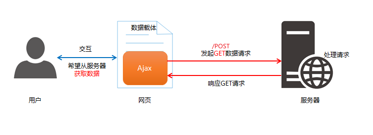
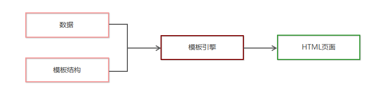
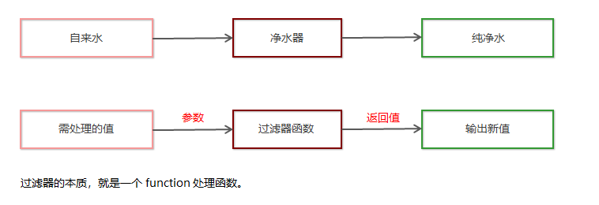
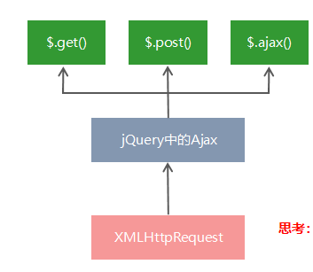
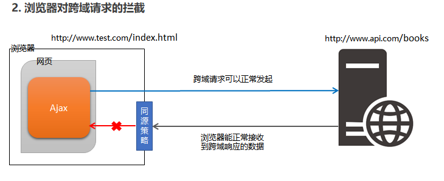
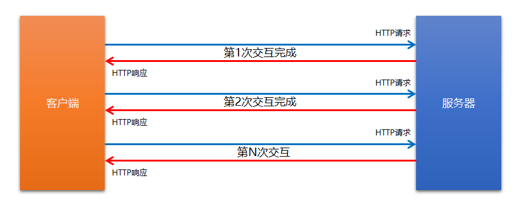
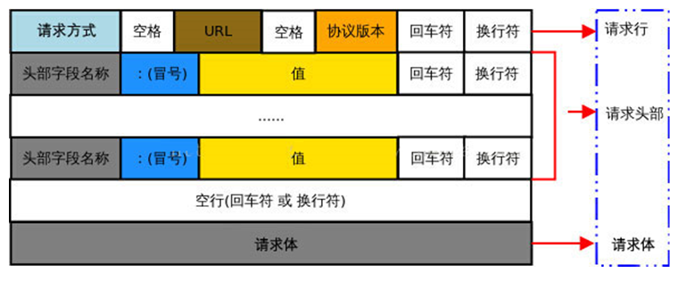
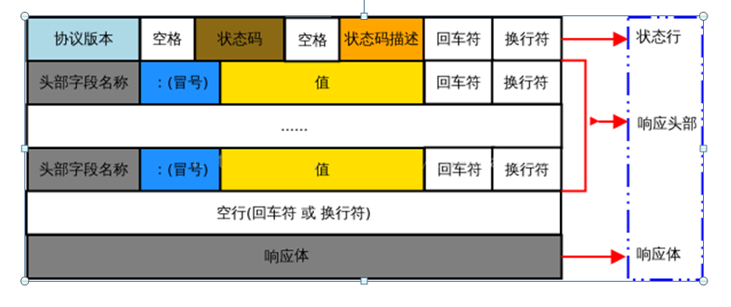

# Ajax


> #  **客户端与服务器的概念:**
>
> ​	服务器 :负责存放和对外提供资源的电脑
>
> ​	客户端:负责获取和消费资源的电脑
>
> 

- URL地址的概念(全称是UniformResourceLocator):中文叫**统一资源定位符**

  - ## **URL地址由三部分组成:**

- 网页中请求**数据**的方式/**客户端与服务器的通信过程**:(客户端发送请求)**请求 =>** (服务期处理)**处理 =>** **响应**(服务器把找到的资源发送给客户端)

>  数据,也是服务器对外提供的一种资源。只要是资源，必然要通过 请求 – 处理 – 响应 的方式进行获取

- ## **资源的请求方式**

  - 客户端请求服务器时，**请求的方式**有很多种，最常见的两种请求方式分别为 get 和 post 请求。

    - **get 请求**通常用于**获取服务端资源**（向服务器要资源）

       例如：根据 URL 地址，从服务器获取 HTML 文件、css 文件、js文件、图片文件、数据资源等

    - **post 请求**通常用于**向服务器提交数据**（往服务器发送资源）

       例如：登录时向服务器*提交的登录信息*、*注册时向服务器提交的注册信息*、添加用户时向服务器提交的用户信息等各种**数据提交操作**


# Ajax

- 什么是Ajax:Ajax的全称是`Asynchronous Javascript And XML`(异步 Javascript 和 XML)

  > 通俗的理解:在网页中利用XMLHttpRequest对象和服务器进行数据交互的方式,就是Ajax

- 作用:能让我们轻松实现**网页**与**服务器**之间的**数据交互**

## jQuery中的Ajax

- 浏览器中提供的**XMLHttpRequest用法比较复杂**,所以jQuery对**`XMLHttpRequest`**进行了封装,提供了一系列Ajax相关的函数,极大**降低了Ajax的使用难度**

- jQuery中发起Ajax请求最常用的三个方法:

  - `$.get()`

    - 发起带参数的请求
  
      ```js
      //语法:
      $.get(url,[data],[callback])
      
      示例:
      $.get('http://www.liulongbin.top:3006/api/getbooks', { id: 1 }, function(res) {
          console.log(res)
      })
      ```
  
      - 三个参数各自代表的含义:
  
        | 参数名   | 参数类型   | 是否必选 | 说明                         |
        | -------- | ---------- | -------- | ---------------------------- |
        | **url**  | **string** | **是**   | 要请求的**资源地址**         |
        | data     | object     | 否       | 请求资源期间要**携带的参数** |
        | callback | function   | 否       | 请求成功时的**回调函数**     |
  
    - 发起**不带参数**的请求
  
      > 使用$.get函数发起不带参数的请求时,直接提供**请求的URL地址**和**请求成功之后的回调函数**即可,示例:
  
      ```js
      $.get('http://www.liulongbin.top:3006/api/getbooks', function(res) {
          console.log(res) // 这里的 res 是服务器返回的数据
      })
      
      ```
  
  - `$.post()`
  
    > jQuery 中 $.post() 函数的功能单一，专门用来发起 post 请求，从而向服务器提交数据。
  
    语法:
  
    ```js
    $post(url,[data],[callback])
    ```
  
    | **参数名** | **参数类型** | **是否必选** | **说明**                     |
    | ---------- | ------------ | ------------ | ---------------------------- |
    | **url**    | **string**   | **是**       | **提交数据的地址**           |
    | data       | object       | 否           | **要提交的数据**             |
    | callback   | function     | 否           | 数据提交成功时的**回调函数** |
  
    示例:
  
    ```js
    $.post(
       'http://www.liulongbin.top:3006/api/addbook', // 请求的URL地址
       { bookname: '水浒传', author: '施耐庵', publisher: '上海图书出版社' }, // 提交的数据
       function(res) { // 回调函数
          console.log(res)
       }
    )
    
    ```
  
  - `$.ajax()函数的语法`
  
    > 相比于 $.get() 和 $.post() 函数，jQuery 中提供的 $.ajax() 函数，是一个功能比较综合的函数，它允许我们对 Ajax 请求进行更详细的配置
  
    ```JS
    //示例:
    $.ajax({
       type: '', // 请求的方式，例如 GET 或 POST
       url: '',  // 请求的 URL 地址
       data: { },// 这次请求要携带的数据
       success: function(res) { } // 请求成功之后的回调函数
    })
    
    ```
  
  
  
  ## 接口
  
  > 接口的概念:使用 Ajax 请求数据时，**被请求的 URL 地址**，就叫做**数据接口**（简称**接口**）。同时，每个接口必须有**请求方式**。
  >
  > ```js
  > 例如：
  > http://www.liulongbin.top:3006/api/getbooks  获取图书列表的接口(GET请求)
  > http://www.liulongbin.top:3006/api/addbook   添加图书的接口（POST请求）
  > 
  > ```
  >
  
  - 接口的请求过程
  
  - 接口测试工具:https://www.getpostman.com/downloads/
  
  - ### 接口文档
  
    > 概念:**接口的说明文档，它是我们调用接口的依据。**好的接口文档包含了对**接口URL，参数**以及**输出内容**的说明，我们参照接口文档就能方便的知道接口的作用，以及接口如何进行调用
  
    - 接口文档的组成部分:
  
      1. **接口名称**：用来标识各个接口的简单说明，如**登录接口，获取图书列表接口**等。
  
      2. **接口****URL**：接口的调用地址。
  
      3. **调用方式**：接口的调用方式，如 **GET** 或 **POST。**
  
      4. **参数格式**：接口需要传递的参数，每个参数必须包含**参数名称、参数类型、是否必选、参数说明**这4项内容。
  
      5. **响应格式**：接口的返回值的详细描述，一般包含**数据名称、数据类型、说明**3项内容。
  
      6. 返回示例（可选）：通过对象的形式，例举服务器返回数据的结构。
  
  
  
  
  ## form表单
  
  > 表单在网页中主要负责**数据采集功能**。HTML中的<form>标签，就是用于采集用户输入的信息，并通过<form>标签的提交操作，把采集到的信息提交到服务器端进行处理。
  
  - ### 表单的组成部分
  
    - 表单标签
  
    - 表单域
  
      > 包含了文本框、密码框、隐藏域、多行文本框、复选框、单选框、下拉选择框和文件上传框等
  
    - 表单按钮
  
    ```html
    <form>
        <input type="text" name="email_or_mobile" />
        <input type="password" name="password" />
        <input type="checkbox" name="remember_me" checked />
        <!-- 以上三行是表单域 -->
        <button type="submit">提交</button>
    </form>
    
    ```
  
  - ### `<form>标签的属性`
  
    > <form>标签用来采集数据，<form>标签的属性则是用来规定**如何把采集到的数据发送到服务器**。
    >
    > | **属性** | **值**                                                       | **描述**                                   |
    > | -------- | ------------------------------------------------------------ | ------------------------------------------ |
    > | action   | URL地址                                                      | 规定当提交表单时，向何处发送表单数据       |
    > | method   | get或post                                                    | 规定以何种方式把表单数据提交到 action  URL |
    > | enctype  | application/x-www-form-urlencoded  multipart/form-data  text/plain | 规定在发送表单数据之前如何对其进行编码     |
    > | target   | _blank  _self  _parent  _top  *framename*                    | 规定在何处打开 action  URL                 |
  
    1. **action**
  
       > action 属性用来规定当提交表单时，**向何处发送表单数据**。
  
       - action 属性的值应该是后端提供的一个 URL 地址，这个 URL 地址专门负责接收表单提交过来的数据。
       - 当 <form> 表单在未指定 action 属性值的情况下，action 的默认值为当前页面的 URL 地址。
  
       > **注意**：当提交表单后，页面会立即跳转到 action 属性指定的 URL 地址
  
    2. target
  
       > target 属性用来规定**在何处打开** **action URL**。
       >
       > 它的可选值有5个，默认情况下，target 的值是 _self，表示在相同的框架中打开 action URL。
       >
       > | **值**      | **描述**                       |
       > | ----------- | ------------------------------ |
       > | _blank      | 在新窗口中打开。               |
       > | _self       | 默认。在相同的框架中打开。     |
       > | _parent     | 在父框架集中打开。（很少用）   |
       > | _top        | 在整个窗口中打开。（很少用）   |
       > | *framename* | 在指定的框架中打开。（很少用） |
  
    3. **method**
  
       - method 属性用来规定**以何种方式**把表单数据提交到 action URL。
       - 它的可选值有两个，分别是 get 和 post。
       - 默认情况下，method 的值为 get，表示通过URL地址的形式，把表单数据提交到 action URL。
  
       > 注意:get 方式适合用来提交少量的、简单的数据。
       >
       > post 方式适合用来提交大量的、复杂的、或包含文件上传的数据。
  
    4. **enctype**
  
       > enctype 属性用来规定在**发送表单数据之前如何对数据进行编码**。
       >
       > | **值**                            | **描述**                                                     |
       > | --------------------------------- | ------------------------------------------------------------ |
       > | application/x-www-form-urlencoded | 在发送前编码所有字符（默认）                                 |
       > | multipart/form-data               | 不对字符编码。  在使用包含文件上传控件的表单时，必须使用该值。 |
       > | text/plain                        | 空格转换为 “+”  加号，但不对特殊字符编码。（很少用）         |
  
       > 注意:在涉及到**文件上传**的操作时，**必须**将 enctype 的值设置为 multipart/form-data
       >
       > 如果表单的提交不涉及到文件上传操作，则直接将 enctype 的值设置为 application/x-www-form-urlencoded 即可！
  
  - ### 表单的同步提交及缺点
  
    1. **什么是表单的同步提交**:通过点击 submit 按钮，触发表单提交的操作，从而使页面跳转到 action URL 的行为，叫做表单的同步提交.
  
    2. 表单同步提交的缺点
  
       ①<form>表单同步提交后，整个页面会发生跳转，**跳转到** **action URL** **所指向的地址**，用户体验很差。
  
       ②<form>表单同步提交后，**页面之前的状态和数据会丢失**。
  
    3. **如何解决表单同步提交的缺点**
  
       >  如果使用表单提交数据，则会导致以下两个问题：
  
       **① 页面会发生跳转**
  
       **② 页面之前的状态和数据会丢失**
  
       解决方案：**表单只负责采集数据， Ajax 负责将数据提交到服务器**。
  


## 通过Ajax提交表单数据

- ### 阻止表单默认提交行为

  > 当监听到表单的提交事件以后，可以调用事件对象的 event.preventDefault() 函数，来阻止表单的提交和页面的跳转，示例代码如下：
  >
  > ```js
  > $('#form1').submit(function(e) {
  >    // 阻止表单的提交和页面的跳转
  >    e.preventDefault()
  > })
  > 
  > $('#form1').on('submit', function(e) {
  >    // 阻止表单的提交和页面的跳转
  >    e.preventDefault()
  > })
  > 
  > ```

- ### 快速获取表单中的数据

  1. **serialize() 函数 **

     ```js
     $(selector).serialize()
     
     serialize() 函数的好处：`可以一次性获取到表单中的所有的数据。`
     
     ```

  2. **serialize()函数示例**

     ```js
     <form id="form1">
         <input type="text" name="username" />
         <input type="password" name="password" />
         <button type="submit">提交</button>
     </form>
     
     $('#form1').serialize()
     // 调用的结果：
     // username=用户名的值&password=密码的值
     
     ```

     > 注意：在使用 serialize() 函数快速获取表单数据时，**必须为每个表单元素添加** **name** **属性**！


## 模板引擎

> 基本概念:模板引擎，顾名思义，它可以根据程序员指定的**模板结构**和**数据**，自动生成一个完整的HTML页面。

- ### 模板引擎的好处:

  - ①减少了字符串的拼接操作

    ②使代码结构更清晰

    ③使代码更易于阅读与维护

- ### **art-template模板引擎**

  > art-template 是一个简约、超快的模板引擎。中文官网首页为 http://aui.github.io/art-template/zh-cn/index.html

  - **art-template的安装**

    > 在浏览器中访问 http://aui.github.io/art-template/zh-cn/docs/installation.html 页面，找到下载链接后，鼠标右键，选择“**链接另存为**”，将 art-template 下载到本地，然后，通过 <script> 标签加载到网页上进行使用。

  - **art-template模板引擎使用步骤**

    ①导入 art-template

    ②定义数据

    ③定义模板

    ④调用 template 函数:`template('模板的id',需要渲染的数据对象)`

    ⑤渲染HTML结构

  - **art-template标准语法**

    1. 解释:art-template 提供了 `{{ }}` 这种语法格式，在 `{{ }} `内可以进行**变量输出**，或**循环数组**等操作，这种 `{{ }}` 语法在 art-template 中被称为标准语法。

    2. **标准语法-输出**

       > 在 {{ }} 语法中，可以进行**变量**的输出、**对象属性**的输出、**三元表达式**输出、**逻辑或**输出、**加减乘除等表达式**输出。

       ```js
       {{value}}
       {{obj.key}}
       {{obj['key']}}
       {{a ? b : c}}
       {{a || b}}
       {{a + b}}
       ```

       

    3. **标准语法 – 原文输出**

       >  如果要输出的 value 值中，包含了 HTML 标签结构，则需要使用**原文输出**语法，才能保证 HTML 标签被正常渲染。

       ```js
       {{@ value }}
       ```

       

    4. **标准语法 – 条件输出**

       > 如果要实现条件输出，则可以在 {{ }} 中使用 `if … else if … /if `的方式，进行按需输出。

       ```js
       {{if value}} 按需输出的内容 {{/if}}
       
       {{if v1}} 按需输出的内容 {{else if v2}} 按需输出的内容 {{/if}}
       
       ```

       

    5. **标准语法 – 循环输出**

       > 如果要实现循环输出，则可以在 {{ }} 内，通过 each 语法循环数组，当前循环的索引使用 **$index** 进行访问，当前的循环项使用 **$value** 进行访问。

       ```js
       {{each arr}}
           {{$index}} {{$value}}
       {{/each}}
       ```

    6. **标准语法 - 过滤器**

       ```js
       {{value | filterName}}
       ```

       > 过滤器语法类似**管道操作符**，它的上一个输出作为下一个输入。
       >
       > 定义过滤器的基本语法如下：

       ```js
       template.defaults.imports.filterName = function(value){/*return处理的结果*/}
       ```

- ### 模板引擎的实现原理

  - #### 正则与字符串操作

    1. **基本语法**

       > exec() 函数用于**检索字符串**中的正则表达式的匹配。
       >
       > 如果字符串中有匹配的值，**则返回该匹配值**，否则返回 **null**

       ```js
       RegExpObject.exec(string)
       
       //示例:
       var str = 'hello'
       var pattern = /o/
       console.log(pattern.exec(str))
       // 输出的结果["o", index: 4, input: "hello", groups: undefined] 
       ```

    2. **分组**

       > 正则表达式中 **( )** 包起来的内容表示一个分组，可以通过分组来**提取自己想要的内容**，示例代码如下：

       ```js
       var str = '<div>我是{{name}}</div>'
        var pattern = /{{([a-zA-Z]+)}}/
       
        var patternResult = pattern.exec(str)
        console.log(patternResult)
        // 得到 name 相关的分组信息
        // ["{{name}}", "name", index: 7, input: "<div>我是{{name}}</div>", groups: undefined]
       
       ```

    3. **字符串的replace**
    
       > replace() 函数用于在字符串中用一些字符**替换**另一些字符，语法格式如下：
    
       ```js
       var result = '123456'.replace('123', 'abc') // 得到的 result 的值为字符串 'abc456'
       
       ```
    
       - 示例代码如下:
    
         ```js
         var str = '<div>我是{{name}}</div>'
         var pattern = /{{([a-zA-Z]+)}}/
         
         var patternResult = pattern.exec(str)
         str = str.replace(patternResult[0], patternResult[1]) // replace 函数返回值为替换后的新字符串
         // 输出的内容是：<div>我是name</div>
         console.log(str)
         
         ```
    
    4. **多次replace**
    
       ```js
       var str = '<div>{{name}}今年{{ age }}岁了</div>'
       var pattern = /{{\s*([a-zA-Z]+)\s*}}/
       
       var patternResult = pattern.exec(str)
       str = str.replace(patternResult[0], patternResult[1])
       console.log(str) 
       // 输出 <div>name今年{{ age }}岁了</div>
       
       patternResult = pattern.exec(str)
       str = str.replace(patternResult[0], patternResult[1])
       console.log(str) 
       // 输出 <div>name今年age岁了</div>
       
       patternResult = pattern.exec(str)
       console.log(patternResult) // 输出 null
       
       ```
    
    5. **使用while循环replace**
    
       ```js
       var str = '<div>{{name}}今年{{ age }}岁了</div>'
       var pattern = /{{\s*([a-zA-Z]+)\s*}}/
       
       var patternResult = null
       while(patternResult = pattern.exec(str)) {
          str = str.replace(patternResult[0], patternResult[1])
       }
       console.log(str) // 输出 <div>name今年age岁了</div>
       
       ```
    
    6. **replace替换为真值**
    
       ```js
       var data = { name: '张三', age: 20 }
       var str = '<div>{{name}}今年{{ age }}岁了</div>'
       var pattern = /{{\s*([a-zA-Z]+)\s*}}/
       
       var patternResult = null
       while ((patternResult = pattern.exec(str))) {
          str = str.replace(patternResult[0], data[patternResult[1]])
       }
       console.log(str)
       
       ```
    
  - #### 实现简易的模板引擎
  
    1. **实现步骤**
  
       ①定义模板结构
  
       ②预调用模板引擎
  
       ③封装 template 函数
  
       ④导入并使用自定义的模板引擎
  
    2. 定义模板结构
  
       ```js
       <!-- 定义模板结构 -->
       <script type="text/html" id="tpl-user">
          <div>姓名：{{name}}</div>
          <div>年龄：{{ age }}</div>
          <div>性别：{{  gender}}</div>
          <div>住址：{{address  }}</div>
       </script>
       
       ```
  
    3. **预调用模板引擎**
  
       ```js
       <script>
          // 定义数据
          var data = { name: 'zs', age: 28, gender: '男', address: '北京顺义马坡' }
          // 调用模板函数
          var htmlStr = template('tpl-user', data)
          // 渲染HTML结构
          document.getElementById('user-box').innerHTML = htmlStr
       </script>
       
       ```
  
    4. **封装template函数**
  
       ```js
       function template(id, data) {
         var str = document.getElementById(id).innerHTML
         var pattern = /{{\s*([a-zA-Z]+)\s*}}/
         var pattResult = null
         while ((pattResult = pattern.exec(str))) {
           str = str.replace(pattResult[0], data[pattResult[1]])
         }
         return str
       }
       
       ```
  
    5. **导入并使用自定义的模板引擎**
  
       ```js
       <head>
           <meta charset="UTF-8" />
           <meta name="viewport" content="width=device-width, initial-scale=1.0" />
           <meta http-equiv="X-UA-Compatible" content="ie=edge" />
           <title>自定义模板引擎</title>
           <!-- 导入自定义的模板引擎 -->
           <script src="./js/template.js"></script>
       </head>
       
       ```
  
       


## Ajax加强

- ### XMLHttpRequest的基本使用

  > XMLHttpRequest（简称 xhr）是浏览器提供的 Javascript 对象，通过它，可以**请求服务器上的数据资源**。之前所学的 jQuery 中的 Ajax 函数，就是基于 xhr 对象封装出来的

- ### **使用xhr发起GET请求**

  - 步骤:

    ①创建 xhr 对象

    ②调用 xhr.open() 函数

    ③调用 xhr.send() 函数

    ④监听 xhr.onreadystatechange 事件

  - ```js
    // 1. 创建 XHR 对象
    var xhr = new XMLHttpRequest()
    // 2. 调用 open 函数，指定 请求方式 与 URL地址
    xhr.open('GET', 'http://www.liulongbin.top:3006/api/getbooks')
    // 3. 调用 send 函数，发起 Ajax 请求
    xhr.send()
    // 4. 监听 onreadystatechange 事件
    xhr.onreadystatechange = function() {
        // 4.1 监听 xhr 对象的请求状态 readyState ；与服务器响应的状态 status
        if (xhr.readyState === 4 && xhr.status === 200) {
            // 4.2 打印服务器响应回来的数据
            console.log(xhr.responseText)
        }
    }
    
    ```

- ### xhr对象的属性

  | **属性**           | **描述**                                                     |
  | ------------------ | ------------------------------------------------------------ |
  | onreadystatechange | 定义当 readyState 属性发生变化时被调用的函数                 |
  | readyState         | 保存 XMLHttpRequest 的状态。 0：请求未初始化 1：open方法已被调用 2：send方法被调用，请求已收到 3：正在处理请求，数据接收中 4：ajax请求完成，这意味着数据传输已经彻底完成或者失败 |
  | responseText       | 以字符串返回响应数据                                         |
  | responseXML        | 以 XML 数据返回响应数据                                      |
  | status             | 返回请求的状态号 200: “OK” 403: “Forbidden” 404: “Not Found” |
  | statusText         | 返回状态文本（比如 “OK” 或 “Not Found”）                     |

  > 补充:readyState 属性，用来表示**当前** **Ajax** **请求所处的状态**。每个 Ajax 请求必然处于以上状态中的一个

- ### **使用xhr发起带参数的GET请求**

  > 使用 xhr 对象发起带参数的 GET 请求时，只需在调用 xhr.open 期间，为 URL 地址指定参数即可：
  >
  > ```js
  > // ...省略不必要的代码
  > xhr.open('GET', 'http://www.liulongbin.top:3006/api/getbooks?id=1')
  > // ...省略不必要的代码
  > 
  > 这种在 URL 地址后面拼接的参数，叫做`查询字符串`
  > ```

- ### **查询字符串**

  1. 定义:查询字符串（URL 参数）是指在 URL 的末尾加上用于向服务器发送信息的字符串（变量）。

     > 格式：将英文的 **?** 放在URL 的末尾，然后再加上 **参数＝值** ，想加上多个参数的话，使用 **&** 符号进行分隔。以这个形式，可以将想要发送给服务器的数据添加到 URL 中。

     ```js
     // 不带参数的 URL 地址
     http://www.liulongbin.top:3006/api/getbooks
     // 带一个参数的 URL 地址
     http://www.liulongbin.top:3006/api/getbooks?id=1
     // 带两个参数的 URL 地址
     http://www.liulongbin.top:3006/api/getbooks?id=1&bookname=西游记
     
     ```

  2. GET请求携带参数的本质

     > 无论使用 $.ajax()，还是使用 $.get()，又或者直接使用 xhr 对象发起 GET 请求，当需要携带参数的时候，本质上，都是直接将参数以查询字符串的形式，追加到 URL 地址的后面，发送到服务器的。

     ```js
     $.get('url', {name: 'zs', age: 20}, function() {})
     // 等价于
     $.get('url?name=zs&age=20', function() {})
     
     $.ajax({ method: 'GET', url: 'url', data: {name: 'zs', age: 20}, success: function() {} })
     // 等价于
     $.ajax({ method: 'GET', url: 'url?name=zs&age=20', success: function() {} })
     
     ```

- ### **URL编码与解码**

  1.  URL编码解释:

     > URL 地址中，只允许出现英文相关的字母、标点符号、数字，因此，在 URL 地址中不允许出现中文字符。
     >
     > 如果 URL 中需要包含中文这样的字符，则必须对中文字符进行**编码**（转义）。

     - **URL编码的原则**：使用安全的字符（没有特殊用途或者特殊意义的可打印字符）去表示那些不安全的字符。

       URL编码原则的通俗理解：使用**英文字符**去表示**非英文字符。**

  2.  对URL进行编码与解码

     > 浏览器提供了 URL 编码与解码的 API，分别是：
     >
     > - lencodeURI() 编码的函数
     >
     > - ldecodeURI() 解码的函数

- ### 使用xhr发起POST请求

  - 步骤

    ①创建 xhr 对象

    ②调用 xhr.open() 函数

    ③**设置** **Content-Type** **属性**（固定写法）

    ④调用 xhr.send() 函数，**同时指定要发送的数据**

    ⑤监听 xhr.onreadystatechange 事件

    ```js
    // 1. 创建 xhr 对象
    var xhr = new XMLHttpRequest()
    // 2. 调用 open()
    xhr.open('POST', 'http://www.liulongbin.top:3006/api/addbook')
    // 3. 设置 Content-Type 属性（固定写法）
    xhr.setRequestHeader('Content-Type', 'application/x-www-form-urlencoded')
    // 4. 调用 send()，同时将数据以查询字符串的形式，提交给服务器
    xhr.send('bookname=水浒传&author=施耐庵&publisher=天津图书出版社')
    // 5. 监听 onreadystatechange 事件
    xhr.onreadystatechange = function() {
     if (xhr.readyState === 4 && xhr.status === 200) {
            console.log(xhr.responseText)
        }
    }
    
    ```

  

## 数据交换格式

> 数据交换格式，就是服务器端与客户端之间进行**数据传输与交换的格式**
>
> 前端领域，经常提及的两种数据交换格式分别是 **XML** 和 **JSON。**

- ### XML

  1. XML解释

     >  XML 的英文全称是 E**X**tensible **M**arkup **L**anguage，即**可扩展标记语言**。因此，XML 和 HTML 类似，也是一种标记语言。

  2. **XML和HTML的区别**

     > XML 和 HTML 虽然都是标记语言，但是，它们两者之间没有任何的关系。

     - HTML 被设计用来描述网页上的**内容**，是网页内容的载体
     - XML 被设计用来**传输和存储数据**，是数据的载体

  3. **XML的缺点**

     ①XML 格式臃肿，和数据无关的代码多，体积大，传输效率低

     ②在 Javascript 中解析 XML 比较麻烦

- ### JSON

  1. **JSON的概念,作用以及现状**

     - 概念:JSON 的英文全称是 JavaScript Object Notation，即“JavaScript 对象表示法”。简单来讲，**JSON 就是 Javascript 对象和数组的字符串表示法**，它使用文本表示一个 JS 对象或数组的信息，因此，**JSON** **的本质是字符串**。
     - 作用:JSON 是一种**轻量级的文本数据交换格式**，在作用上类似于 XML，专门用于存储和传输数据，但是 JSON 比 XML 更小、更快、更易解析。
     - 现状：JSON 是在 2001 年开始被推广和使用的数据格式，到现今为止，**JSON 已经成为了主流的数据交换格式。**

  2. **JSON的两种结构**

     > JSON 就是用字符串来表示 Javascript 的对象和数组。所以，JSON 中包含**对象**和**数组**两种结构，通过这两种结构的**相互嵌套**，可以表示各种复杂的数据结构。

     - **对象结构**：对象结构在 JSON 中表示为 { } 括起来的内容。数据结构为 { key: value, key: value, … } 的键值对结构。其中，key 必须是使用**英文的双引号包裹**的字符串，value 的数据类型可以是**数字、字符串、布尔值、null、数组、对象**6种类型。

       ```js
       {
           "name": "zs",
           "age": 20,
           "gender": "男",
           "address": null,
           "hobby": ["吃饭", "睡觉", "打豆豆"]
       }
       ```

       

     - **数组结构**：数组结构在 JSON 中表示为 [ ] 括起来的内容。数据结构为 [ "java", "javascript", 30, true … ] 。数组中数据的类型可以是**数字、字符串、布尔值、null、数组、对象**6种类型。

       ```js
       [ "java", "python", "php" ]
       [ 100, 200, 300.5 ]
       [ true, false, null ]
       [ { "name": "zs", "age": 20}, { "name": "ls", "age": 30} ]
       [ [ "苹果", "榴莲", "椰子" ], [ 4, 50, 5 ] ]
       
       ```

  3. **JSON语法注意事项**

     ①属性名必须使用双引号包裹

     ②字符串类型的值必须使用双引号包裹

     ③JSON 中不允许使用单引号表示字符串

     ④JSON 中不能写注释

     ⑤JSON 的最外层必须是对象或数组格式

     ⑥不能使用 undefined 或函数作为 JSON 的值

     **JSON 的作用**：在计算机与网络之间存储和传输数据。

     ==**JSON 的本质**==：用字符串来表示 Javascript 对象数据或数组数据

  4. **JSON和JS对象的关系**

     > JSON 是 JS 对象的字符串表示法，它使用文本表示一个 JS 对象的信息，本质是一个字符串。例如：

     ```js
     //这是一个对象
     var obj = {a: 'Hello', b: 'World'}
     
     //这是一个 JSON 字符串，本质是一个字符串
     var json = '{"a": "Hello", "b": "World"}' 
     
     ```

  5. **JSON和JS对象的互转**

     ```js
     //要实现从 JSON 字符串转换为 JS 对象，使用 JSON.parse() 方法：
     
     //要实现从 JS 对象转换为 JSON 字符串，使用 JSON.stringify() 方法：
     
     ```

  6. **序列化和反序列**

     > 把**数据对象转换为字符串**的过程，叫做**序列化**，例如：调用 JSON.stringify() 函数的操作，叫做 JSON 序列化。
     >
     > 把**字符串转换为数据对象**的过程，叫做**反序列化**，例如：调用 JSON.parse() 函数的操作，叫做 JSON 反序列化

## XMLHttpRequest Level2的新特性

- ### **XMLHttpRequest与Level2的对比**

  1. **旧版XMLHttpRequest的缺点**

     ①只支持文本数据的传输，无法用来读取和上传文件

     ②传送和接收数据时，没有进度信息，只能提示有没有完成

  2. XMLHttpRequest Level2的新功能

     ①可以设置 HTTP 请求的时限

     ②可以使用 FormData 对象管理表单数据

     ③可以上传文件

     ④可以获得数据传输的进度信息

- ### **设置HTTP请求时限:**

  ```js
  //Ajax 操作很耗时，而且无法预知要花多少时间。如果网速很慢，用户可能要等很久。新版本的 XMLHttpRequest 对象，增加了 timeout 属性，可以设置 HTTP 请求的时限
  xhr.timeout = 3000
  
  //上面的语句，将最长等待时间设为 3000 毫秒。过了这个时限，就自动停止HTTP请求。与之配套的还有一个 timeout 事件，用来指定回调函数
   xhr.ontimeout = function(event){
       alert('请求超时！')
   }
  ```

- ### **FormData对象管理表单数据**

  > Ajax 操作往往用来提交表单数据。为了方便表单处理，HTML5 新增了一个 FormData 对象，可以模拟表单操作：

  ```js
     // 1. 新建 FormData 对象
        var fd = new FormData()
        // 2. 为 FormData 添加表单项
        fd.append('uname', 'zs')
        fd.append('upwd', '123456')
        // 3. 创建 XHR 对象
        var xhr = new XMLHttpRequest()
        // 4. 指定请求类型与URL地址
        xhr.open('POST', 'http://www.liulongbin.top:3006/api/formdata')
        // 5. 直接提交 FormData 对象，这与提交网页表单的效果，完全一样
        xhr.send(fd)
  
  ```

  > FormData对象也可以用来获取网页表单的值，示例代码如下：

  ```js
   // 获取表单元素
   var form = document.querySelector('#form1')
   // 监听表单元素的 submit 事件
   form.addEventListener('submit', function(e) {
      e.preventDefault()
       // 根据 form 表单创建 FormData 对象，会自动将表单数据填充到 FormData 对象中
       var fd = new FormData(form)
       var xhr = new XMLHttpRequest()
       xhr.open('POST', 'http://www.liulongbin.top:3006/api/formdata')
       xhr.send(fd)
       xhr.onreadystatechange = function() {}
  })
  
  ```

- ### 上传文件

  > 新版 XMLHttpRequest 对象，不仅可以发送文本信息，还可以上传文件。

  实现步骤:

  ①定义 UI 结构

  ②验证是否选择了文件

  ③向 FormData 中追加文件

  ④使用 xhr 发起上传文件的请求

  ⑤监听 onreadystatechange 事件

  1. 定义UI结构

     ```js
      <!-- 1. 文件选择框 -->
         <input type="file" id="file1" />
         <!-- 2. 上传按钮 -->
         <button id="btnUpload">上传文件</button>
         <br />
         <!-- 3. 显示上传到服务器上的图片 -->
         
     
     ```

  2. 验证是否选择了文件

     ```js
      // 1. 获取上传文件的按钮
      var btnUpload = document.querySelector('#btnUpload')
      // 2. 为按钮添加 click 事件监听
      btnUpload.addEventListener('click', function() {
          // 3. 获取到选择的文件列表
          var files = document.querySelector('#file1').files
          if (files.length <= 0) {
              return alert('请选择要上传的文件！')
          }
          // ...后续业务逻辑
      })
     
     ```

  3. 向FormData中追加文件

     ```js
        // 1. 创建 FormData 对象
      var fd = new FormData()
      // 2. 向 FormData 中追加文件
      fd.append('文件名', files[0])
     ```

  4. 使用xhr发起上传文件的请求

     ```js
     // 1. 创建 xhr 对象
      var xhr = new XMLHttpRequest()
      // 2. 调用 open 函数，指定请求类型与URL地址。其中，
      `请求类型必须为 POST`
     xhr.open('POST', 'http://www.liulongbin.top:3006/api/upload/avatar')
      // 3. 发起请求
      xhr.send(fd)
     ```

  5. 监听onreadystatechange事件

     ```js
     xhr.onreadystatechange = function() {
       if (xhr.readyState === 4 && xhr.status === 200) {
         var data = JSON.parse(xhr.responseText)
         if (data.status === 200) { // 上传文件成功
           // 将服务器返回的图片地址，设置为  标签的 src 属性
           document.querySelector('#img').src = 'http://www.liulongbin.top:3006' + data.url
         } else { // 上传文件失败
           console.log(data.message)
         }
       }
     }
     ```

- ### 显示文件上传进度

  > 新版本的 XMLHttpRequest 对象中，可以通过监听 xhr.upload.onprogress 事件，来获取到文件的上传进度。语法格式如下：

  ```js
  // 创建 XHR 对象
   var xhr = new XMLHttpRequest()
   // 监听 xhr.upload 的 onprogress 事件
   xhr.upload.onprogress = function(e) {
      // e.lengthComputable 是一个布尔值，表示当前上传的资源是否具有可计算的长度
      if (e.lengthComputable) {
          // e.loaded 已传输的字节
          // e.total  需传输的总字节
          var percentComplete = Math.ceil((e.loaded / e.total) * 100)
      }
   }
  ```

  - 具体步骤:

    1. 导入需要的库

       ```js
        <link rel="stylesheet" href="./lib/bootstrap.css" />
           <script src="./lib/jquery.js"></script>
       ```

    2. 基于Bootstrap渲染进度条

       ```js
       <!-- 进度条 -->
           <div class="progress" style="width: 500px; margin: 10px 0;">
             <div class="progress-bar progress-bar-info progress-bar-striped active" id="percent" style="width: 0%">
               0%
             </div>
           </div>
       
       ```

    3. 监听上传进度的事件

       ```js
        xhr.upload.onprogress = function(e) {
           if (e.lengthComputable) {
           // 1. 计算出当前上传进度的百分比
           var percentComplete = Math.ceil((e.loaded / e.total) * 100)
           $('#percent')
               // 2. 设置进度条的宽度
               .attr('style', 'width:' + percentComplete + '%')
               // 3. 显示当前的上传进度百分比
               .html(percentComplete + '%')
           }
        }
       
       ```

    4. 监听上传完成的事件

       ```js
        xhr.upload.onload = function() {
            $('#percent')
                // 移除上传中的类样式
                .removeClass()
                // 添加上传完成的类样式
                .addClass('progress-bar progress-bar-success')
        }
       
       ```

## jQuery高级用法

- ### jQuery实现文件上传的步骤

  1. 定义UI结构

     ```js
     <!-- 导入 jQuery -->
         <script src="./lib/jquery.js"></script>
     
         <!-- 文件选择框 -->
         <input type="file" id="file1" />
         <!-- 上传文件按钮 -->
         <button id="btnUpload">上传</button>
     
     ```

  2. 验证是否选择了文件

     ```js
     $('#btnUpload').on('click', function() {
          // 1. 将 jQuery 对象转化为 DOM 对象，并获取选中的文件列表
          var files = $('#file1')[0].files
          // 2. 判断是否选择了文件
          if (files.length <= 0) {
              return alert('请选择图片后再上传！‘)
          }
      })
     ```

  3. 向FormData中追加文件

     ```js
     // 向 FormData 中追加文件
      var fd = new FormData()
      fd.append('avatar', files[0])
     
     ```

  4. 使用jQuery发起上传文件的请求

     ```js
     $.ajax({
          method: 'POST',  url: 'http://www.liulongbin.top:3006/api/upload/avatar',
          data: fd,
          // 不修改 Content-Type 属性，使用 FormData 默认的 Content-Type 值
          contentType: false,
          // 不对 FormData 中的数据进行 url 编码，而是将 FormData 数据原样发送到服务器
          processData: false,
          success: function(res) {
              console.log(res)
          }
      })
     ```

- ### jQuery实现loading效果

  1. ajaxStart(callback)

     > Ajax 请求**开始**时，执行 ajaxStart 函数。可以在 ajaxStart 的 callback 中显示 loading 效果，示例代码如下：

     ```js
      // 自 jQuery 版本 1.8 起，该方法只能被附加到文档
      $(document).ajaxStart(function() {
          $('#loading').show()
      })
     
     `注意： $(document).ajaxStart() 函数会监听当前文档内所有的 Ajax 请求。`
     ```

  2. ajaxStop(callback)

     > Ajax 请求**结束**时，执行 ajaxStop 函数。可以在 ajaxStop 的 callback 中隐藏 loading 效果，示例代码如下：

     ```js
     // 自 jQuery 版本 1.8 起，该方法只能被附加到文档
      $(document).ajaxStop(function() {
          $('#loading').hide()
      })
     
     ```


## axios

> axios概念:Axios 是专注于**网络数据请求**的库。
>
> 相比于原生的 XMLHttpRequest 对象，axios **简单易用**。
>
> 相比于 jQuery，axios 更加**轻量化**，只专注于网络数据请求。

- ### axios发起GET请求

  - 语法:

    ```js
    axios.get('url', { params: { /*参数*/ } }).then(callback)
    ```

  -  具体示例:

    ```js
    // 请求的 URL 地址
    var url = 'http://www.liulongbin.top:3006/api/get'
     // 请求的参数对象
     var paramsObj = { name: 'zs', age: 20 }
     // 调用 axios.get() 发起 GET 请求
     axios.get(url, { params: paramsObj }).then(function(res) {
         // res.data 是服务器返回的数据
         var result = res.data
         console.log(res)
     })
    
    ```

- ### 直接使用axios发起请求

  > axios 也提供了类似于 jQuery 中 $.ajax() 的函数，语法如下：

  ```js
   axios({
       method: '请求类型',
       url: '请求的URL地址',
       data: { /* POST数据 */ },
       params: { /* GET参数 */ }
   }) .then(callback)
  ```

  1. **直接使用axios发起GET请求**

     ```js
     axios({
          method: 'GET',
          url: 'http://www.liulongbin.top:3006/api/get',
          params: { // GET 参数要通过 params 属性提供
              name: 'zs',
              age: 20
          }
      }).then(function(res) {
          console.log(res.data)
      })
     
     ```

  2. **直接使用axios发起POST请求**

     ```js
      axios({
          method: 'POST',
          url: 'http://www.liulongbin.top:3006/api/post',
          data: { // POST 数据要通过 data 属性提供
              bookname: '程序员的自我修养',
              price: 666
          }
      }).then(function(res) {
          console.log(res.data)
      })
     
     ```

  3. ==注意事项:==当请求类型为GET时,参数要通过`params`属性提供,为POST时,数据要通过`data`属性提供


## 了解同源策略和跨域

1. **同源**

   > 同源的概念:如果两个页面的协议，域名和端口都相同，则两个页面具有**相同的源**
   >
   >  http://www.test.com/index.html (http是协议,test.com是域名,如果端口没有指定,默认等于80)

2. **同源策略**

   > **同源策略**（英文全称 Same origin policy）是**浏览器**提供的一个**安全功能。**
   >
   > 通俗的理解：浏览器规定，A 网站的 JavaScript，不允许和**非同源的**网站 C 之间，进行资源的交互，例如：
   >
   > ①无法读取非同源网页的 Cookie、LocalStorage 和 IndexedDB
   >
   > ②无法接触非同源网页的 DOM
   >
   > ③无法向非同源地址发送 Ajax 请求

3. **跨域**

   > **同源**指的是两个 URL 的协议、域名、端口一致，反之，则是**跨域**。
   >
   > 出现跨域的根本原因：**浏览器的同源策略**不允许非同源的 URL 之间进行资源的交互。
   >
   > 例:
   >
   > ```js
   > 网页：http://www.test.com/index.html
   > 接口：http://www.api.com/userlist
   > ```

   1. **浏览器对跨域请求的拦截**

      > 注意：浏览器允许发起跨域请求，但是，跨域请求回来的数据，会被浏览器拦截，无法被页面获取到！

   2. **实现跨域数据请求**

      > 现如今，实现跨域数据请求，最主要的两种解决方案，分别是 **JSONP** 和 **CORS。**
      >
      > JSONP：出现的早，兼容性好（兼容低版本IE）。是前端程序员为了解决跨域问题，被迫想出来的一种临时解决方案。缺点是**只支持 GET 请求**，不支持 POST 请求。
      >
      > CORS：出现的较晚，它是 W3C 标准，属于跨域 Ajax 请求的根本解决方案。支持 GET 和 POST 请求。缺点是不兼容某些低版本的浏览器。

   

## JSONP

> JSONP (JSON with Padding) 是 JSON 的一种“使用模式”，可用于解决主流浏览器的跨域数据访问的问题

> JSONP的实现原理:
>
> ​	由于**浏览器同源策略**的限制，网页中**无法通过 Ajax 请求非同源的接口数据**。但是 <script> 标签不受浏览器同源策略的影响，可以通过 src 属性，请求非同源的 js 脚本。
>
> ​	因此，JSONP 的实现原理，就是通过 <script> 标签的 src 属性，请求跨域的数据接口，并通过**函数调用**的形式，接收跨域接口响应回来的数据。

- ### JSONP的缺点

  > 由于 JSONP 是通过 <script> 标签的 src 属性，来实现跨域数据获取的，所以，JSONP 只支持 GET 数据请求，不支持 POST 请求

  > 注意：**JSONP** **和** **Ajax** **之间没有任何关系**，不能把 JSONP 请求数据的方式叫做 Ajax，因为 JSONP 没有用到 XMLHttpRequest 这个对象。

- ### jQuery中的JSONP

  > jQuery 提供的 $.ajax() 函数，除了可以发起真正的 Ajax 数据请求之外，还能够发起 JSONP 数据请求，例如：

  ```js
   $.ajax({
     url: 'http://ajax.frontend.itheima.net:3006/api/jsonp?name=zs&age=20',
      // 如果要使用 $.ajax() 发起 JSONP 请求，必须指定 datatype 为 jsonp
      `dataType`: `'jsonp'`,
      success: function(res) {
         console.log(res)
      }
   })
  
  `默认情况下，使用 jQuery 发起 JSONP 请求，会自动携带一个 callback=jQueryxxx 的参数，jQueryxxx 是随机生成的一个回调函数名称。`
  ```

- ### 自定义参数及回调函数名称

  > 在使用 jQuery 发起 JSONP 请求时，如果想要自定义 JSONP 的**参数**以及**回调函数名称**，可以通过如下两个参数来指定：

  ```js
  $.ajax({
      url: 'http://ajax.frontend.itheima.net:3006/api/jsonp?name=zs&age=20',
      dataType: 'jsonp',
      // 发送到服务端的参数名称，默认值为 callback
      `jsonp`: 'callback',
      // 自定义的回调函数名称，默认值为 jQueryxxx 格式
      `jsonpCallback`: 'abc',
      success: function(res) {
         console.log(res)
      }
   })
  
  ```

- ### jQuery中的JSONP的实现过程

  > jQuery 中的 JSONP，也是通过 <script> 标签的 src 属性实现跨域数据访问的，只不过，jQuery 采用的是**动态创建和移除** **<script>** **标签**的方式，来发起 JSONP 数据请求。

  - 在**发起 JSONP 请求**的时候，动态向 <header> 中 append 一个 <script> 标签；

  - 在 
  - 以后，动态从 <header> 中移除刚才 append 进去的 <script> 标签；


## 防抖和节流

- ### 防抖

  1. 概念:**防抖策略**（debounce）是当事件被触发后，**延迟 n 秒**后再**执行回调**，如果在这 **n 秒内事件又被触发**，则**重新计时**。

  2. 防抖的应用场景

     > 用户在输入框中连续输入一串字符时，可以通过防抖策略，只在输入完后，才执行查询的请求，这样可以有效减少请求次数，节约请求资源；

  3. **实现输入框的防抖**案例:

     ```js
      var timer = null                    // 1. 防抖动的 timer
     
      function debounceSearch(keywords) { // 2. 定义防抖的函数
         timer = setTimeout(function() {
         // 发起 JSONP 请求	
         getSuggestList(keywords)
         }, 500)
      }
     
      $('#ipt').on('keyup', function() {  // 3. 在触发 keyup 事件时，立即清空 timer
         clearTimeout(timer)
         // ...省略其他代码
         debounceSearch(keywords)
      })
     
     ```

- ### 缓存搜索框的建议列表

  1. **定义全局缓存对象**

     ```js
      // 缓存对象
       var cacheObj = {}
     
     ```

  2. **将搜索结果保存到缓存对象中**

     ```js
     // 渲染建议列表
      function renderSuggestList(res) {
         // ...省略其他代码
         // 将搜索的结果，添加到缓存对象中
         var k = $('#ipt').val().trim()
         cacheObj[k] = res
      }
     
     ```

  3. **优先从缓存中获取搜索建议**

     ```js
      // 监听文本框的 keyup 事件
      $('#ipt').on('keyup', function() {
         // ...省略其他代码
     
         // 优先从缓存中获取搜索建议
         if (cacheObj[keywords]) {
            return renderSuggestList(cacheObj[keywords])
         }
         // 获取搜索建议列表
         debounceSearch(keywords)
       })
     
     ```

- ### 节流

  > 概念:**节流策略**（throttle），顾名思义，可以减少一段时间内事件的触发频率

  - #### **节流应用场景**:

    ①鼠标连续不断地触发某事件（如点击），只在单位时间内只触发一次；

    ②懒加载时要监听计算滚动条的位置，但不必每次滑动都触发可以降低计算的频率，而不必去浪费 CPU 资源；

  - #### 节流案例-鼠标跟随效果

    ```js
    $(function() {
      var angel = $('#angel')
      var timer = null // 1.预定义一个 timer 节流阀
      $(document).on('mousemove', function(e) {
        if (timer) { return } // 3.判断节流阀是否为空，如果不为空，则证明距离上次执行间隔不足16毫秒
        timer = setTimeout(function() {
          $(angel).css('left', e.pageX + 'px').css('top', e.pageY + 'px')
          timer = null // 2.当设置了鼠标跟随效果后，清空 timer 节流阀，方便下次开启延时器
        }, 16)
      })
    })
    
    ```

  - #### 防抖和节流的区别

    - 防抖：如果事件被频繁触发，防抖能保证**只有最有一次触发生效**！前面 N 多次的触发都会被忽略！

    - 节流：如果事件被频繁触发，节流能够减**少事件触发的频率**，因此，节流是**有选择性地**执行一部分事件！


## HTTP协议加强

- ### HTTP协议简介

  - #### 通信的概念:

    > 通信，就是**信息的传递和交换**。
    >
    > 通信三要素:
    >
    > - 通信的主体
    >
    > - 通信的内容
    >
    > - 通信的方式

    1. 现实生活中的通信

       ```js
       //案例:张三要把自己考上传智专修学院的好消息写信告诉自己的好朋友李四。
       
       其中：
       通信的`主体`是张三和李四；
       通信的`内容`是考上传智专修学院；
       通信的`方式`是写信；
       
       ```

    2. 互联网中的通信

       ```js
       //案例:服务器把传智专修学院的简介通过响应的方式发送给客户端浏览器。
       
       其中，
       通信的`主体`是服务器和客户端浏览器；
       通信的`内容`是传智专修学院的简介；
       通信的`方式`是响应；
       ```

  - #### **通信协议**

    > **通信协议**（Communication Protocol）是指通信的双方完成通信所必须遵守的规则和约定。
    >
    > 通俗的理解：通信双方采用约定好的格式来发送和接收消息，这种事先约定好的通信格式，就叫做通信协议。

    1. **现实生活中的通信协议**:张三与李四采用写信的方式进行通信，在填写信封时，写信的双方需要遵守固定的规则。信封的填写规则就是一种通信协议。

    2. **互联网中的通信协议**

       > 客户端与服务器之间要实现**网页内容**的传输，则通信的双方必须遵守**网页内容的传输协议。**
       >
       > 
       >
       > 网页内容又叫做**超文本**，因此网页内容的传输协议又叫做**超文本传输协议**（HyperText Transfer Protocol） ，简称 **HTTP** **协议**。

  - #### HTTP

    1. HTTP协议

       > **HTTP** **协议**即超文本传送协议 (HyperText Transfer Protocol) ，它规定了客户端与服务器之间进行网页内容传输时，所必须遵守的传输格式。
       >
       > 例如：
       >
       > - 客户端要以HTTP协议要求的格式把数据提交到服务器
       >
       > -  服务器要以HTTP协议要求的格式把内容响应给客户端

    2. HTTP协议的交互模型

       > ==HTTP 协议采用了 **请求/响应** 的交互模型。==

       

- ### HTTP请求消息

  > 由于 HTTP 协议属于客户端浏览器和服务器之间的通信协议。因此，客户端发起的请求叫做 **HTTP** **请求**，客户端发送到服务器的消息，叫做 **HTTP** **请求消息**。
  >
  > 
  >
  > 注意：HTTP **请求消息**又叫做 HTTP **请求报文。**

  - #### HTTP 请求消息的组成部分

    > HTTP 请求消息由请求行（request line）、请求头部（ header ） 、空行 和 请求体 4 个部分组成

    1. 请求行

       > **请求行**由请求方式、URL 和 HTTP 协议版本 3 个部分组成，他们之间使用空格隔开。

    2. 请求头部

       > **请求头部**用来描述**客户端的基本信息**，从而**把客户端相关的信息告知服务器。**
       >
       > 比如：
       >
       > **User-Agent** 用来说明当前是什么类型的浏览器；**Content-Type** 用来描述发送到服务器的数据格式；**Accept** 用来描述客户端能够接收什么类型的返回内容；
       >
       > **Accept-Language** 用来描述客户端期望接收哪种人类语言的文本内容。
       >
       > 请求头部由多行 **键/值对** 组成，每行的键和值之间用英文的冒号分隔。

       - 常见的请求头字段

         - | **头部字段**    | **说明**                                       |
           | --------------- | ---------------------------------------------- |
           | Host            | 要请求的服务器域名                             |
           | Connection      | 客户端与服务器的连接方式(close  或  keepalive) |
           | Content-Length  | 用来描述请求体的大小                           |
           | Accept          | 客户端可识别的响应内容类型列表                 |
           | User-Agent      | 产生请求的浏览器类型                           |
           | Content-Type    | 客户端告诉服务器实际发送的数据类型             |
           | Accept-Encoding | 客户端可接收的内容压缩编码形式                 |
           | Accept-Language | 用户期望获得的自然语言的优先顺序               |

           > 关于更多请求头字段的描述，可以查看 MDN 官方文档：https://developer.mozilla.org/zh-CN/docs/Web/HTTP/Headers

    3.  **空行**

       > 最后一个请求头字段的后面是一个**空行**，通知服务器**请求头部至此结束。**
       >
       > 请求消息中的空行，用来分隔**请求头部**与**请求体**。

    4. 请求体

       > 请求体中存放的，是要通过 **POST 方式**提交到服务器的数据。
       >
       > ==注意:==只有 POST 请求才有请求体，GET 请求没有请求体

- ### HTTP响应消息

  > 概念:**响应消息**就是**服务器响应给客户端的消息内容**，也叫作响应报文。

  - #### HTTP响应消息的组成部分

    > HTTP响应消息由**状态行、响应头部、空行** 和 **响应体** 4 个部分组成，如下图所示：

    1. **状态行**

       > **状态行**由 ***HTTP 协议版本**、**状态码**和**状态码的描述文本*** 3 个部分组成，他们之间使用空格隔开;

    2. **响应头部**

       > **响应头部**用来描述**服务器的基本信息**。响应头部由多行 *键/值对* 组成，每行的键和值之间用英文的冒号分隔。
       >
       > 
       >
       > 关于更多响应头字段的描述，可以查看 MDN 官方文档：https://developer.mozilla.org/zh-CN/docs/Web/HTTP/Headers

    3. **空行**

       > 在最后一个响应头部字段结束之后，会紧跟一个**空行**，用来通知客户端**响应头部至此结束。**
       >
       > 响应消息中的空行，用来分隔**响应头部**与**响应体。**

    4. **响应体**

       > 响应体中存放的，是服务器响应给客户端的资源内容。

- ### HTTP请求方法

  > HTTP 请求方法，属于 HTTP 协议中的一部分，请求方法的作用是：用来表明要对服务器上的资源执行的操作。最常用的请求方法是 GET 和 POST。

  | **序号** | **方法**   | **描述**                                                     |
  | -------- | ---------- | ------------------------------------------------------------ |
  | 1        | **GET**    | (**查询**)发送请求来获得服务器上的资源，请求体中不会包含请求数据，请求数据放在协议头中。 |
  | 2        | **POST**   | (**新增)**向服务器提交资源（例如提交表单或上传文件）。数据被包含在请求体中提交给服务器。 |
  | 3        | **PUT**    | (**修改**)向服务器提交资源，并使用提交的新资源，替换掉服务器对应的旧资源。 |
  | 4        | **DELETE** | (**删除**)请求服务器删除指定的资源。                         |
  | 5        | HEAD       | HEAD  方法请求一个与 GET 请求的响应相同的响应，但没有响应体。 |
  | 6        | OPTIONS    | 获取http服务器支持的http请求方法，允许客户端查看服务器的性能，比如ajax跨域时的预检等。 |
  | 7        | CONNECT    | 建立一个到由目标资源标识的服务器的隧道。                     |
  | 8        | TRACE      | 沿着到目标资源的路径执行一个消息环回测试，主要用于测试或诊断。 |
  | 9        | PATCH      | 是对  PUT 方法的补充，用来对已知资源进行局部更新 。          |

- ### HTTP响应状态代码

  > **HTTP响应状态码**(HTTP Status Code),也属于 HTTP 协议的一部分，**用来标识响应的状态。**
  >
  > 响应状态码会随着响应消息一起被发送至客户端浏览器，浏览器根据服务器返回的响应状态码，就能知道这次 HTTP 请求的结果是成功还是失败了。
  >
  > - 例子:`HTTP/1.1 200 OK	//这里的200就是状态码`	
  >
  >   


