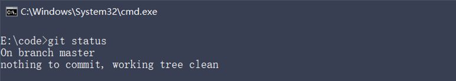

# Git之旅

## 起步

### 关于版本控制

- #### 本地版本控制

  - 特点:使用软件来记录文件的不同版本，提高了工作效率，降低了手动维护版本的出错率

  - 缺点：

    ①单机运行，不支持多人协作开发

    ②版本数据库故障后，所有历史更新记录会丢失

- #### 集中化的版本控制系统

  - 特点：基于服务器、客户端的运行模式

    ①服务器保存文件的所有更新记录

    ②客户端只保留最新的文件版本

  - 优点：联网运行，支持多人协作开发

  - 缺点：

    ①不支持离线提交版本更新

    ②中心服务器崩溃后，所有人无法正常工作

    ③版本数据库故障后，所有历史更新记录会丢失

- #### 分布式版本控制系统

  - 特点：基于服务器、客户端的运行模式

  - 服务器保存文件的所有更新版本

  - 客户端是服务器的完整备份，并不是只保留文件的最新版本

  - 优点：

    ①联网运行，支持多人协作开发

    ②客户端断网后支持离线本地提交版本更新

    ③服务器故障或损坏后，可使用任何一个客户端的备份进行恢复

    > 典型代表:Git

### Git基础概念

1. **什么是Git**

   > Git 是一个开源的分布式版本控制系统，是目前世界上最先进、最流行的版本控制系统。可以快速高效地处理从很小到非常大的项目版本管理。
   >
   > 特点：项目越大越复杂，协同开发者越多，越能体现出 Git 的高性能和高可用性！

2. **Git的特性**

   > Git 之所以快速和高效，主要依赖于它的如下两个特性：
   >
   > ①直接记录快照，而非差异比较
   >
   > ②近乎所有操作都是本地执行

   - Git的记录快照

     > **Git 快照**是在原有文件版本的基础上重新生成一份新的文件，类似于备份。为了效率，如果文件没有修改，Git 不再重新存储该文件，而是只保留一个链接指向之前存储的文件。
     >
     > 
     >
     > 缺点：占用磁盘空间较大
     >
     > 优点：版本切换时非常快，因为每个版本都是完整的文件快照，切换版本时直接恢复目标版本的快照即可。
     >
     > 特点：空间换时间

   - 近乎所有的操作都是本地执行

     > 在 Git 中的绝大多数操作都**只需要访问本地文件和资源**，一般不需要来自网络上其它计算机的信息。
     >
     > 
     >
     > 特性：
     >
     > ①断网后依旧可以在本地对项目进行版本管理
     >
     > ②联网后，把本地修改的记录同步到云端服务器即可

3. **Git的三个区域**

   > 使用 Git 管理的项目，拥有三个区域，分别是**工作区、暂存区、Git 仓库。**

4. **Git中的三种状态**

   - **已修改**

     表示修改了文件，但还没将修改的结果放到暂存区

   - **已暂存**

     表示对已修改文件的当前版本做了标记，使之包含在下次提交的列表中

   - **已提交**

     表示文件已经安全地保存在本地的 Git 仓库中

     > 注意:
     >
     > - 工作区的文件被修改了，但还没有放到暂存区，就是**已修改**状态。
     >
     > - 如果文件已修改并放入暂存区，就属于**已暂存**状态。
     >
     > - 如果 Git 仓库中保存着特定版本的文件，就属于**已提交**状态。

5. **基本的Git工作流程**

   ①在工作区中修改文件

   ②将你想要下次提交的更改进行暂存

   ③提交更新，找到暂存区的文件，将快照永久性存储到 Git 仓库
   
   ------
   
   

## Git基础

### 安装并配置Git

1. 在Windos中下载并安装Git

   > 在开始使用 Git 管理项目的版本之前，需要将它安装到计算机上。可以使用浏览器访问如下的网址，根据自己的操作系统，选择下载对应的 Git 安装包：
   >
   > https://git-scm.com/downloads

2. 配置用户信息

   > 安装完 Git 之后，要做的第一件事就是设置自己的用户名和邮件地址。因为通过 Git 对项目进行版本管理的时候，Git 需要使用这些基本信息，来记录是谁对项目进行了操作：

   > 注意：如果使用了 --global 选项，那么该命令只需要运行一次，即可永久生效。

### Git的基本操作

1. #### 获取Git仓库的两种方式

   ①将尚未进行版本控制的本地目录**转换**为 Git 仓库

   ②从其它服务器**克隆**一个已存在的 Git 仓库

2. #### 在现有的目录中初始化仓库

   - 如果自己有一个尚未进行版本控制的项目目录，想要用 Git 来控制它，需要执行如下两个步骤：

     ①在项目目录中，通过鼠标右键打开“Git Bash”

     ②执行 git init 命令将当前的目录转化为 Git 仓库

     > git init 命令会创建一个名为 .git 的隐藏目录，**这个** **.git** **目录就是当前项目的** **Git** **仓库**，里面包含了初始的必要文件，这些文件是 Git 仓库的必要组成部分。

3. #### 工作区中文件的4种状态

   > 工作区中的每一个文件可能有 4 种状态，这四种状态共分为两大类，如图所示

   >  ==Git操作的终极结果:让工作区中的文件都处于"未修改"的状态==

4. #### 检查文件的状态

   > 可以使用`git status`命令查看文件处于什么状态
   >
   > 未跟踪的文件意味着 Git 在之前的快照（提交）中没有这些文件；Git 不会自动将之纳入跟踪范围，除非明确地告诉它“我需要使用 Git 跟踪管理该文件”。

5. #### 以精简的方式显示文件状态

   > 使用 git status 输出的状态报告很详细，但有些繁琐。如果希望以精简的方式显示文件的状态，可以使用如下两条完全等价的命令，其中 **-s** 是 **--short** 的简写形式：

   - 未跟踪文件前面有红色的 `??` 标记

6. #### 跟踪新文件

   > 使用命令 git add 开始跟踪一个文件。 所以，要跟踪 index.html 文件，运行如下的命令即可：

7. #### 提交更新

   > 现在暂存区中有一个 index.html 文件**等待被提交**到 Git 仓库中进行保存。可以执行 git commit 命令进行提交,其中 **-m 选项**后面是本次的**提交消息**，用来**对提交的内容做进一步的描述：**

   - 提交成功时,再次**检查文件状态**,得到提示如下:

8. #### 对已提交的文件进行修改

   > 目前，index.html 文件**已经被 Git 跟踪**，并且**工作区和 Git 仓库**中的 index.html 文件内容保持一致。当我们修改了工作区中 index.html 的内容之后，再次运行 `git status` 和 `git status -s` 命令，会看到如下的内容：

   >  文件 index.html 出现在 Changes not staged for commit 这行下面，说明**已跟踪文件的内容发生了变化，但还没有放到暂存区**。
   >
   > ==注意==:修改过的、没有放入暂存区的文件前面有红色的 M 标记

9. #### 暂存已修改的文件

   > 目前，工作区中的 index.html 文件已被修改，如果要暂存这次修改，需要再次运行 git add 命令，这个命令是个多功能的命令，主要有如下 3 个功效：
   >
   > ①可以用它**开始跟踪新文件**
   >
   > ②把**已跟踪的、且已修改**的文件放到暂存区
   >
   > ③把有冲突的文件标记为已解决状态

10. #### 提交已暂存的文件

    > 再次运行` git commit -m "提交消息"` 命令，即可将暂存区中记录的 index.html 的快照，提交到 Git 仓库中进行保存：

11. #### 撤销对文件的修改

    > ==撤销操作的本质:==用Git仓库中保存的文件,覆盖工作区中指定的文件
    >
    > 操作的结果：所有的修改会丢失，且无法恢复！危险性比较高，请慎重操作！

    原理图:

12. #### 向暂存区中一次性添加多个文件

    > 如果需要被暂存的文件个数比较多，可以使用如下的命令，一次性将所有的新增和修改过的文件加入暂存区

    - 命令:`git add .`

13. #### 取消暂存的文件

    - `git reset HEAD 要移除的文件名称`

14. #### 跳过使用暂存区域

    > Git 提供了一个跳过使用暂存区域的方式， 只要在提交的时候，给 **git commit** 加上 **-a** 选项，Git 就会自动把所有已经跟踪过的文件暂存起来一并提交，从而跳过 git add 步骤：
    >
    > `git commit -a -m "描述消息"`

15. #### 移除文件

    - 从 Git 仓库中移除文件的方式有两种：

      ①从 Git 仓库和工作区中同时移除对应的文件

      ②只从 Git 仓库中移除指定的文件，但保留工作区中对应的文件
      
      

16. #### 忽略文件

    > 一般我们总会有些文件无需纳入 Git 的管理，也不希望它们总出现在未跟踪文件列表。 在这种情况下，我们可以创建一个名为 **.gitignore** 的配置文件，列出要忽略的文件的匹配模式。

    - 文件 .gitignore 的格式规范如下：

      ①以` # 开头`的是注释

      ②以 `/ 结尾`的是目录

      ③以 `/ 开头`防止递归

      ④以 `! 开头`表示取反

      ⑤可以使用 **glob 模式**进行文件和文件夹的匹配（glob 指简化了的正则表达式）

    - #### glob模式

      - 所谓的 glob 模式是指简化了的正则表达式：

        ① **星号 \*** 匹配*零个或多个任意字符*

        ② **[abc]** 匹配*任何一个列在方括号中的字符* （此案例匹配一个 a 或匹配一个 b 或匹配一个 c）

        ③ **问号** **?** 只*匹配一个任意字符*

        ④ 在方括号中使用**短划线**分隔两个字符， 表示所有在这两个字符范围内的都可以匹配（比如 [0-9] 表示匹配所有 0 到 9 的数字）

        ⑤ **两个号表示任何中间目录**，比如src**build，可以匹配到src/test/build，也可以匹配到src/current/build。

      - #### .gitignore文件的例子

17. #### 查看提交历史

    > 如果希望回顾项目的提交历史，可以使用 `git log` 这个简单且有效的命令。

18. #### 回退到指定的版本

------

## Github

- ### 开源相关概念

  1. #### 开源

     > 开源是指不仅提供程序还提供程序的源代码
     >
     > 闭源是只提供程序，不提供源代码

  2. ### 什么是开源许可协议

     > 开源并不意味着完全没有限制，为了**限制使用者的使用范围和保护作者的权利**，每个开源项目都应该遵守**开源许可协议**（ Open Source License ）。

  3. #### 常见的5种开源许可协议

     ① BSD（Berkeley Software Distribution）

     ② Apache Licence 2.0

     ③ **GPL**（GNU General Public License）

     - 具有传染性的一种开源协议，不允许修改后和衍生的代码做为闭源的商业软件发布和销售

     - 使用 GPL 的最著名的软件项目是：Linux

     ④ LGPL（GNU Lesser General Public License）

     ⑤ **MIT**（Massachusetts Institute of Technology, MIT）

     - 是目前限制最少的协议，唯一的条件：在修改后的代码或者发行包中，必须包含原作者的许可信息

     - 使用 MIT 的软件项目有：jquery、Node.js

       > 关于更多开源许可协议的介绍，可以参考博客 https://www.runoob.com/w3cnote/open-source-license.html

  4. #### 为什么要拥抱开源

     > 开源的核心思想是“**我为人人，人人为我**”，人们越来越喜欢开源大致是出于以下 3 个原因：
     >
     > ①开源给使用者更多的控制权
     >
     > ②开源让学习变得容易
     >
     > ③开源才有真正的安全

  5. #### 开源项目托管平台

     > 专门用于免费存放开源项目源代码的网站，叫做**开源项目托管平台**。目前世界上比较出名的开源项目托管平台主要有以下 3 个：
     >
     > - Github（全球最牛的开源项目托管平台，没有之一）
     >
     > - Gitlab（对代码私有性支持较好，因此企业用户较多）
     >
     > - Gitee（又叫做码云，是国产的开源项目托管平台。访问速度快、纯中文界面、使用友好）
     >
     > 注意:以上 3 个开源项目托管平台，只能托管以 Git 管理的项目源代码，因此，它们的名字都以 Git 开头。

  6. #### 什么是Github

     > Github 是全球最大的**开源项目**托管平台。因为只支持 Git 作为唯一的版本控制工具，故名 GitHub。
     >
     > 在 Github 中，你可以：
     >
     > ①关注自己喜欢的开源项目，为其点赞打 call
     >
     > ②为自己喜欢的开源项目做贡献（Pull Request）
     >
     > ③和开源项目的作者讨论 Bug 和提需求 （Issues）
     >
     > ④把喜欢的项目复制一份作为自己的项目进行修改（Fork）
     >
     > ⑤创建属于自己的开源项目
     >
     > ⑥etc…
     >
     > ●
     >
     > So，**Github** **≠** **Git**

- ### 远程仓库的两种访问方式

  > Github 上的远程仓库，有两种访问方式，分别是 HTTPS 和 SSH。它们的区别是：
  >
  > ①HTTPS：**零配置**；但是每次访问仓库时，需要重复输入 Github 的账号和密码才能访问成功
  >
  > ②SSH：**需要进行额外的配置**；但是配置成功后，每次访问仓库时，不需重复输入 Github 的账号和密码
  >
  > 
  >
  > 注意：在实际开发中，**推荐使用 SSH 的方式访问远程仓库。**

  - #### SSH key

    > SSH key 的**作用**：实现本地仓库和 Github 之间免登录的加密数据传输。
    >
    > SSH key 的**好处**：免登录身份认证、数据加密传输。
    >
    > SSH key 由**两部分组成**，分别是：
    >
    > ①id_rsa（私钥文件，存放于客户端的电脑中即可）
    >
    > ②id_rsa.pub（公钥文件，需要配置到 Github 中）

    1. 生成SSH key

       ①打开 Git Bash

       ②粘贴如下的命令，并将 your_email@example.com 替换为注册 Github 账号时填写的邮箱：

       l ssh-keygen -t rsa -b 4096 -C "your_email@example.com"

       ③连续敲击 3 次回车，即可在 C:\Users\用户名文件夹\.ssh 目录中生成 id_rsa 和 id_rsa.pub 两个文件

    2. 配置SSH key

       ①使用记事本打开 id_rsa.pub 文件，复制里面的文本内容

       ②在浏览器中登录 Github，点击头像 -> Settings -> SSH and GPG Keys -> New SSH key

       ③将 id_rsa.pub 文件中的内容，粘贴到 Key 对应的文本框中

       ④在 Title 文本框中任意填写一个名称，来标识这个 Key 从何而来

    3. 检测Github的SSH key是否配置成功

       `ssh -T git@github.com`

  - #### 将远程仓库克隆到本地

    > 打开 Git Bash，输入如下的命令并回车执行：`git clone 远程仓库的地址`

## Git 分支

- ### 本地分支操作

  1. #### 分支的概念

     > 分支就是科幻电影里面的平行宇宙，当你正在电脑前努力学习Git的时候，另一个你正在另一个平行宇宙里努力学习SVN。
     >
     > 如果两个平行宇宙互不干扰，那对现在的你也没啥影响。
     >
     > 不过，在某个时间点，两个平行宇宙合并了，结果，你既学会了Git又学会了SVN！

  2. #### 分支在实际开发中的作用

     > 在进行多人协作开发的时候，为了防止互相干扰，提高协同开发的体验，建议每个开发者都基于分支进行项目功能的开发，例如：

  3. #### master主分支

     > 在初始化本地 Git 仓库的时候，Git 默认已经帮我们创建了一个名字叫做 master 的分支。通常我们把这个 master 分支叫做主分支。

     > 在实际工作中，master 主分支的作用是：**用来保存和记录整个项目已完成的功能代码**。
     >
     > 因此，不允许程序员直接在 master 分支上修改代码，因为这样做的风险太高，容易导致整个项目崩溃。

  4. #### 功能分支

     > 由于程序员不能直接在 master 分支上进行功能的开发，所以就有了功能分支的概念。
     >
     > **功能分支**指的是专门用来开发新功能的分支，它是临时从 master 主分支上分叉出来的，当新功能开发且测试完毕后，最终需要合并到 master 主分支上，如图所示：

  5. #### 查看分支列表

     使用如下的命令，可以查看当前 Git 仓库中所有的分支列表：

     命令:`git brance`

     > 注意：分支名字前面的 ***** 号表示**当前所处的分支。**

  6. #### 创建新分支

     > 使用如下的命令，可以基于当前分支，创建一个新的分支
     >
     > `git branch 分支名称`
     >
     > 图示:

  7. #### 切换分支

     > 使用如下的命令，可以切换到指定的分支上进行开发：
     >
     > `git checkout login`

  8. #### 分支的快速创建和切换

     > 使用如下的命令，可以创建指定名称的新分支，并立即切换到新分支上：
     >
     > `-b `表示创建一个新分支
     >
     > `checkout `表示切换到刚才新建的分支上
     >
     > `git checkout -b 分支名称`

  9. #### 合并分支

     步骤:

     1. 切换到`main`分支

        `git checkout master`

     2. `git merge login`

  10. #### 删除分支

      > **当把功能分支的代码合并到 master 主分支上以后**，就可以使用如下的命令，删除对应的功能分支:
      >
      > `git branch -d 分支名称`

  11. #### 遇到冲突时的分之合并

      > 如果在两个不同的分支中，对同一个文件进行了不同的修改，Git 就没法干净的合并它们。 此时，我们需要打开这些包含冲突的文件然后**手动解决冲突**。

- ### 远程分支操作

  1. #### 将本地分支推送到远程仓库

     > 如果是**第一次**将本地分支推送到远程仓库，需要运行如下的命令：

     - 注意:第一次推送分支需要带` -u` 参数，此后可以直接使用 `git push` 推送代码到远程分支。

  2. #### 查看远程仓库中所有的分支列表

     `git remote show 远程仓库名称`

  3. #### 跟踪分支

     > 跟踪分支指的是：从远程仓库中，把远程分支下载到本地仓库中。需要运行的命令如下：

  4. #### 拉取远程分支的最新的代码

     > 可以使用如下的命令，把远程分支最新的代码下载到本地对应的分支中：
     >
     > `git pull`

  5. #### 删除远程分支

     > 可以使用如下的命令，删除远程仓库中指定的分支：
     >
     > `git push 远程仓库名称 --delete 远程分支名称`

     

