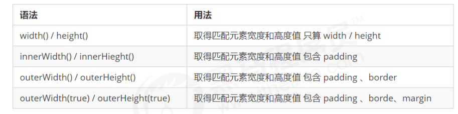

# JQuery

### jQuery概述

-  jQuery是简介的js库:就是一个JS文件,里面对我们原生js代码进行了封装,存放到里面

- 其设计宗旨是"write Less Do More"

  > 比如jQuery,就是为了快速方便的操作DOM,里面基本都是函数(方法

- 优点:

  - 轻量级
  - 跨浏览器兼容
  - 链式编程,隐式迭代
  - 对事件,样式,动画支持,简化了DOM操作
  - 支持插件扩展开发.如:树形菜单,日期空间,轮播图等
  - 免费,开源

## jQuery的基本使用

- jQ的入口函数

  ```js
  `$(function () ){
  	...//此处是页面DOM加载完成的入口	
  });
  `
  //方式二:
  $(document).ready(function(){
      ...//此处是页面DOM加载完成的入口
  }
  ```

  1. 等着DOM结构渲染完毕即可执行内部代码
  2. 相当于原生js中的DOMContentLoaded
  3. 不同于原生js中的load事件是等页面文档,外部的js文件,ss文件,图片等加载完才执行内部代码

- jQ的顶级对象`$`

  1. `$`是jQuery的别称,在代码中可以使用jQuery代替$
  2. `$`是jQ的顶级对象,相当于原生的js中的`window`.把元素利用`$`包装成jQ对象,就可以调用jQ的方法

  - `$`的作用

    - **1、作为jQuery包装器，利用选择器来选择DOM元素（这个也是最强大的功能）**

      例如：$("table tr:nth-child(even)")

      **2、实用工具函数，作为几个通用的实用工具函数的命名空间的前缀**

      例如：$.trim(someString)

      **3、文档就绪处理程序，相当于$(document).ready(...)**

      例如：$(function(){...}); 里面的函数会在DOM树加载完之后执行

      **4、创建DOM元素**

      例如：$("<p>how are you?</p>")

      **5、扩展jQuery**

      例如：$.fn.disable = function(){...}

      **6、使用jQuery和其他库**

  - ==jQ对象和DOM对象==

  - DOM对象:	用原生js获取过来的对象就是DOM对象

  - jQ对象:用jQ方式获取过来的对象就是jQ对象

     - 本质:通过`$`把DOM元素进行了封装后产生的对象(伪数组)
     - **当产生的是伪数组时,具有兄弟关系的元素会有自动排序索引,表兄弟不行**

  - jQ对象只能使用jQ方法,DOM对象则使用原生的js属性和方法

     ```js
     //例:
     var mySpan = document.querySelector("span");	//mySpan是DOM对象
     $("div"); 	// $("div")是jQ对象
     ```

  - jQ对象和DOM对象之间是可以相互转换的

     1. DOM对象转换为jQuery:`$(DOM对象)`

        ```js
        $('div')
        ```

     2. jQuery对象转换为DOM对象(两种方式)

        ```js
        //1.
        $('div')[0]	//index是索引号
        
        //2.
        $('div').get(index)	//index是索引号
        ```

- ## jQ常用的API

  - ### jQ基本选择器

    - ```js
      $("选择器")	//	里面选择器直接写css选择器即可,但是要加引号
      ```
      
    - ==隐式迭代(重要)==:遍历内部DOM元素(伪数组形式存储)的过程就叫做**隐式迭代**

      ```js
      //1.给四个div设置背景颜色为粉色 jQ对象不能使用style
      $("div").css("background","pink")
      
      `隐式迭代就是把匹配的所有元素内部进行遍历循环,给每一个元素添加css这个方法`
      ```
      
    - 筛选选择器

      | 语法       | 用法          | 描述                                                 |
      | ---------- | ------------- | ---------------------------------------------------- |
      | :first     | $('li:first') | 获取第一个li元素                                     |
      | :last      | $('li:last')  | 获取最后一个li元素                                   |
      | :eq(index) | $("li:eq(2)") | 获取到的li元素中,选择索引为2的元素,==索引号从0开始== |
      | :odd       | $("li:odd")   | 选择奇数个数的元素==索引号从0开始==                  |
      | :even      | $("li:even")  | 选择偶数个数的元素==索引号从0开始==                  |
      
    - ==jQ筛选方法(重点)==

    - `:checked选择器`::checked查找被选中的表单元素

    - `parents("父级")`选择器可以直接查找指定的父级元素

    - **链式编程**

      > 链式编程是为了节省代码量，看起来更优雅

      ```js
      $(this).css('color', 'red').sibling().css('color', ''); 
      ```

      > 注意添加的对象

  - ### jQ样式操作

    - **操作css方法**

      1. 参数只写属性名,则是返回属性值

         ```jjs
         $(this).css("color");
         ```

      2. 参数是**属性名**,**属性值**,**逗号分隔**,是设置一组样式,属性必须加引号,属性必须加引号,值如果是数字可以不用跟单位和引号

         ```js
         $(this).css("color","red");
         ```

      3. 参数可以是对象形式,方便设置多组样式。属性名和属性值用冒号隔开， 属性可以不用加引号

         ```js
         $(this).css({ "color":"white","font-size":"20px"});
         ```

      > 注意:css() 多用于样式少时操作，多了则不太方便。
    - **设置类样式方法**

      > 作用等同于以前的classList,可以操作类样式,注意操作类里面的参数不要加点

      ```js
      // 1.添加类
      $("div").addClass("current");
      
      // 2.删除类
      $("div").removeClass("current");
      
      // 3.切换类
      $("div").toggleClass("current");
      ```
      
      ​	**注意**：
      
      1. 设置类样式方法比较适合样式多时操作，可以弥补css()的不足。
      2. 原生 JS 中 className 会覆盖元素原先里面的类名，jQuery 里面类操作只是对指定类进行操作，不影响原先的类名。

  - ### **jQ效果**

    - jQuery 给我们封装了很多动画效果，最为常见的如下：

      - 显示隐藏：show() / hide() / toggle() ;
      - 划入画出：slideDown() / slideUp() / slideToggle() ; 
      - 淡入淡出：fadeIn() / fadeOut() / fadeToggle() / fadeTo() ; 
      - 自定义动画：animate() ;

      > 注意：
      >
      > 动画或者效果一旦触发就会执行，如果多次触发，就造成多个动画或者效果排队执行。
      >
      > jQuery为我们提供另一个方法，可以停止动画排队：stop() ;

    - **显示隐藏**

      1.  **显示语法规范**

         ```js
         show([speed,[easing],[fn]])
         ```

         - **显示参数**
           1. 参数都可以省略， 无动画直接显示。
           2. speed：三种预定速度之一的字符串(“slow”,“normal”, or “fast”)或表示动画时长的毫秒数值(如：1000)。 
           3. easing：(Optional) 用来指定切换效果，默认是“swing”，可用参数“linear”。 
           4. fn: 回调函数，在动画完成时执行的函数，每个元素执行一次

      2. **隐藏语法规范**

         ```js
         hide([speed,[easing],[fn]])
         ```

         - 隐藏参数
           1. 参数都可以省略， 无动画直接显示。
           2. speed：三种预定速度之一的字符串(“slow”,“normal”, or “fast”)或表示动画时长的毫秒数值(如：1000)。
           3. easing：(Optional) 用来指定切换效果，默认是“swing”，可用参数“linear”。
           4. fn: 回调函数，在动画完成时执行的函数，每个元素执行一次。

      3. 切换语法

         ```js
         toggle([speed,[easing],[fn]])
         ```

         - 切换参数

           1. 参数都可以省略， 无动画直接显示。
           2. speed：三种预定速度之一的字符串(“slow”,“normal”, or “fast”)或表示动画时长的毫秒数值(如：1000)。
           3. easing：(Optional) 用来指定切换效果，默认是“swing”，可用参数“linear”。
           4. fn: 回调函数，在动画完成时执行的函数，每个元素执行一次。

           > 建议：平时一般不带参数，直接显示隐藏即可。

    - **滑动效果**

      1. 下滑效果语法:

         ```js
         slideDown([speed,[easing],[fn]])
         ```

         - 下滑效果参数
           1. 参数都可以省略， 无动画直接显示。
           2. speed：三种预定速度之一的字符串(“slow”,“normal”, or “fast”)或表示动画时长的毫秒数值(如：1000)。
           3. easing：(Optional) 用来指定切换效果，默认是“swing”，可用参数“linear”。
           4. fn: 回调函数，在动画完成时执行的函数，每个元素执行一次。

      2. 上滑效果语法:

         ```js
         slideUp([speed,[easing],[fn]])
         ```

         -  上滑效果参数
           1. 参数都可以省略， 无动画直接显示。
           2. speed：三种预定速度之一的字符串(“slow”,“normal”, or “fast”)或表示动画时长的毫秒数值(如：1000)。
           3. easing：(Optional) 用来指定切换效果，默认是“swing”，可用参数“linear”。
           4. fn: 回调函数，在动画完成时执行的函数，每个元素执行一次。

      3. 滑动切换效果

         ```js
         slideToggle([speed,[easing],[fn]])
         ```

         - 参数
           1. 参数都可以省略， 无动画直接显示。
           2. speed：三种预定速度之一的字符串(“slow”,“normal”, or “fast”)或表示动画时长的毫秒数值(如：1000)。
           3. easing：(Optional) 用来指定切换效果，默认是“swing”，可用参数“linear”。
           4. fn: 回调函数，在动画完成时执行的函数，每个元素执行一次。

      4. 事件切换

         ```js
         hover([over,]out)
         ```

         1. over:鼠标移到元素上要触发的函数（相当于mouseenter）

         2. out:鼠标移出元素要触发的函数（相当于mouseleave）

         3. 如果只写一个函数，则鼠标经过和离开都会触发它

            > 补充:
            >
            > ```js
            > //正派角色：
            > 
            > //1.mouseenter：当鼠标经过被选元素才会触发，此方法不会冒泡，当鼠标经过被选元素的子元素时，不会触发mouseenter事件，对应mouseleave事件。
            > //2.mouseover：当鼠标经过被选元素和被选元素的子元素时都会触发mouseover事件，对应mouseout事件。
            > //3.mousemove：当鼠标移入被选元素内后，任意移动一个像素点都会触发。
            > 
            > `正派角色：
            > 
            > 1.mouseenter：当鼠标经过被选元素才会触发，此方法不会冒泡，当鼠标经过被选元素的子元素时，不会触发mouseenter事件，对应mouseleave事件。
            > 2.mouseover：当鼠标经过被选元素和被选元素的子元素时都会触发mouseover事件，对应mouseout事件。
            > 3.mousemove：当鼠标移入被选元素内后，任意移动一个像素点都会触发。
            > ```
            >
            > 

      5. 动画队列及其停止排队方法

         1. 动画或效果队列:动画或者效果一旦触发就会执行，如果多次触发，就造成多个动画或者效果排队执行。

         2. 停止排队

            ```js
            stop()
            ```

            1. stop() 方法用于停止动画或效果。
            2.  注意： stop() 写到动画或者效果的**前面， 相当于停止结束上一次的动画。**

    - **淡入淡出效果**

      1. **淡入效果:**

         ```js
         fadeIn([speed,[easing],[fn]])
         ```

         - 参数:
           1. 参数都可以省略， 无动画直接显示。
           2. speed：三种预定速度之一的字符串(“slow”,“normal”, or “fast”)或表示动画时长的毫秒数值(如：1000)。
           3. easing：(Optional) 用来指定切换效果，默认是“swing”，可用参数“linear”。
           4. fn: 回调函数，在动画完成时执行的函数，每个元素执行一次。

      2. **淡出效果**

         ```js
         fadeOut([speed,[easing],[fn]])
         ```

         - 参数
           1. 参数都可以省略， 无动画直接显示。
           2. speed：三种预定速度之一的字符串(“slow”,“normal”, or “fast”)或表示动画时长的毫秒数值(如：1000)。
           3. easing：(Optional) 用来指定切换效果，默认是“swing”，可用参数“linear”。
           4. fn: 回调函数，在动画完成时执行的函数，每个元素执行一次。

      3. 淡入淡出切换效果语法

         ```js
         fadeToggle([speed,[easing],[fn]])
         ```

         - 参数
           1. 参数都可以省略， 无动画直接显示。
           2. speed：三种预定速度之一的字符串(“slow”,“normal”, or “fast”)或表示动画时长的毫秒数值(如：1000)。
           3. easing：(Optional) 用来指定切换效果，默认是“swing”，可用参数“linear”。
           4. fn: 回调函数，在动画完成时执行的函数，每个元素执行一次。

      4. **渐进方式调整到指定的不透明度**

         ```js
         fadeTo([[speed],opacity,[easing],[fn]])
         ```

         - 参数
           1. **speed**：三种预定速度之一的字符串(“slow”,“normal”, or “fast”)或表示动画时长的毫秒数值(如：1000)。**必须写**
           2. **opacity 透明度必须写，取值 0~1 之间。**
           3. easing：(Optional) 用来指定切换效果，默认是“swing”，可用参数“linear”
           4. fn: 回调函数，在动画完成时执行的函数，每个元素执行一次
      
    - **自定义动画**

      > ​	自定义动画非常强大，通过参数的传递可以模拟以上所有动画，方法为：animate() ;
      >
      > ​	语法规范如下:

      - 语法

        ```js
        animate(params,[speed],[easing],[fn])
        ```

      - 参数

        1. **params: 想要更改的样式属性，以对象形式传递，必须写。 属性名可以不用带引号， 如果是复合属性则需要采 取驼峰命名法 borderLeft**。其余参数都可以省略。
        2. speed：三种预定速度之一的字符串(“slow”,“normal”, or “fast”)或表示动画时长的毫秒数值(如：1000)。
        3. easing：(Optional) 用来指定切换效果，默认是“swing”，可用参数“linear”。
        4. fn: 回调函数，在动画完成时执行的函数，每个元素执行一次。

  - ### jQ属性操作

    - **设置或获取元素固有属性值prop()**

      > 所谓元素固有属性就是元素本身自带的属性，比如a  元素里面的 href ，比如  input元素里面的 type

      1. 获取属性语法

         ```js
         prop("属性")
         ```

      2. 设置属性语法

         ```js
         prop("属性","属性值")
         ```

    - **设置或获取元素自定义属性值 attr()**

      > 用户自己给元素添加的属性，我们称为自定义属性。 比如给 div 添加 index =“1”。

      1. 获取属性语法

         ```js
         attr(''属性'') // 类似原生 getAttribute()
         ```

      2. 设置属性语法

         ```js
         attr(''属性'', ''属性值'') // 类似原生 setAttribute()
         ```

         > 改方法也可以获取 H5 自定义属性

    - **数据缓存 data()**

      > data() 方法可以在指定的元素上存取数据，并不会修改 DOM 元素结构。一旦页面刷新，之前存放的数据都将被移除。

      1. 附加数据语法

         ```js
         data(''name'',''value'') // 向被选元素附加数据 
         ```

      2. 获取数据

         ```js
         date(''name'') // 向被选元素获取数据
         ```

         > 还可以读取 HTML5 自定义属性 data-index

  - ### jQ文本属性

    >  主要针对元素的**内容**还有**表单的值**操作

    1. 普通元素内容 html() (相当于原生inner HTML)

       ```JS
       html() // 获取元素的内容
       html(''内容'') // 设置元素的内容
       ```

    2. 普通元素文本内容 text() (相当与原生 innerText)

       ```JS
       text() // 获取元素的文本内容
       text(''文本内容'') // 设置元素的文本内容
       ```

    3. 单的值 val()（ 相当于原生value)

       ```JS
       val() // 获取表单的值
       val(''内容'') // 设置表单的值
       ```

       > 补充方法:toFixed(2)方法:可以保留指定数量的小数:`Num.toFixed("要保留的位数")`

  - ### jQ元素操作

    >  主要是==遍历==、创建、添加、删除元素操作。

    - **遍历元素**

      > jQuery 隐式迭代是对同一类元素做了同样的操作。 如果想要给同一类元素做不同操作，就需要用到遍历。

      - 语法1

        ```js
        $("div").each(function (index, domEle) { xxx; }） 
        ```

        1.  each() 方法遍历匹配的每一个元素。主要用DOM处理。 each 每一个
        2.  里面的回调函数有2个参数： index 是每个元素的索引号; demEle 是每个**DOM元素对象，不是jquery对象**
        3.  **所以要想使用jquery方法，需要给这个dom元素转换为jquery对象 $(domEle)**

      - 语法2

        ```js
        $.each(object，function (index, element) { xxx; }） 
        ```

        1. $.each()方法可用于遍历任何对象。主要用于数据处理，比如数组，对象
        2. 里面的函数有2个参数： index 是每个元素的索引号; element 遍历内容
      
    - 创建元素

      - 语法:`$(''<li></li>'');`

        > 动态的创建了一个<li>

    - 添加元素

      1. **内部添加**

         ```js
         element.append(''内容'')
         //把内容放入匹配元素内部最后面，类似原生 appendChild。
         
         element.prepend(''内容'')  
         //把内容放入匹配元素内部最前面。
         ```

      2. **外部添加**

         ```js
         element.after(''内容'')        //  把内容放入目标元素后面
         
         element.before(''内容'')    //  把内容放入目标元素前面 
         ```

      > ① 内部添加元素，生成之后，它们是父子关系。 
      > ② 外部添加元素，生成之后，他们是兄弟关系。

    - **删除元素**

      ```js
      element.remove()   //  删除匹配的元素（本身）
      
      element.empty()    //  删除匹配的元素集合中所有的子节点 
      
      element.html('''')   //  清空匹配的元素内容
      ```

      > ① remove 删除元素本身。 
      > ② empt() 和  html('''') 作用等价，都可以删除元素里面的内容，只不过 html 还可以设置内容

    

  - ### jQ尺寸,位置操作

    - **jq尺寸**

      -  以上参数为空，则是获取相应值，返回的是数字型。
      - 如果参数为数字，则是修改相应值。
      - 参数可以不必写单位。

    - **jq位置**

      > 位置主要有三个： **offset()**、position()、scrollTop()/scrollLeft()

      - **offset() 设置或获取元素偏移**
        1. offset() 方法设置或返回被选元素相对于文档的偏移坐标，跟父级没有关系。
        2.  该方法有2个属性 left、top 。offset().top 用于获取距离**文档**顶部的距离，offset().left 用于获取距离文档左侧的距离。
        3. 可以设置元素的偏移：offset({ top: 10, left: 30 })
      -  **position() 获取元素偏移**
        1.  position() 方法用于返回被选元素相对于带有定位的父级偏移坐标，如果父级都没有定位，则以文档为准。
        2.  该方法有2个属性 left、top。position().top 用于获取距离定位父级顶部的距离，position().left 用于获取距离定 位父级左侧的距离。
        3. 该方法只能获取。
      - **scrollTop()/scrollLeft() 设置或获取元素被卷去的头部和左侧**
        1. scrollTop() 方法设置或返回被选元素被卷去的头部
        2. 不跟参数是获取，参数为不带单位的数字则是设置被卷去的头部。

- ### jQuery事件

  - ### **事件注册**

    - 语法:

      ```js
      //element.事件(function(){}) 
      $(“div”).click(function(){ 事件处理程序 }) 
      ```

      > 其他事件和原生基本一致。 比如mouseover、mouseout、blur、focus、change、keydown、keyup、resize、scroll 等

  - ###  **事件处理**

    -  **事件处理 on() 绑定事件**

      > on() 方法在匹配元素上绑定一个或多个事件的事件处理函数

      - 语法

        ```js
        element.on(events,[selector],fn)
        ```

        1. events:一个或多个用空格分隔的事件类型，如"click"或"keydown" 。

        2.  selector: 元素的子元素选择器 。

        3. fn:回调函数 即绑定在元素身上的侦听函数。

      - **on()方法优势1:**

        - 可以绑定多个事件，多个处理事件处理程序。

          ```js
          $(“div”).on({
           mouseover: function(){}, 
          mouseout: function(){},
          click: function(){}
          });
          ```

        - 如果事件处理程序相同

          ```js
          $(“div”).on(“mouseover mouseout”, function() {
           $(this).toggleClass(“current”);
           }); 
          ```

      - **on()方法优势2:**

        - 可以事件委派操作 。事件委派的定义就是，把原来加给子元素身上的事件绑定在父元素身上，就是把事件委派给父元素

          ```js
          $('ul').on('click', 'li', function() {
           alert('hello world!');
          }); 
          ```

          > 在此之前有bind(), live() delegate()等方法来处理事件绑定或者事件委派，最新版本的请用on替代他们

      - **on()方法优势3:**

        - 动态创建的元素，click() 没有办法绑定事件， on() 可以给动态生成的元素绑定事件

          ```js
          //也可以给未来创建的元素绑定事件
          $(“div").on("click",”p”, function(){
           alert("俺可以给动态生成的元素绑定事件")
          });
          
          $("div").append($("<p>我是动态创建的p</p>"));
          ```

    -  **事件处理 off() 解绑事件**

      > off() 方法可以移除通过 on() 方法添加的事件处理程序。

      ```js
      $("p").off() // 解绑p元素所有事件处理程序
      
      $("p").off( "click") // 解绑p元素上面的点击事件 后面的 foo 是侦听函数名
      
      $("ul").off("click", "li"); // 解绑事件委托
      ```

      > 如果有的事件只想触发一次， 可以使用 one() 来绑定事件。

    -  **自动触发事件 trigger()**

      > 有些事件希望自动触发, 比如轮播图自动播放功能跟点击右侧按钮一致。可以利用定时器自动触发右侧按钮点击事件，不必鼠标 点击触发

      ```js
      element.click() // 第一种简写形式
      
      element.trigger("type") // 第二种自动触发模式
      
      $("p").on("click", function () {
       alert("hi~");
      });
      $("p").trigger("click"); // 此时自动触发点击事件，不需要鼠标点击
      
      
      element.triggerHandler(type) //种自动触发模式
      `ggerHandler模式不会触发元素的默认行为，这是和前面两种的区别
      ```

  - ### **事件对象**

    > 事件被触发，就会有事件对象的产生。

    ```js
    element.on(events,[selector],function(event) {}) 
    ```

    - 阻止默认行为：event.preventDefault() 或者 return false
    - 阻止冒泡： event.stopPropagation()

- ## jQuery其他方法

  - ### jQuery拷贝对象

    > 如果想要把某个对象拷贝（合并） 给另外一个对象使用，此时可以使用 $.extend() 方法

    语法:

    ```js
    $.extend([deep], target, object1, [objectN])
    ```

    1. deep: 如果设为true 为深拷贝， 默认为false 浅拷贝 
    2.  target: 要拷贝的目标对象 
    3.  object1:待拷贝到第一个对象的对象。 
    4.  objectN:待拷贝到第N个对象的对象。 
    5.  浅拷贝目标对象引用的被拷贝的对象地址，修改目标对象**会影响**被拷贝对象。
    6. 深拷贝，前面加true， 完全克隆，修改目标对象**不会影响**被拷贝对象。

  - ### 多库共存

    > **问题概述**： jQuery使用$作为标示符，随着jQuery的流行,其他 js 库也会用这$作为标识符， 这样一起使用会引起冲突。

    > **客观需求**： 需要一个解决方案，让jQuery 和其他的js库不存在冲突，可以同时存在，这就叫做多库共存。

    - #### jQuery 解决方案：

      ```js
      //1. 把里面的 $ 符号 统一改为 jQuery。 比如 		jQuery(''div'')
      
      //2. jQuery 变量规定新的名称： 
      $.noConflict() var xx = $.noConflict();
      ```

  - ### jQuery插件

    > jQuery 功能比较有限，想要更复杂的特效效果，可以借助于 jQuery 插件完成。 注意: 这些插件也是依赖于jQuery来完成的，所以必须要先引入jQuery文件，因此也称为 jQuery 插件

    - **jQuery 插件常用的网站：**

      1.  jQuery 插件库 http://www.jq22.com/
      2. jQuery 之家 http://www.htmleaf.com/ 

    - **jQuery 插件使用步骤：** 

      1. 引入相关文件。（jQuery 文件 和 插件文件）  
      2. 复制相关html、css、js (调用插件)

    - **jQuery 插件演示：**

      1. 瀑布流 
      2. 图片懒加载（图片使用延迟加载在可提高网页下载速度。它也能帮助减轻服务器负载） 当我们页面滑动到可视区域，再显示图片。 我们使用jquery 插件库 EasyLazyload。 注意，此时的js引入文件和js调用必须写到 DOM元素（图片）最后面 
      3.  全屏滚动（fullpage.js） 
         - gitHub： https://github.com/alvarotrigo/fullPage.js 
         - 中文翻译网站： http://www.dowebok.com/demo/2014/77/

    - **bootstrap JS 插件：** 

      >  bootstrap 框架也是依赖于 jQuery 开发的，因此里面的 js插件使用 ，也必须引入jQuery 文件

    
    
    解决edge浏览器中$(document).scroll(500)不生效问题:
    
    ```js
    $(window).on("beforeunload", function () {
            $(document).scrollTop(500);
          });
    ```
    
    

