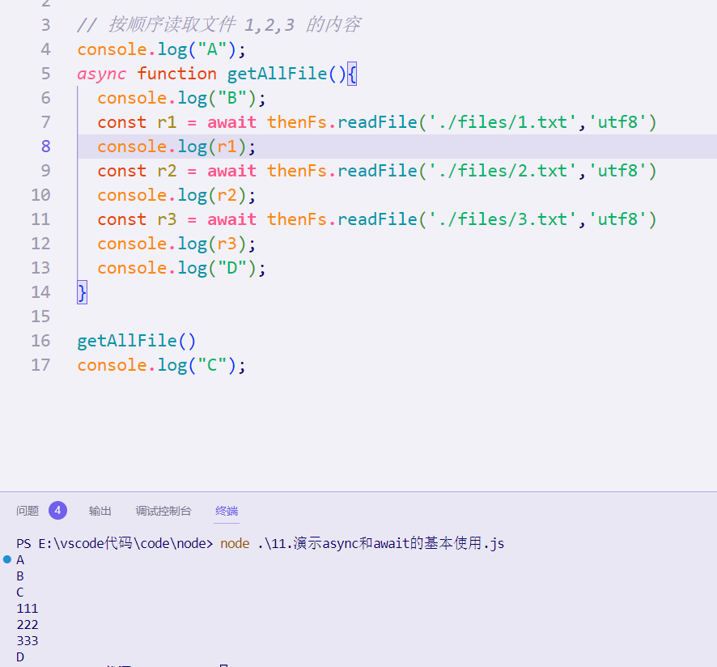
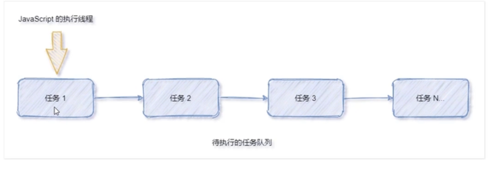
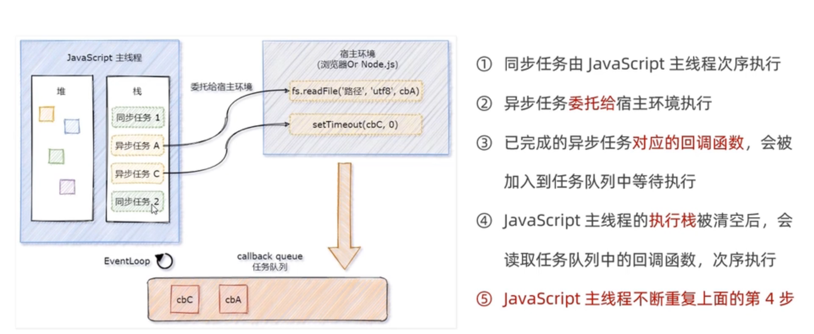
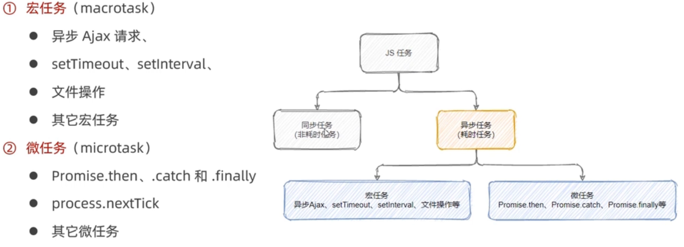
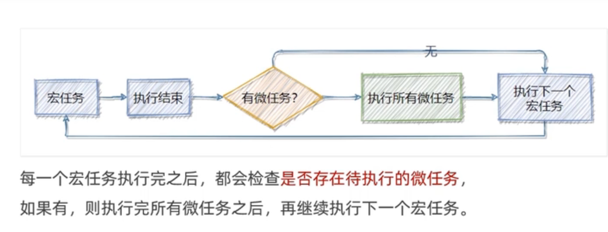
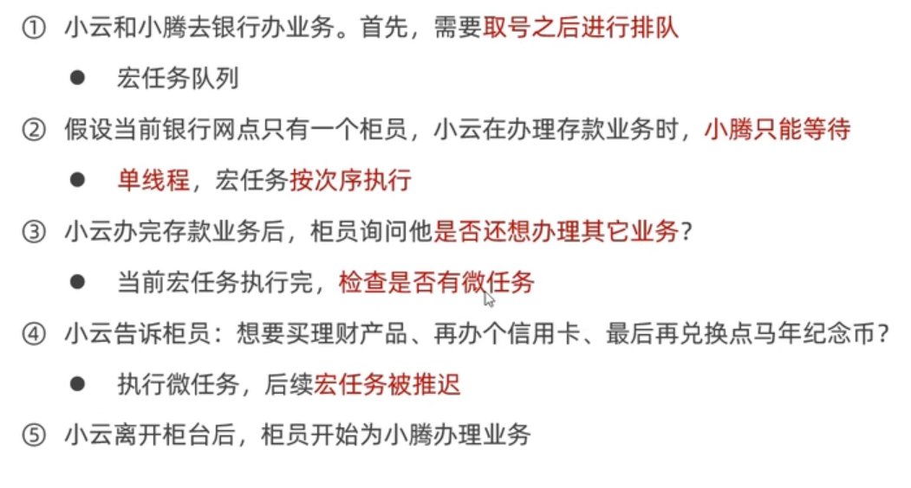

javascript介绍

### javascript是什么

>  javascript是一门编程语言，可以实现很多的网页交互效果。

1. ##### javascript书写位置

   1. 内联

      ```js
      例:
      <input type="button"  value="点击" onclick="alert(1)" />
      ```

   2. 内嵌 - 写到</body>标签上方
   3. 外部 - 通过src引入html页面中，但是<script>标签不要写内容
   
2. ##### javascript的注释

   1. 单行注释 //
   2. 多行注释 /**/

3. ##### javascript的结束符

   1. 分号;	可加可不加
   2. 注意换行默认为结束符

4. ##### java输入输出语句

   1. ```js
      输入语法：prompt()
      输出语法：
      alert() 
      //页面弹出警告对话框
      document.write()
      //向body内输出内容，如果输出的内容写的是标签，也会被解析成网页元素
      console.log()
      //控制台输出语法，程序员调试使用
      ```

5. 字面量：在计算机科学中，字面量（literal）是在计算机中描述事/物

   - 123 是数字字面量
   - ’黑马程序员‘ 字符串字面量

### 变量

1. 变量的理解
   
   - 一个容器，用来存放数据
2. 变量的本质
   
   - 变量是内存空间里的一块空间，用来存储数据
3. 变量的声明和赋值
   
   - 变量通过let来声明 通过 = 实现赋值
4. 变量通过变量名来获取里面的数据(例)

   ```js
   // 声明了一个变量，里面存放了28这个数据
   let age = 18
   //变量里的数据发生变化更改为19
   age = 19
   // 页面输出的结果为19
   document.write(age)
   ```

5. 变量是怎么使用的

   - 声明变量本质是去内存申请空间

6. 变量的命名规范

   1. 规则:
      - 不能使用关键字
      - 只能用下划线
      - 字母严格**区分大小写**
   2. 规范：
      - 起名有意义
      - 遵守小驼峰命名法
        - 第一个单词首字母小写，后每个单词首字母大写。例：userName

7. `let`和`var`的区别：

   - var

     1. **在非严格模式 (non-strict mode) 下的`var` 或者函数声明时**

        ```js
        
        	通过`var`声明的变量或者非严格模式下 (non-strict mode) 创建的函数声明没有块级作用域。在语句块里声明的变量的作用域不仅是其所在的函数或者 script 标签内，`所设置变量的影响会在超出语句块本身之外持续存在`
        
        ```

     2. 使用var声明的变量，其[作用域](https://so.csdn.net/so/search?q=作用域&spm=1001.2101.3001.7020)为该语句所在的函数内，且存在变量提升现象；

   - let

     1. 使用let声明的变量，其作用域为该语句所在的代码块内，不存在变量提升；
     2. let不允许在相同作用域内，重复声明同一个变量
     3. ==使用let 声明的变量在块级作用域内能强制执行更新变量==

8. 数组

   ```js
   1.声明语法
   let 数组名 = [数据1，数据2,..., 数据n]
   // 在数组中，数据的编号也叫索引或下标
   
   2.取值语法
   数组名[下标]
   ```

### 数据类型

> JS数据类型整体分为两大类：

#### **基本数据类型**

- number 数字型

- string 字符串型

  - **通过单引号、双引号或反引号(``)包裹的数据都叫字符串**

  - 注意事项：

    1. 单/双引号可互相嵌套，但是不以自己嵌套自己（口诀：外双内单，或者外单内双）
    2. 必要时可使用转义字符 \,输出单引号或双引号

  - 字符串拼接：+

  - **模板字符串**

    ```js
    ``
    // 介绍:
    	模板字符串相当于加强版的字符串，用反引号 ,除了作为普通字符串，还可以用来定义多行字符串，还可以在字符串中加入变量和表达式
    	`模板字符串中的换行和空格都是会被保留的`
    
    ```

    1. 作用

       - 拼接字符串和变量

       - 简化字符串拼接

         ```js
         //	字符串插入变量和表达式。`
           `变量名写在 ${} 中，${} 中可以放入 JavaScript 表达式。`
         ```

    2. 符号

       - ``

       - 内容拼接变量时，用${}包住变量

#### boolean 布尔型

> 
>
> null和undefined默认为false

#### undefined 未定义型

- 只声明变量，不赋值的情况下，变量的默认值为undefined
- 工作中使用场景：判断用户是否有数据传递过来

#### null 空类型

- null 和 undefined 区别：
  1. undefined 表示没有赋值
  2. null 表示赋值了，但是内容为空
- null开发使用场景：
  - 官方：把null作为尚未创建的对象
  - 通俗：将来有个变量里面存放的是一个对象，但是对象还没创建好，可以先给个null

#### Symbol

> *Symbol 是 ES6 引入了一种新的原始数据类型，表示独一无二的值*

#### **(复杂)引用数据类型**

- Object
  
- 在 JavaScript 中，几乎所有的对象都是 `Object` 类型的实例，它们都会从 `Object.prototype` 继承属性和方法，虽然大部分属性都会被覆盖（shadowed）或者说被重写了（overridden）。
  
- function
- array(数组)
- 还有两个特殊的对象：正则（RegExp）和日期（Date）

- 不同数据类型的存储方式 

  ```js
  // 简单数据类型存储值
  // 对象 是引用数据类型 栈里面存储的
  ```


### **数据类型检测及转换**

#### 检测数据类型

- 通过typeof关键字检测数据类型

#### 类型转换

- **隐式转换**：某些运算符被执行时，系统内部自动将数据类型进行转换，这种转换称为隐式转换

  1. **规则**：

     - +号两边只要有一个是字符串，都会把另外一个转换成字符串型

     - 除了+以外的算术运算符 比如 - * / 等都会把数据类型转换成数字类型

  2. **缺点：**

     - 转换类型不明确，靠经验才能总结

  3. **小技巧：**

     - +号作为正号解析可以转换成Number


#### **显示转换**

- **概念：**自己写代码告诉系统该转成什么类型

- **转换为数字型**

  ```js
  Number(数据)
  /*
      转成数字类型
      如果字符串内容里有非数字，转换失败时结果为 NaN（Not a Number）即不是一个数字
      NaN也是number类型的数据，代表非数字
  */
  parselnt(数据)
  //只保留整数
  parseFloat(数据)
  //可以保留小数
  
  //区别：
  //1.Number() 只能放数字类型的字符，不能放abc这样的字母
  //2.parseFloat 经常用于过滤单位
  ```

- 转换为字符串

  ```js
  String()
  变量.toString() //括号里可跟进制(填写要转换成的进制数字)
  ```

- 转换大小写

  ```js
  toLowerCase()
  //此方法返回所有字符都为小写的字符串。
  
  toUpperCase()
  //此方法返回所有字符均为大写的字符串。
  `注意:以上两方法在不影响 的值的情况下返回了一个新字符串`
  ```


### **js 截取字符串的方法**：

1. ` substring() `

   > `语法：string.substring(`from`, to)`

   - 功能：用于提取字符串中介于两个指定下标之间的字符；
   - string.substring(from, to) 方法从 from 位置截取到 to 位置，to 可选，没有设置时默认到末尾。

2. `substr()`

   > `语法：string.substr(`start`,length)`

   - 功能：可在字符串中抽取从开始下标开始的指定数目的字符；
   - length：可选。子串中的字符数，必须是数值。 	如果省略了该参数，那么返回从 stringObject 的开始位置到结尾的字串。

3. `split()`

   > `语法：string.split(separator,limit)`

   - separator：可选。字符串或正则表达式，从该参数指定的地方分割 string Object。
     		   如果把空字符串 ("") 用作 separator，那么 stringObject 中的每个字符之间都会被分割。
   - limit：   可选。该参数可指定返回的数组的最大长度。
     		   如果设置了该参数，返回的子串不会多于这个参数指定的数组。
       		   如果没有设置该参数，整个字符串都会被分割，不考虑它的长度。

   ```js
   var str = "123,456,789";
    
   console.log(str.split('')); // ["1", "2", "3", ",", "4", "5", "6", ",", "7", "8", "9"]
   console.log(str.split(',')); // ["123", "456", "789"]
   ```

   **注意： split() 方法不改变原始字符串。**

4. `join()`

   > `语法：array.join(separator)`

   - 功能：用于把数组中的所有元素转换一个字符串；
   - separator：可选，指定要使用的分隔符。如果省略该参数，则使用逗号作为分隔符。

   ```js
   var str = [123,456,789];
    
   console.log(str.join('')); // 123456789
   console.log(str.join(',')); // 123,456,789
   ```

5. `charAt`

   > 语法：string.charAt(index)

   - 功能：返回指定位置的字符；
   - index：必需。表示字符串中某个位置的数字，即字符在字符串中的位置。(索引从0开始)	

- javascript中使用表单、priority获取过来的数据默认是字符串类型的，此时就不能直接简单的进行加法运算


### 常量

- js中有5种常量
  1. 整型常量，其实就是正数；
  2. 实型常量，其实就是小数；
  3. 字符串常量，其实就是用单引号或者双引号括起来的内容；
  4. 布尔常量；
  5. 自定义常量，使用“const 常量名称 = 常量取值;”语句定义

### 表达式

JavaScript 有以下表达式类型：

- 算数：得出一个数字，例如 3.14159。（通常使用[算数运算符](https://developer.mozilla.org/zh-CN/docs/Web/JavaScript/Guide/Expressions_and_Operators#算术运算符)）
- 字符串：得出一个字符串，例如，"Fred" 或 "234"。（通常使用[字符串运算符](https://developer.mozilla.org/zh-CN/docs/Web/JavaScript/Guide/Expressions_and_Operators#字符串运算符)。）
- 逻辑值：得出 true 或者 false。（经常涉及到[逻辑运算符](https://developer.mozilla.org/zh-CN/docs/Web/JavaScript/Guide/Expressions_and_Operators#逻辑运算符)。）
- 基本表达式：javascript 中基本的关键字和一般表达式。
- 左值表达式：分配给左值。

### 运算符

- 算数运算符

  ```js
  +：求和
  -：求差
  *：求积
  /：求商
  %：取模（取余数）
  
  //js中优先级相同时以从左向	右执行
  //优先级
  乘、除、取余优先级相同
  加、减优先级相同
  先乘除、后加减，有括号先算括号里
  ```

  - 二元运算符：例`10 + 20`

  - 一元运算符：++、--、！

    - 自增运算符：
      - 前自增`++i`：先自增后运算
      - 后自增`i++`：先运算后自增
      - > 补充：自增/自减运算符有隐式转换的特点
  
  - 赋值运算符：`=`
  
  - 比较运算符（常用）：
  
    ```js
    ==
    // 左右两边是否相等
        
    ===
    // 左右两边是否数据类型和值都相等
        
    !==
    //左右两边是否不全等
    
    // 比较类型为boolean类型，即只会返回true或false
    ```
  
    - 比较运算符的细节
      - NaN不等于任何值，包括它本身
      - 尽量不要比较小数，因为小数有精度问题
      - 不同类型之间比较会发生隐式转换
  
  - 逻辑运算符
  
    1. 逻辑运算符里的短路
  
       - 短路：只存在于&&和||中，当满足一定条件会让右边代码不执行
  
         ```js
         &&	
         //左边为false就短路
         ||	
         //左边为true就短路
         // 原因：通过左边能得到整个式子的结果，因此没必要判断右边
             
         //有5个值是当false来看
            	false 数字0 '' undefined null
         ```
  
  - 运算符优先级
  
    -  一元运算符里的==逻辑非优先级很高==
    -  逻辑与比逻辑或优先级高

### for循环

- ```js
  //语法
  for (起始值; 循环条件; 变化值) {
      
      循环体
  }
  ```

- for 循环嵌套

  ```js
  for ( ; ; ) {
      for ( ; ;) {
          
      }
  }
  ```

### 数组

- 基本用法

  1. 

     ```js
     //声明语法
     let 数组名 = [数据1,数据2, ..., 数据n]
     //例
     let names = ['小明','小刚','小红','小丽']
     ```

     - 在数组中，数组的编号也叫**索引或下标**

     - 数组可以存储任意类型的数据

  1. 

     ```js
     //取值语法
     数组名[下标]
     ```

  1. 一些术语：

     - 元素：数组中保存的每个数据都叫数组元素

     - 下标：数组中数据的编号

     - 长度：数组中数据的个数，通过数组的`length`属性获得

       - ```js
         //获取长度语法
         数组名.length
         ```

  1. 遍历数组：用循环把数组中每个元素都访问到，一般会用到for循环遍历数组

     ```js
     //语法
     for (let i = 0; i< 数组名.length; i++) {
         数组名[i]
     }
     ```

- 操作数组

  - 数组的本质就是数据集合，操作数据就是 **增 删 改 查** 语法：

    ```js
    //查询数组数据
    数组[下标] //或称为访问数组数据
    
    //改
    数组[下标] = 新值
    
    //增
    数组.push(新增的内容) //在结尾增
    数组.unshift(新增的内容) //在开头增
    
    //删除数组中的数据
    数组.pop() //删除最后一个
    数组.shift() //删除第一个
    数组.splice(起始位置的索引,删除的个数) //删除指定元素
    ```
    
    - `数组.splice`补充
    
      ```js
      //	2.插入操作：执行插入操作时，第二个参数deleteCount传入0即可；
      let arr = ["I", "study", "JavaScript"];
      
      // 从索引 2 开始
      // 删除 0 个元素
      // 然后插入 "complex" 和 "language"
      arr.splice(2, 0, "complex", "language");
      
      //	3.替换操作：执行替换操作时，第二个参数为要被替换的元素个数，后面跟上要替换的deleteCount个元素即可；
       let arr = [1,2,6,7,5]
      
       arr.splice(2,2,3,4) //将从下标2开始（包括2）的2个元素替换为3，4
      
      ```
    
  
- `常用Array对象方法`

  - `join()`

    > 定义和用法:join() 方法用于把数组中的所有元素转换一个字符串。
    >
    > 元素是通过指定的分隔符进行分隔的。

    ```js
    //语法
    array.join(separator)
    
    //参数值
    separator //可选。指定要使用的分隔符。如果省略该参数，则使用逗号作为分隔符。.
    
    //返回值
    String类型 //返回一个字符串。该字符串是通过把 arrayObject 的每个元素转换为字符串，然后把这些字符串连接起来，在两个元素之间插入 separator 字符串而生成的。data
    
    ```

### 函数

#### 概念：function，是被设计为**执行特定任务**的代码块

```js
// 声明语法
function 函数名() {
    函数体
}

// 例
function sayHi() {
    document.rite("hai~~")
}
```

#### 好处：简化代码

#### 函数名命名规范

- 和变量命名基本一致

- 尽量小驼峰式命名法

- 前缀应该为动词

- 命名建议：常用动词约定

  ```js
  // 例
  function getName() {}
  function addSquares() {}
  ```

  

#### 函数调用语法

```js
函数名 ()
```

#### 函数传参

- 有参数的函数声明和调用

  ```js
  // 声明语法
  function 函数名(参数列表) {
      函数体
  }
  
  // 调用语法
  函数名(传递的参数列表)
  // 例
  getSquare(8)
  getSum(10,20)
  ```


#### 参数

- 形参和实参

  - 形参：声明函数时写在函数名右边小括号里的叫形参（形式上的参数）
  - 实参：调用函数时写在函数名右边小括号里的叫实参（实际上的参数）
    - ==实参也可放变量==
  - **形参可理解为**在函数内声明的**变量**（比如 num1 = 10）实参可理解为给这个变量赋值
  - **开发中尽量保持形参和实参个数一致**

#### 函数传参

> JavaScript函数的传参形式有以下几种：

1. **位置参数**：这是最常见的一种传参形式，函数参数按照它们在函数定义中的顺序传递。例如：

   ```js
   function multiply(a, b) {
     return a * b;
   }
   
   multiply(2, 3); // 6
   
   ```

2. **默认参数**：函数参数可以有默认值，如果没有传入相应的参数，则使用默认值。例如：

   ```js
   function greet(name = 'World') {
     console.log(`Hello, ${name}!`);
   }
   
   greet(); // Hello, World!
   greet('Alice'); // Hello, Alice!
   
   ```

3. 剩余参数：可以使用剩余参数（rest parameters）来传递任意数量的参数。剩余参数是一个数组，包含了所有剩余的参数。例如：

   ```js
   
   function sum(...numbers) {
     return numbers.reduce((acc, cur) => acc + cur, 0);
   }
   
   sum(1, 2, 3); // 6
   sum(4, 5, 6, 7); // 22
   
   ```

   

4. 对象解构：可以使用对象解构（object destructuring）来传递具有多个属性的对象。例如：

   ```js
   function printUser({ name, age }) {
     console.log(`Name: ${name}, Age: ${age}`);
   }
   
   const user = { name: 'Alice', age: 30 };
   printUser(user); // Name: Alice, Age: 30
   
   ```


#### 函数返回值

```js
// 语法
return 数据

//注意事项
1.在函数体中使用 return 关键字能将内部的执行结果交给函数外部使用
2.函数内部只能出现一次 return ，并且 return 后面代码不会再被执行，所以 return 后面的数据不要换行写
3. return 会立即结束当前函数
4.函数可以没有 return ，此情况函数默认返回值为 undefined
5.在函数中可以使用 return 语句将一个值（函数的运行结果）返回给调用函数的程序，这个值可以是任何类型，例如数组、对象、字符串等
	
```

#### 作用域

- 释义：**代码的范围内是可用的**（在哪个区域内起作用）

- 分类

  - **全局作用域**：作用于所有代码执行的环境（整个 script 标签内部）或者一个独立的js文件
  - **局部作用域**：作用于函数内的代码环境，就是局部作用域。因为跟函数有关系，所以也称为函数作用域。
  - **块级作用域**：块作用域由 {} 包括，if语句和for语句里面的{}等

- 变量的作用域：在js中，根据作用域的不同，变量可以分为

  - **全局变量**：函数外部 let 的变量 （**全局变量在任何区域都可以访问和修改**）

  - **局部变量**：函数内部 let 的变量 （**局部变量只能在当前函数内部访问和修改**）

  - **块级变量**：{} 内部的 let 变量 （let 定义的变量，只能在块级作用域里访问，不能跨块访问，也不能跨函数访问）

  - ```js
    //注意事项
    如果函数内部或者块级作用域内部，变量没有声明，直接赋值，也当全局变量看（不推荐）
    但是有一种情况，函数内部的形参可以看做是局部变量
    ```

  - **变量访问原则-作用域链**

    - 只要是代码，就至少有一个作用域
    - 写在函数内部的局部作用域
    - 如果函数中还有函数，那么在这个作用域中就又可以诞生一个作用域
      - ==就近原则==
      
        > 当在作用域内访问 变量/方法 的时候，会找离自己最近的那个 变量/方法 （就近原则）
    - 根据在内部函数可以访问外部函数变量的这种机制，用链式查找决定哪些数据能够被内部函数访问，就称作**作用域链**

#### **预解析**

> 概念:JavaScript 代码是由浏览器中的 JavaScript 解析器来执行的。JavaScript 解析器在运行 JavaScript 代码的时候分为两步：***预解析***和***代码执行***。

- 预解析：在当前作用域下, JS 代码执行之前，浏览器会默认把带有 var 和 function 声明的变量在内存中进行提前声明或者定义。

  - **预解析会把变量和函数的声明在代码执行之前执行完成。**

- 代码执行： 从上到下执行JS语句。

-  变量预解析(==变量提升==)

  ```js
  预解析也叫做变量、函数提升。
  `变量提升（变量预解析）： 变量的声明会被提升到当前作用域的最上面，变量的赋值不会提升`
  ```

- 函数预解析

  ```js
  `函数提升： 函数的声明会被提升到当前作用域的最上面，但是不会调用函数。``
  ```

-  函数表达式声明函数问题

  ```js
  //注意:fn是变量只是这里赋值给的是函数而已，而赋值操作不会被预解析
  
  fn();
  var fn = function() {
      console.log('想不到吧');
  }
  //结果：报错提示 ”fn is not a function"
  ```


#### 匿名函数

> 匿名函数常用场景

- 匿名函数

   ```js
   // 语法
   function() {}
   ```

   

- 函数表达式（将匿名函数赋值给一个变量，并且通过变量名称进行调用 我们将这个称为函数表达式）

   ```js
   // 语法：
   let 变量名 = function () {
       // 函数体
   }
   
   // 调用：
   函数名()	
   ```

- 立即执行函数

   - 作用：避免变量污染

      ```js
      // 语法
      // 方式一
      (function (形参) { console.log(11) })(实参);
      
      // 方式二
      (function (形参) { console.log(11) }(实参))
      // 不需要调用，立即执行
      ```

      

      > 注意：多个立即执行函数要用`;`隔开,==立即函数前面必须加分号==

#### **构造函数**

> 用来创建对象的函数，称为构造函数(构造器),用来定义构造函数，模拟类的定义

```js
function 构造函数名{
this.属性名 = 属性值;
this.方法名 = function(){方法定义};
}

//	调用构造函数，创建对象：
var 对象名 = new 构造函数名();
```

- **this关键字**

  > this指向:因为函数在js中既可以当做值传递和返回，也可当做对象和构造函数，所有函数在运行时需要确定其当前的运行环境，this就出生了，所以，this会根据运行环境的改变而改变，同时，函数中的this也只能在运行时才能最终确定运行环境

  1. 函数中的this，表示调用函数的当前对象
  2. 构造函数中的this，表示将来new出来的**当前对象**(实例)
  3. 事件绑定的匿名回调函数中的this，表示事件源（发生事件的元素）
  4. **1：this永远指向一个对象；**

     **2：this的指向完全取决于函数调用的位置**

### 对象

- 对象介绍：

  - 是一种数据类型

  - 无序的数据的集合

- 特点：

  - 无序的数据的集合

  - 可以详细的描述某个事物

1. **对象语法**

   ```js
   let 对象名 = { // 声明
       属性名： 属性值,
       方法名: function(){}
   }
   
   ```

2. **对象由属性和方法组成**

   - 属性：信息或叫特征（名词）。比如 手机尺寸、颜色、重量等
   - 方法：功能或叫行为（动词）。比如 手机打电话、发短信、玩游戏等

3. **属性**：数据描述性的信息，如人的姓名、身高、年龄等，一般都是名词性

   - 属性成对出现
   - 多个属性之间使用英文`,`分隔
   - 属性就是依附在对象上的变量（外面是变量，对象内是属性）
   - 属性名是特殊符号（如空格、中隔线）时使用`""`或`''`

4. **对象访问属性**

   ```js
   // 语法
   // 方式一：
   对象名.属性名
   
   // 方式二：
   对象名['属性名']
   ```

5. **对象中的方法**：行为性的信息称为方法，如跑步、唱歌等，一般是动词性，本质是函数

   1. 方法是由方法名和函数两部分构成，它们之间使用`:`分隔
   2. 多个属性之间使用英文`,`分隔
   3. 方法是依附在对象中的函数
   4. 方法名不能是特殊符号（如空格、中隔线）

6. **对象中的方法访问**：声明对象，并添加了若干方法后，可以使用`.`调用对象中的函数，称之为**方法调用**

   ```js
   // 语法
   对象名.方法名()
   ```

7. **操作对象**：

   ```js
   // 查
   对象名.属性名 或 对象['属性名']
   对象名.方法()
   
   // 改
   对象名.属性名 = 值
   对象名.方法 = function(){}
   
   // 增（对象添加新的数据）
   对象名.新属性名 = 新值
   
   // 删除对象中的属性
   delete 对象名.属性名
   ```

8. **遍历对象**

   ```js
   // for in 循环语句
   // 语法
   for (let 变量名 in 对象名) {}
   
   例： 
   for (let k in obj) {
       console.log(k)	// 得到属性名
       console.log(obj[k])	// 得到属性值
   }
   ```

9. 数组和对象的关系：

   - 数组是一个特殊的对象，数组具有对象的所有性质；
   - 数组*可以*是一个有序的数据集合，而对象是无序的(因为数组是一个特殊的对象，所以如果按照对象的方法操作数组，那么数组也可以是无序的

10. 内置对象`Math`

    ```js
    // 方法有
    random：生成0-1（包括0不包括1）之间的随机数
    ceil：向上取整
    floor：向下取整
    max：找最小数
    pow：幂运算
    abs：绝对值
    round：就近取整（.5往大取整）返回的整数
    ```

11. 随机数

    ```js
    // 生成任意范围随机数(生成N~M之间的随机数)
    return Math.floor(Math.random() * (M - N + 1)) + N
    ```

12. **注释：**JavaScript 变量不是易变的。只有 JavaScript 对象如此。

13. 函数和方法的区别:

    1. 函数:直接调用的是函数
    2. 方法:通过对象调用的是方法

14. **创建对象的三种方式**

    ```js
    //	一：直接使用Object
        var person = new Object();
        person.name = “ysy”;
    
    //	二：使用构造函数，模拟类的定义
        function Person(){
        this.name = “ysy”;	`函数内的属性和方法前面需要添加 this ，表示当前对象的属性和方法`
        }
    
    //	三：使用对象字面量
        var stu = {
        name: “ysy”;
        };
    
    //创建空对象
    let obj = {};
    ```

15. **方法和调用**

    1. 方法是由方法名和函数两部分构成，它们之间使用 `:` 分隔
    2. 多个属性之间使用英文 `,` 分隔
    3. 方法是依附在对象中的函数
    4. 方法名可以使用 `""` 或 `''`，一般情况下省略，除非名称遇到特殊符号如空格、中横线等

16. **对象初始化**:一个对象初始化器，由花括号/大括号 (`{}`) 包含的一个由零个或多个对象属性名和其关联值组成的一个逗号分隔的列表构成

17. 函数和方法的区别

    - 函数和方法本质上是一样的，只不过方法是函数的特例，是将**函数**值赋给了**对象**

18. js对象和JSON对象的区别

    1. `JSON`对象的**属性名（key）必须被包含在双引号之中**，而JavaScript对象除了有空格的属性名、中间有连字符-的属性名必须在双引号之中外，其它随意
    2. **不能在JSON对象中定义方法**，而在`JavaScript对象`中可以
    3. **JSON对象可以被很多语言操作，而JavaScript对象只有JS自己可以识别**
    
19. JSON和JS对象的关系:JSON 是 JS 对象的字符串表示法。它使用文本表示一个 JS 对象的信息，（JSON）本质是一个字符串。


## ==Web API==

- 作用：就是使用JS去操作 html 和浏览器
- 分类：**DOM**(文档对象类型)、**BOM**(浏览器对象模型)

- **DOM**(Document Object Model——**文档对象模型**)

  - 释义：DOM是浏览器提供的一套专门用来**操作网页内容**的功能，可以开发网页内容特效和实现用户交互
  
  -  DOM完整的解析过程:
  
    ```js
    1.解析HTML结构。
    2.加载外部脚本和样式表文件。
    3.解析并执行脚本代码。//js之类的
    4.DOM树构建完成。//DOMContentLoaded
    5.加载图片等外部文件。
    6.页面加载完毕。//load
    //在第4步的时候DOMContentLoaded事件会被触发。
    //在第6步的时候load事件会被触发。
    
    ```
  
    


  - 作用：开发网页内容特效和实现用户交互


- **DOM树**

  - 将HTML文档以树状结构直观的表现出来，我们称为文档树或 DOM 树

  - 描述网页内容关系的名词

  - 作用：**文档树直观的体现了标签与标签之间的关系**

### **DOM对象（重要）**：

> 浏览器根据html标签生成的 **JS对象**

- DOM核心思想
  - 把网页内容当做**对象**来处理
  
- 所有的标签属性都可以在这个对象上面找到

- 修改这个对象的属性会自动映射到标签身上

- document 对象
    - 是 DOM 里提供的一个对象
    - 所以它提供的属性和方法都是**用来访问和操作网页内容的**
      - 例：document.write()
    - 网页所有内容都在document里面

### **获取dom对象**

1. 根据css选择器来获取dom元素（重点）

   1. 选择匹配的第一个元素

      ```js
      //	语法：
      	document.querySelector('css选择器')
      
      //	参数：
      	包含一个或多个有效的css选择器 字符串
      
      //	返回值
          css选择器匹配的第一个元素，一个HTMLELement（HTML 文档中任何可能的元素类型）对象。
          如果没有匹配到，则返回null
      ```

   2. 选择匹配的多个元素

      ```js
      //	语法：
      	document.querySelectorALL('css选择器')
      
      //	参数：
      	包含一个或多个有效的css选择器 字符串
          
      //	返回值：
          css选择器匹配的Nodelist（数组字面量） 对象
      ```

      - document.querySelectorALL('css选择器')`得到的是一个**伪数组**，
        - 有长度有索引号的数组
        - 但是没有 `pop()、push()`等数组方法，想要得到里面的每一个对象，则需要遍历（for）的方式获得。 
        - 注意：只有一个元素，通过`querySelectorALL`获取过来的也是一个**伪数组**，里面只有一个元素而已

2. 获取页面中的标签最常用的两种方式

   - `querySelectorALL`
   - `querySelector`

3. 二者区别：

   - `querySelector()`只能选择一个元素，可以直接操作
   - `querySelectorALL()`可以选择多个元素，得到的是伪数组，需要遍历得到每一个元素

4. 注意事项

   - 里面写css选择器
   - **必须是字符串，必须加引号**

### 修改DOM元素内容

- 设置/修改dom元素的3种方式

  - `document.write()方法`
  - `元素.innerText = 值`
  - ` 元素.innerHTML = 值（推荐使用）`

- 三者区别：

  ```js
  //	document.write()方法，只能追加到body中
  
  //	元素.innerText属性 只识别内容，不能解析标签
  
  //	元素.innerHTML属性	能够解析标签
  ```

  > ​	补充:

  1. `元素.innerHTML`:**也就是从对象的起始位置到终止位置的全部内容,包括Html标签**
  2. `test.innerText`:**从起始位置到终止位置的内容, 但它去除Html标签** 

### 设置/修改DOM元素属性

1. 设置/修改元素常用属性

   - 通过JS设置/修改标签元素属性，比如通过src更换 图片

   - 语法：`对象.属性 = 值`

     ```js
     //	例
     //	1. 获取元素
     	let pic = document.querySelector('img')
     //	2, 操作元素
         pic.src = './images/b02.jpg'
         pic.title = '这是一个图片'
     ```

2. 设置/修改元素**样式**属性

   - 通过 style 属性操作css

   - 语法：`对象.style.样式属性 = 值`

     ```js
     //	举例
     	let box = document.querySelector('元素选择器')
     	//	修改元素属性
             box.style.backgroundColor = 'red'
             box.style.width = '300px'
             box.style.marginTop = '50px'
     ```

     - **注意：**
       1. 修改样式通过style属性引出
       2. 如果属性有-连接符，需要转换为**小驼峰**命名法
       3. 赋值的时候，需要的时候不要忘加**css单位**

   - className和classList

     ```js
     className
     //	作用：可以同时修改多个样式
     //	注意事项：直接使用className赋值会覆盖以前的类名
     	
     classList
     //	追加一个类
     元素.classList.add('类名')
     //	删除一个类
     元素.classList.remove('类名')
     //	切换一个类
     元素.classList.toggle('类名')
     //	判断一个类是否存在,存在返回true,反则false
     元素.classList.contains('类名')
     ```

   - 设置/修改 表单元素 属性
   
     ```js
     //	获取：
     	DOM对象.属性名
     //	设置：
     	DOM对象.属性名 = 新值
     //	例
     	表单.value = '用户名'
     	表单.type = 'password'	// 密码不可见
     
     //	表单属性中添加就有效果，移除就没有效果，一律使用布尔值表示，如果为true 代表添加了该属性 如果为false 
     比如：disabled（不可用）、checked（选中）、selected
     //	例
     	checkbox.checked = true
     ```
     
   - `value`,`innerHTML`,`innerText`,`inner`属性的用法:
   
     ```js
     1.value属性
     //	用于获取表单 input 单选 复选 textarea select 
     
     2.innerHTML,innerText
     //	获取div span ul li 标签 有文字内容
     
     3.inner
     //	获取button里的内容
     ```
   

### **定时器-间歇函数**

1. 开启定时器

   ```js
   setInterval(函数，间隔时间)
   	//	作用：每隔一段时间调用这个函数
   	//	间隔时间单位是毫秒
   //	例
   function repeat() {
       console.log('到期我和我符合年轻')
   }
   //	每隔一秒调用repeat函数
   setInterval(repeat,1000)
   ```

2. 关闭定时器

   ```js
   let 变量名 = setInterval(函数,间隔时间)
   clearInterval(变量名)
   ```

### 事件

> 介绍：事件是在编程时系统内发生的**动作**或者发生的事情

> 温馨提示：只要是对象都可以添加事件


- **事件监听**：就是让程序检测是否有事件产生，一旦有事件触发，就立即调用一个函数做出响应，也称为 注册事件

- 语法：

    ```js
    元素.addEventListener('事件',要执行的函数)	//	这里的元素也就是事件源
    ```

- 事件监听三要素：

    ```js
    - 事件源（元素）：被事件触发的dom元素
    - 事件：用什么方式触发，比如鼠标单击 click、鼠标经过mouseover 等
    - 事件调用的函数：要做什么事
    ```

    

- > 注意事项：

      1. 事件类型要加**引号**
      2. **函数是点击之后再去执行，每次点击都会执行一次**

- **事件类型**

  - 鼠标事件（鼠标触发）
    - click	鼠标点击
    - mouseenter 鼠标经过
    - mouseleave 鼠标离开
    - mousemove 鼠标移动

  - 焦点事件（表单获得光标）
    - focus 获得焦点
    - blur 失去焦点
    - > change (离开表单并且值变化时触发)

      - onchange 事件会在域的内容改变时发生。
    
        onchange 事件也可用于单选框与复选框改变后触发的事件
    
  - 键盘事件（键盘触发）
    - keydown 键盘按下触发
    - Keyup 键盘抬起触发

  - 文本事件（表单输入触发）
    
    - input 用户输入事件(当表单里面值发生变化的时候触发)

- ==**事件是特殊的方法**==，基本一样，两个名词而言，事件这个名词只是更好的表述了自已的特性。

  > 程序员写一个函数且将该函数赋值给相应的事件

- 绑定事件的方式:

- 在JavaScript中，有三种常用的绑定事件的方法：

  1. 在DOM元素中直接绑定；
  2. 在JavaScript代码中绑定；
  3. 绑定事件监听函数。


### 高阶函数（了解）

- 高阶函数分为：

  1. 函数表达式

     - 函数也是 [数据]
     - 把函数赋值给变量

  2. 回调函数：

     - 把一个函数当做另外一个函数的参数传递，这个函数就是**回调函数**

     - 回调函数本质还是函数，只不过把他当成参数使用

     - 使用匿名函数作为回调函数参数比较常见

     - 常见使用场景：

       ```js
       function fn() {
           console.log('我是回调函数...')
       }
       //	fn传递给了setInterval,fn就是回调函数
       setInterval(fn,1000)  //	此处fn后面可以不加括号,回调函数会自动帮我们调用函数
       ```

     

### 环境对象（了解）

> 介绍：环境对象指的是函数内部特殊的**变量this**，它代表着当前函数运行时所处的环境

> 作用：弄清楚this的指向，可以让我们的代码更简洁

- 函数的调用方式不同，this 指代的对象也不同
- `[谁调用，this就是谁]`是判断this指向的粗略规则
- 直接调用函数，其实相当于是 `window.函数`，所以 this 指代 window


### 排他思想(了解)

> 介绍当前元素为A状态，其他元素为B状态

**使用：**

```js
1.	干掉所有人
	1.	使用for循环
2.	复活他自己
	1.	通过this或者下标找到自己或者对应的元素
```

## DOM节点

> 介绍:DOM树里的每一个内容都称之为节点

- 节点类型

  - ==元素节点==
    - 所有的标签 比如 body,div
    - html 是根节点
  - 属性节点
    - 所有的属性 比如 href
  - 文本节点
    - 所有的属性 比如 href
  - 文本节点
    - 所有的文本
  - 其他

### **查找节点**

> **针对查找节点返回的都是对象**

- 父节点查找:

  - `parentNode 属性`

  - 返回最近一级的父节点 找不到返回为null

  - 语法:

    ```js
    子元素.parentNode
    ```

  - 子节点查找:

    - childNodes

      - 获得所有子节点,包括文本节点(空格,换行),注释节点等

    - ==children(重点)==

      - 仅获得所有元素节点

      - 返回的还是一个伪数组

      - 语法:

        ```js
        父元素.children
        ```


  - 兄弟关系查找:

    - 下一个兄弟节点:`nextElementSibling 属性`
- 上一个兄弟节点:`previousElementSibling 属性`

### **创建节点**

- 即创建出一个新的网页元素,再添加到网页内,一般先创建节点,然后插入节点

- 创建元素节点方法:

  ```js
  //	创建一个新的元素节点
  document.createElement("标签名")
  ```


### **追加节点**

- 要想在界面看到追加的节点,还得插入到某个父元素中

- 插入到父元素的最后一个子元素:

  ```js
  //	插入到这个父元素的最后
  父元素.appendChild(要插入的元素)
  ```

- 插入到父元素中某个子元素的前面

  ```js
  //	插入到某个子元素的前面
  父元素.insertBefore(要插入的元素,在哪个元	素前面)
  ```

### **删除节点**

- 在javaScript原生DOM操作中,要删除元素必须通过**父元素删除**

  - **语法**

    ```js
    父元素.removeChild(要删除的元素)
    ```

- 通过remove方法删除节点(元素)

  > 注:

  - 如果不存在父子关系则删除不成功
  - 删除节点和隐藏节点(display:none) 的区别:前者从html中删除节点,后者,隐藏节点后实际还存在


### **`insertAdjacentHTML()`** 方法


   > 方法将指定的文本解析为 [`Element`](https://developer.mozilla.org/zh-CN/docs/Web/API/Element) 元素，并将结果节点插入到 DOM 树中的指定位置

   - 语法:

     ```js
     element.insertAdjacentHTML(position, text);
     ```

   - `position`

     > 一个 [`DOMString`](https://developer.mozilla.org/zh-CN/docs/Web/JavaScript/Reference/Global_Objects/String)，表示插入内容相对于元素的位置，并且必须是以下字符一：

     - `'beforebegin'`：元素自身的前面。
     - `'afterbegin'`：插入元素内部的第一个子节点之前。
     - `'beforeend'`：插入元素内部的最后一个子节点之后。
     - `'afterend'`：元素自身的后面。

   - `text`

     是要被解析为 HTML 或 XML 元素，并插入到 DOM 树中的 [`DOMString`](https://developer.mozilla.org/zh-CN/docs/Web/JavaScript/Reference/Global_Objects/String)


### 时间对象

- 实例化时间对象

  - 在代码中发现了new关键字时,一般将这个操作称为**实例化**

  - 创建一个时间对象并获取时间

    ```js
    //	获得当前时间
    let date = new Date()
    
    //	获得指定时间
    let date = new Date("1049-10-01")
    ```

- 时间对象方法

  |     方法      |        作用        |         说明         |
  | :-----------: | :----------------: | :------------------: |
  | getFullYear() |      获得年份      |    获取四位数年份    |
  |  gerMonth()   |      获得月份      |   **取值为 0~11**    |
  |    getDate    | 获取月份中的每一天 | 不同月份取值也不相同 |
  |   getDay()    |      获取星期      |    **取值为0~6**     |
  |  getHours()   |      获取小时      |      取值为0~23      |
  | gerMinutes()  |      获取分钟      |      取值为0~59      |
  | getSeconds()  |       获取秒       |      取值为0~59      |

- 时间戳

  > 解释:是指1970年01月01日00时00秒起至现在的毫秒数,它是一种特殊的计量时间的方式

  - 获取时间戳的3种方式:

    ```js
    //	1.使用getTime() 方法
    	//1.实例化
    	let date = new Date()
        //2.获取时间戳
        console.log(date.getTime())
    
    //	2.简写 +new Date()
    	console.log(+new Date())
    
    //	3.使用Date().now()
    	console.log(Date.now())
    	//	好处:无需实例化
    	//	但是只能得到当前的时间戳,而前面两种可以返回指定时间的时间戳
    ```


### 事件对象和属性

- 事件对象介绍

  - 事件对象也是个对象,这个对象里有事件触发时的相关信息

  - 例如:鼠标点击事件中,事件对象就存了鼠标点在哪个位置等信息

- 获取的方式

  - 在事件绑定的回调函数的第一个参数就是事件的对象

  - 一般命名为event,evt,e

    ```js
    元素.addEventListener("click",function(e){}) //	其中e就是事件对象
    ```

### **部分常用事件属性**

- type
  
  - 获取当前的事件类型
- pageX/pageY
  
  - 不受可视窗口的影响,可以获得页面中的坐标
- clientX/clientY
  
  - 获取光标相对于浏览器可见窗口左上角的位置,仅在当前可视区域内有效
- offsetX/offsetY
  
  - 获取光标相对于DOM元素左上角的位置
- key
  
- 用户按下键盘键的值
  
- target

  - `e.target`返回的是触发事件的对象（元素）

  - 定义:

    - target 属性规定哪个 DOM 元素触发了该事件。
      target 事件属性可返回事件的目标节点（触发该事件的节点），如生成事件的元素、文档或窗口。

  - 语法:

    ```js
    event.target
    
    event.target.nodeName 　　//获取事件触发元素标签名（li，p，div，img，button…）
    
    event.target.id　　　　　　//获取事件触发元素id
    
    event.target.className　　//获取事件触发元素classname
    
    event.target.innerHTML　 //获取事件触发元素的内容（li）
    
    ```
    
    > 解决兼容性问题:
    
    ```js
    var target = eve.target || eve.srcElement;
    
    var eve = eve || window.event
    ```
    
    

- `target`和`this`的区别:

  - `this`：哪个元素绑定了这个点击事件，就返回哪个元素；
  - `e.target`：点击了哪个元素，就返回哪个元素

### 事件流以及2个阶段(了解)

- 事件流:指的是事件完整执行过程中的流动路径

  > ​	说明:假设页面里有个div,当触发事件时,会经历两个阶段,分别是捕获阶段,冒泡阶段

- 2个阶段:捕获阶段是 从父到子 冒泡阶段是从子到父


- **事件冒泡概念:**当一个元素的事件被触发时,同样的事件将会在该元素的所有祖先元素中依次被触发.这一过程称为事件冒泡

  > ​	简单理解:当一个元素触发事件后,会依次向上调用所有父级元素的同名事件

- **事件捕获概念:**从DOM的根元素开始去执行对应的事件(从外到里)

  - 事件捕获需要写对应代码才能看见

    ```js
    DOM.addEventListener(事件类型,事件处理函数,是否使用捕获机制)
    ```

    > 说明:若传入false代表冒泡阶段触发,默认就是false

- 阻止事件流动

  - 语法

    ```js
    事件对象.stopPropagation()
    ```

    > ​	此方法可以阻止事件流动传播,不光在冒泡阶段有效,捕获阶段也有效

  - 鼠标经过事件:

    - mouseover 和 mouseout 会有冒泡效果
    - mouseenter 和 mouseleave 没有冒泡效果(推荐)

- 阻止默认行为

  - 阻止默认行为,比如链接点击不跳转,表单域的跳转

  - 语法:

    ```js
    e.preventDefault()
    ```

- **两种注册事件的区别**:

  - 传统on注册(L0)
    - 同一个对象,后面注册的事件会覆盖前面注册的事件(同一个事件)
    - 直接使用null覆盖就可以实现事件的解绑
    - 都是冒泡阶段执行的
  - 事件监听注册(L2)
    - 语法:addEventListener(事件类型,事件处理函数,是否使用捕获)
    - 后面注册的事件不会覆盖前面的
    - 可以通过第三个参数去确定是在冒泡或者捕获阶段执行
    - 必须使用remveEventListener(事件类型,事件处理函数,获取捕获或者冒泡阶段)
    - 匿名函数无法解绑


### 事件委托

- 事件委托是利用事件流的特征解决一些开发需求的只是技巧
- 总结:
  - **优点**:给父元素添加事件(可以提高性能)
  - **原理**:事件委托其实是利用事件冒泡的特点,给父元素添加事件,子元素可以触发
  - **实现**:`事件对象.target`可以获得真正触发事件的元素

### 滚动事件和加载事件

1. **滚动事件**

   - 当页面进行滚动时触发的事件

   - 事件名:`scroll`

   - 监听整个页面滚动:

     ```js
     //	页面滚动事件
     window.addEventListener('scroll',function(){
         //	执行的操作
     })
     	//	可以给window或document添加scroll事件
     ```

   - 监听某个元素的内部滚动直接给某个元素加即可

2. **加载事件**

   - `load`事件
     - 监听整个页面资源给window加
   - `DOMContenLoaded`
     - 给`document`加,当初始的HTML文档被完全加载和解析完成后,`DOMContentLoaded`事件被触发,而无需等待样式表,图像完全加载


### 元素大小和位置

1. **scroll家族**
   
   - 获取宽高:
     - 获取元素的内容总款高(不包含滚动条)返回值不带单位
     - scrollWidth和scrollHeight
   - 获取位置:
     - 获取元素内容往左,往上滚出去看不到的距离
     - **scrollLeft和scrollTop**
     - 这两个属性是可以**修改**的
   - 检测页面滚动的头部距离(被卷去的头部)
  - `document.documentElement.scrollTop`

2. **offset家族**
   - 获取宽高:
     - 获取元素的自身宽高,包含元素自身设置的宽高,padding,border
     - offsetWidth和offsetHeight
   - 获取位置:
     - 获取元素距离自己**定位父级**元素的左,上距离
     - **offsetLeft和offsetTop 注意是只读属性**

3. client家族

   - 获取宽高:

     - 获取元素的可见部分宽高(不包含边框,滚动条等)
     - clientWidth和clientHeight

   - 会在窗口尺寸改变的时候触发事件:

     - resize

       ```js
       window.addEventListener('resize',function(){
           //	执行的代码
       })
       
       ```

     - 检测屏幕宽度:

       ```js
       window.addEventListener('resize',function(){
           let w = document.documentElement.clientWidth
           console.log(w)
       })
       ```

### Window对象

> <!--window 对象是 BOM 的核心，用来表示当前浏览器窗口，其中提供了一系列用来操作或访问浏览器的方法和属性。另外，JavaScript 中的所有全局对象(变量)、函数以及变量也都属于 window 对象-->

- BOM(Browser Object Model)是浏览器对象模型

  - window
    - navigator
    - location
    - document
    - history
    - screen

- window是浏览器内置中的全局对象,我们所学习的所有Web APIS的知识内容都是基于window对象实现的

- window对象下包含的五个属性,即所谓的BOM(浏览器对象模型)

- document是实现DOM的基础,它其实是依附于window的属性

  > 注:依附于window对象的所有属性和方法,使用时可以省略window

- ##### window对象的常见属性

  - **定时器-延时函数**

    - **setTimeout**:js内置的一个来让代码延迟执行的函数

    - 语法:

      ```js
      setTimeout(回调函数,等待的毫秒数)
      ```

    - setTimeout仅仅只执行一次,平时省略window

      ```js
      let timer = setTimeout(回调函数,等待的毫秒数)
      clearTimeout(timer)
      ```

    - setlnterval和setTimeout的区别
  
      - setlnterval的特征是重复执行,首次执行会延时
      - setTimeout的特征是延时执行,只执行一次
      - setTimeout结合递归函数,能模拟setinterval重复执行
      - clearTimeout清除由setTimeout创建的定时任务
  
    - 递归函数:自己调用自己就是递归函数
  
  - - 1. 1. 
  
  - **location对象**
  
    - location的数据类型是对象,它拆分并保存了URL地址的各个组成部分
    - **常用属性和方法:**
      - **href**属性获取完整的URL地址,对其赋值时用于地址的跳转
      - search属性获取地址中携带的参数,符号 ? 后面部分
      - **hash**属性获取地址中的哈希值,符号 # 后面部分
      - reload方法用来刷新当前页面,传入参数true时表示强势刷新
  
  - navigator对象:该对象记录了浏览器自身的相关信息
  
    - 常用属性和方法:通过userAgent检测浏览器的版本及平台
  
  - histroy对象
  
    - history的数据类型是对象,该对象与浏览器地址栏的操作相对应,如前进,后退,历史记录等
  
    - 常用方法和属性:
  
      | history对象方法 | 作用                |
      | --------------- | ------------------- |
      | back()          | 后退                |
      | forward()       | 前进                |
      | go(参数)        | 前进后退功能(1或-1) |

### swiper插件:套用轮播图

### 本地存储

- 本地存储特性:

  1. 数据存储在用户浏览器中

  1. 设置,读取方便,甚至页面刷新不丢失数据

  1. 容量较大,sessionStorage和**localStorage**约5M左右

- **localStorage**

  1. 生命周期永久有效,除非手动删除 否则关闭页面也会存在

  2. 可以多窗口(页面)共享(统一浏览器可以共享)

  3. 以键值对的形式存储使用

  4. ```js
     //	存储数据
     localStorage.setltem('键','值')
     
     //	获取数据
     localStorage.getltem('键')
     
     //	删除数据
     localStorage.removeItem('键')
     
     //修改数据
     3、改：
     修改localStorage的方法与新增的方法一样，为已经存在的key值继续添加value值，新添加的会覆盖之前的，从而达到修改的效果；
     
     `存储复杂数据类型存储`
     	本地只能存储字符串,无法存储复杂数据类型,需要将复杂数据类型转换成JSON字符串,再存到本地
     
     `**JSON.stringify(复杂数据类型)**`
         将复杂数据转换成JSON字符串 存储 本地存储中
     
     `**JSON.parse(JSON字符串)**
     `将JSON字符串转换成对象 取出 时候使用
     ```

- sessionStorage(了解)

  1. 生命周期为关闭浏览器窗口
  2. 在 同一个窗口(页面)下数据可以共享
  3. 以键值对的形式存储使用
  4. 用法跟localStorage基本相同

- > 拓展:h5自定义属性

  - data-自定义属性:

    ```js
    `在标签上一律以data-开头`
    `在DOM对象上一律以dataset对象方式获取`
    例:
    	<div class="box" data-id="10"></div>
    获取: box.dataset.id
    ```

### 正则表达式

- 正则表达式(Regular Expression)是**用于匹配字符串中字符组合的模式**,在js中,正则表达式也是对象

- 作用:

  - 表单验证(匹配)
  - 过滤敏感词(替换

- 创建正则表达式

  ```js
  //1.通过调用RegExp对象的构造函数创建
  var 变量名 = new RegExp(/表达式/);
  //或者 new RegExp("正则表达式","匹配模式");
  var reg = new RegExp('\\bare\\b','g');
  
  //2,通过字面量创建
  var 变量名 = /表达式/;
  ```

  > 补充:正则表达式里面不需要加引号,不管是数字还是字符串

- 测试正则表达式 `test`

  ```js
  //	判断是否有符合规则的字符串:
  `test()方法 用来查看正则表达式与指定的字符串是否匹配,返回的是布尔值`
  reg.test(str)
  
  1.reg 是写的正则表达式
  2.str 我们要测试的文本
  3.就是检测str文本是否复合我们写的正则表达式规范
  ```

  - ``exec()方法用于检索(查找)复合规则的字符串,找到返回数组,否则返回nall`

    -  修饰符 g 的使用:

      > 当使用了 g 修饰符，每次调用 exec()方法后，如果匹配到了字符串，则 **lastIndex**属性的值会改变。
      >  而没有使用 g 修饰符，每次调用exec()方法后，lastIndex值永远都为0 ，所以每次调用exec()最多只会检索出一个相同的字符。

- 正则表达式分为两步:

  - 定义正则表达式
  - 检测查找是否匹配

- **元字符**

  - 普通字符:例如所有的字母和数字,只能够匹配字符串中与他们相同的字符

  - 元字符(特殊字符)

    - 比如:`^`,`.`或`*`等

    - 元字符写法:[a-z]

      > 参考文档:

      - MDN:https://developer.mozilla.org/zh-CN/docs/Web/javaScript/Guide/Regular_Expressions
      - 正则测试工具:http://tool.oschina.net/regex

  - 分类:

    - ==边界符(表示位置,开头和结尾,必须用什么开头,用什么结尾)==

      | 边界符 | 说明                                                     |
      | ------ | -------------------------------------------------------- |
      | ^      | 表示匹配行首的文本(以谁开始)<!--^在[]外面才表示边界符--> |
      | $      | 表示匹配行尾的文本*(以谁结束)                            |

      > 如果^和$在一起,表示必须是精确匹配(要求只有一个字符)

      ```js
      //	例:
      var reg1 = /^abc$/;	//精确匹配 要求必须是 abc字符串开头和结尾才符合规范
            console.log(reg.test("abc")); //true
            console.log(reg.test("abcd")); //false
            console.log(reg.test("aabcd")); //false
            console.log(reg.test("abcabc")); //false
      ```
    
      
    
    - 量词(表示重复次数)

       > 量词用来**设定某个模式出现的次数**

       | 量词  | 说明                          |
       | ----- | ----------------------------- |
       | *     | 匹配`*`前面的字符零次或更多次 |
       | +     | 匹配`+`前面的字符一次或更多次 |
       | ?     | 匹配`?`前面的字符零次或一次   |
       | {n}   | 匹配`{}`前面的字符n次         |
       | {n,}  | 匹配`{}`前面的字符最少n次     |
       | {n,m} | 匹配`{}`前面的字符n~m次       |
    
       > 注意:逗号两侧不能出现空格
    
    - 字符类(**字符集**)(比如 \d 表示 0-9)
    
       1. `[] 方括号` [表示有一系列字符可供选择,只要匹配其中一个就可以了.**所有可供选择的字符都放在括号内**
    
          ```js
          //后面的字符串只要包含abc中任意一个字符,都返回true
          console.log(/[abc]/).test('andy'))	//true
          
          var rg1 = /^[abc]$/; //三选一 只有是a或或c才true
                console.log(rg1.test("aa"));	//false
                console.log(rg1.test("b"));
          //true
          ```
    
       2. `-`方括号内部 范围符-
    
          ```js
          /^[a-z]$/.test('c')
          //方括号内部加上 - 表示`范围`
          ```
    
       3. `[^]`方括号内部 取反符^
    
          ```js
          /[^abc]/.test('andy')	//true
          ```
    
       4. 字符组合
    
          ```js
          /[a-z1-9]/.test('andy')	//true
          //方括号内部使用字符组合
          ```
    
       3. 预定义:指的是**某些常见模式的简写方式**
    
          | 预定类 | 说明                                                    |
          | ------ | ------------------------------------------------------- |
          | \d     | 匹配0~9之间的任一数组,,相当于[0-9]                      |
          | \D     | 匹配所有0-9以外的字符,相当于[^0-9]                      |
          | \w     | 匹配任意的字母,数字和下划线,相当于[A-Za-z0-9_]          |
          | \W     | 出所有字母,数字和下划线以外的字符,相当于[^A-Za-z0-9_]   |
          | \s     | 匹配空格(包括换行符,制表符,空格符等),相当于[\t\r\n\v\f] |
          | \S     | 匹配非空格,相当于[^\t\r\n\v\f]                          |
       
    - 括号总结
    
       1. 中括号`[]`:匹配方括号中的任意字符
    
       2. 大括号`{}`:表示里面重复的次数
    
          ```js
          var reg = /^abc{3}$/; //它只是让c重复3次
          ```
    
       3. 小括号`()`:表示优先级
    
       >  补充:正则里面的或者
  
- `replace`替换

  - replace()方法可以实现替换字符串操作,用来替换的参数可以是一个字符串或者是一个正则表达式

    ```js
    stringObject.replace(regexp/substr,replacement)
    ```

    1. 第一个参数:被替换的字符串 或者 正则表达式
  2. 第二个: 替换为的字符串
    3. 返回值是一个替换完毕的新字符串

- **修饰符**

  - > 修饰符约束正则执行的某些细节行为,如是否区分大小写,是否支持多行匹配等

    - | 模式符 | 说明                                                         |
      | ------ | ------------------------------------------------------------ |
      | g      | 用于在目标字符串中实现全局匹配                               |
      | i      | 忽略大小写                                                   |
      | m      | 实现多行匹配                                                 |
      | n      | 以Unicode编码执行正则表达式                                  |
      | y      | 粘性匹配,仅匹配目标字符串中此正则表达式的lastIndex属性指示的索引 |

  - 语法:`/表达式/修饰符`

  - `i`是单词ignore的缩写,正则匹配时字母不区分大小写

    ```JS
    console.log(/a/i.test('a'))	//true
    console.log(/a/i.test('A'))	//true
    ```

    `g`是单词global的缩写,匹配所有满足正则表达式的结果(全局匹配)

  - `字符串.replace(/正则表达式/,'替换的文本')`
  
- 运算符优先级

  - | 运算符                      | 描述                                                         |
    | :-------------------------- | :----------------------------------------------------------- |
    | \                           | 转义符                                                       |
    | (), (?:), (?=), []          | 圆括号和方括号                                               |
    | *, +, ?, {n}, {n,}, {n,m}   | 限定符                                                       |
    | ^, $, \任何元字符、任何字符 | 定位点和序列（即：位置和顺序）                               |
    | \|                          | 替换，"或"操作 字符具有高于替换运算符的优先级，使得"m\|food"匹配"m"或"food"。若要匹配"mood"或"food"，请使用括号创建子表达式，从而产生"(m\|f)ood"。 |

## 面向对象

### 面向对象编程介绍

- 面向过程编程 POP(Process-oriented progranmming)

  - **面向过程**就是按照分析好了的步骤,按照步骤解决问题

  - 面向对象编程 OOP(Object Oriented progranmming)

    - **面向对象**是以对象功能来划分问题,而不是步骤.
    - 特性:
      - 封装性
        - 把复用的功能打包
      - 继承性
        - 儿子继承父亲的属性
      - 多态性
        - 一个对象可以有不同的状态

### 面向过程与面对对象对比

- 面过:
  - 优点:性能高,适合跟硬件联系紧密的东西
  - 缺点:没有面向对象容易维护,易复用,易扩展
- 面对:
  - 优点:易维护,易复用,易扩展
  - 缺点:性能比面过低

### **ES6中的类和对象**

- **类 class** 
  
  - 抽象了对象的公共部分,它**泛指**某一大类(class)
  
- **对象**
  - 特指某一个,通过类实例化一个具体的对象
  - 对象由**属性**和**方法**组成:
    - 属性:事物的**特征**,在对象中用**属性**来表示(常用名词
    - 方法:事物的**行为**,在对象中用**方法**来表示(常用名词)

- 面向对象的思维特点:
  1. 抽取(抽象)对象共用的属性和行为组织(封装)成一个**类**(模板)
  2. 对象进行实例化,获取类的**对象**

- 创建类和对象

  ```js
  1.通过`class关键字`创建类,类名通常`首字母大写`
  
  //constructor 是一种用于创建和初始化class创建的对象的特殊方法
  2.类里面有个constructor 函数,可以接收传递过来的参数,同时`返回实例对象`
  
  3.constructor 函数 只要 new 生成实例时,就会`自动调用这个函数`,如果不写,类也会自动生成这个函数
  
  4.生成实$(this).attr("id")例 new 不能省略
  
  5.最后注意语法规范,`创建类 类名后面不加小括号`, `生成实例 类名后面加小括号,`构造函数不需要加function`
  ```

- 在类中添加方法

  ```js
  我们类里面函数不需要写function
  多个函数方法之间不需要添加逗号分隔
  ```

- 类的继承

  > 子类可以继承父类的一些属性和方法

  ```js
  class Father{	//父类
  
  }
  class Son extends Father {	//子类继承父类
      }
  ```

  - **super关键字**:用于访问和调用对象父类上的函数.==可以调用父类的构造函数==,也可以调用父类的普通函数

    - 子类调用构造函数

      ```js
      class Person {	//父类
          constructor(surname){
              this.surname = surname;
          }
      }
      class Student extends Person{
          constructor(surname,firstname){
              super(surname);	//调用父类的constructor(surname)
              this.firstname = firstname;
          }
      }
      
      `注意:子类在构造函数中使用super,super必须放到子类this
      前面(必须先调用父类的构造方法,再使用子类构造方法)`
      ```
    
    - 子类调用父类**普通函数**

      ```js
      //继承中的属性或者方法查找原则:就近原则
      继承中,如果实例化子类输出一个方法,先看子类有没有这个方法,如果有就先执行子类的,反之执行父类的方法
      ```
  
- ==类使用的注意事项==

  1. *在ES6中类没有变量提升,所以必须先定义类,才能通过类实例化对象*

  2. *类里面的共有的属性和方法一定要加this使用*(**传参除外**)
  
  3. 类里面的this指向问题
  
     1. ==类方法内部，如果含有this，它默认指向类的实例==
     2. constructor 里面的this指向实例对象,方法里面的this指向这个方法的调用者


### 	构造函数和原型


==先记住以下两点，再渐渐通过实例理解==
**1、`__proto__`和`constructor`属性是对象所独有的；**
**2、`prototype`属性是函数所独有的。**
**但是由于 `JS` 中函数也是一种对象，所以函数也拥有 `__proto__` 和 `constructor` 属性**

> ***构造函数***是一种特殊的函数,主要用来初始化对象,即为对象成员变量赋初始值,它总与new一起使用.可把对象中一些公共属性和方法抽取出来,然后封装到这个函数里面

- ==new在执行时会做的四件事==:

  1. 在内存中创建一个新的空对象
  2. 让this指向这个新的对象(将构造函数的作用域赋值给新对象)
  3. 执行构造函数里面的代码,给这个新对象添加属性和方法
  4. 返回这个新对象(所以构造函数里面不需要return

- 实例成员和静态成员

  1. 实例成员:*就是构造函数内部通过this添加的成员* 

  2. 静态成员:*在构造函数本身上添加的成员*`例:构造函数名.成员名`

     > 注意:静态成员只能通过构造函数来访问,不能通过对象来访问

- ##### 构造函数的原型对象prototype

  >  为解决构造函数浪费内存的问题,js引出了原型,构造函数通过原型分配的函数是所有对象所共享的

  - 构造函数通过原型分配的函数是所有对象所==共享的==
  - js规定,==每一个构造函数都有一个prototype属性==,指向原型对象.注意这个**prototype就是一个对象**
  - ***我们可以把那些不变的方法,直接定义在prototype对象上,这样所有对象的实例就可以共享这些方法***
  - 一般情况下,公共属性定义到构造函数中,公共方法放到原型对象上

- **`__proto__`:**

  - ==对象都会有一个属性`__proto__`==指向构造函数的prototype原型对象,之所以我们对象可以使用构造函数prototype原型对象的属性和方法,就是因为对象有`__proto__`原型的存在
  - `__proto__`***对象的原型(`对象.__proto__`)和原型对象(`构造函数.prototype`)prototype是等价的***
  - `__proto__`对象原型的意义:为对象的查找机制体提供一个方向,或者说一条路线,但是它是一个非标准属性,因此实际开发中,不可以使用这个属性,他只是内部指向原型对象

- **构造函数和原型**

  - constructor 构造函数

    **constructor**属性也是**对象才拥有的**，它是从**一个对象指向一个函数**，含义就是**指向该对象的构造函数**，每个对象都有构造函数，从图中可以看出`Function` 这个对象比较特殊，它的构造函数就是它自己（因为 `Function` 可以看成是一个函数，也可以是一个对象），所有函数最终都是由 `Function()` 构造函数得来，所以**constructor**属性的终点就是**Function()**。

    > 如果我们修改了原来的原型对象,给原型对象赋值的是一个对象,则必须手动的利用constructor指回原来的构造函数`语法:constructor:构造函数名`

- **构造函数,实例,原型对象之间的关系**

  

  - ##### 总结

    1. ==函数(Function也是函数)是new Function的结果，所以函数可以作为实例对象==，其构造函数是Function()，原型对象是Function.prototype
    2. ==对象(函数也是对象)是new Object的结果，所以对象可以作为实例对象==，其构造函数是Object()，原型对象是Object.prototype
    3. Object.prototype的原型对象是null

- **原型链**

  - ==通过__proto__一步一步向上找形成的链，我们称之为原型链==

- js的成员查找机制(规则)
  1. 当访问一个对象的属性(包括方法)时,首先查找这个==对象自身==有没有该属性
  2. 如果没有就查找它的原型(也就是`__proto__`指向的==prototype原型对象==)
  3. 如果还没有就查找原型对象的原型(==Object的原型对象==)
  4. 以此类推一直找到Object为止(==null==)

- 原型对象中的this指向

  - 与构造函数中的this一样都是指向***实例对象***

- 利用原型对象扩展内置对象

  ```js
  `注意:数组和字符串内置对象不能给原型对象覆盖操作 Array.prototype = {}`
  
  	只能是Array.prototype.xxx = function(){}的方式
  
  ```

- call方法的作用

  ```js
  //1.可以调用函数
  函数名.call()
  
  //2.可以改变这个函数的this指向
  函数名.call(this,参数1,参数2)	//这里的参数可传入形参并参与运算
  `第2点可以利用父构造函数继承属性`
  ```

- 借用原型对象继承方法

  ```js
  //例:
  Son.prototype = new Father()
  `注意:如果用对象的初始化修改了原型对象,要利用constructor指回原来的构造函数`
  ```

- 类的本质

  1. class本质还是function
  2. 类的所有方法都定义在类的prototype属性上
  3. 类创建的实例,里面也有`__proto__`指向类的prototype原型对象
  4. 所以ES6的类它的绝大部分功能,ES5都可以做到
  5. 所以ES6的类其实就是语法糖
  6. 语法糖:一种便捷写法,简单理解,有两种方法可以实现同样的功能,但是一种写法更加清晰,方便,那么这个方法就是语法糖

### ES5新增方法

> 概述:可以很方便的操作数组或者字符串,包括

#### 数组方法:

- 迭代(遍历方法):forEach(),map(),filter(),some(),every();

  - **forEach**()

    ```js
    //语法:
    array.forEach(function(currentValue,index,arr){})
    
    //forEach() 会为每个数组元素执行一次 函数
    ```

    - currentValue:数组当前项的值
    - index:数组当前项的索引
    - arr:数组对象本身

  - **filter()**:

    ```js
    array.filter(function(currentValue,index,arr))
    
    	其中，`函数 function 为必须`，数组中的每个元素都会执行这个函数。且`如返回值为 true，则该元素被保留`；
      函数的第一个参数 currentValue 也为`必须`，代表当前元素的值。
    ```

    - filter()**主要用于筛选数组**
    - 注意它直接返回一个新数组
    - currentValue:数组当前项的值
    - index:数组当前项的索引
    - arr:数组对象本身

  - **some()**:

    ```js
    array.some(function(currentValue,index,arr))
    
    `如果查询数组中唯一的元素,用some方法更合适`
    ```

    - some方法用于查找数组中是否有满足条件的元素
    - **注意它返回值是布尔值,如果查找到这个元素就返回true,反则false**
    - 如果找到第一个满足条件的元素,则终止循环,不再找

      > `some`和`forEach`的区别:some返回true之后不会再查找,而forEach仍然会
  
  - **every()方法的定义与用法：**
  
    - every()方法用于检测数组中的所有元素是否都满足指定条件（该条件为一个函数）。
  
    - every()方法会遍历数组的每一项，如果有有一项不满足条件，则表达式返回false,剩余的项将不会再执行检测；如果遍历完数组后，每一项都符合条，则返回true。
  
    - ```js
      array.every(function(currentValue,index,arr), thisValue)
      
      // 参数说明
      // 第一个参数为一个回调函数，必传，数组中的每一项都会遍历执行该函数。
      currentValue：必传，当前项的值
      index：选传，当前项的索引值
      arr：选传，当前项所属的数组对象
      // 第二个参数thisValue为可选参数，回调函数中的this会指向该参数对象。
      ```
  
      > 注意: 
      >
      > 1. every()不会对空数组进行检测
      > 2.  every()不会对空数组进行检测
  
  - `reduce()`:用于返回计算结果
  
    - 语法: `array.reduce(function(total, currentValue, currentIndex, arr), initialValue)`
  
      | 参数                                      | 描述                                                         |
      | :---------------------------------------- | :----------------------------------------------------------- |
      | *function(total,currentValue, index,arr)* | 必需。用于执行每个数组元素的函数。                                                                                   函数参数:        total*必需。*初始值*, 或者计算结束后的返回值。*currentValue*必需。当前元素*currentIndex*可选。当前元素的索引*arr*可选。当前元素所属的数组对象。 |
      | *initialValue*                            | 可选。传递给函数的初始值                                     |
  
      -    返回值: 返回计算的结果

#### 字符串方法

- trim()

  ```js
  str.trim()
  ```

  - trim()方法会从一个字符串的两端删除空白字符
- trim()方法不影响原字符串本身,它返回的是一个新字符串

#### 对象方法

- Object.defineProperty():

  > 定义新属性或修改原有的属性

  ```js
  Object.defineProperty(obj,prop,descriptor)
  
  `Object.defineProperty()第三个参数descriptor说明:以对象形式{}书写`
      value:设置属性的值,默认为undefined
      writable:值是否可以重写. true|false 默认为false
      enumerable:目标属性是否可以被枚举(遍历).true|false默认为false
  	configurable:目标属性是否可以被删除或是否可以再次修改特性true|false 默认为false
  ```

  - obj:必需.目标对象
  - prop:必须.需定义或修改的属性的名字
  - descriptor:必需.目标属性所拥有的的特性

- Object.keys():

  > 用于获取对象自身所有的属性名

  ```js
  Object.keys(obj)
  ```

  - 效果类似 for...in
  - 返回一个由属性名组成的数组

### 函数进阶导读

#### ==函数的定义和调用==

- 函数的定义方式

  1. 函数声明方式function关键字(命名函数)

  2. 函数表达式(匿名函数)

  3. new Function()

     ```js
     var fn = new Function('参数1','参数2'.....,'函数体')
     ```

     - Function里面参数都是字符串格式
     - 此方式执行效率低,也不方便书写,不常使用
     - 所有函数都是Function的实例(对象)
     - 函数也属于对象

- 函数与原型对象和实例的关系图


#### 函数的调用方式

```js
1. 普通的函数:
	function fn(){}
	fn()

2. 对象的方法
	var o = {
	sayHi:function(){
        console.log("人生巅峰")
    }
    }
    o.sayHi()

3. 构造函数
	funciton Star(){}
	var obj = new Star()
4. 绑定事件函数
	btn.onclick = function(){}	//点击一次调用
5. 定时器函数
	setInterval(function(){},1000)//每隔一秒调用一次
6. 立即执行函数
	(functino(){}())
//不用调用,自动执行
```


#### ==this==

- 函数内this的指向

  > 这些this的指向,是当我们调用函数的时候确定的,调用方式的不同决定了this指向不同,**一般指向我们的调用者**

  | 调用方式     | this指向                                |
  | ------------ | --------------------------------------- |
  | 普通函数调用 | window                                  |
  | 构造函数调用 | 实例对象 (原型对象的方法也指向实例对象) |
  | 对象方法调用 | 该方法所属对象                          |
  | 事件绑定方法 | 绑定事件对象                            |
  | 定时器函数   | window                                  |
  | 立即执行函数 | window                                  |

- 改变函数内部this指向

  1. **call方法**:

     ```js
     //作用1:调用函数
     //作用2:改变函数内的this指向
     `主要作用:实现继承`
     
     函数名.call(this指向的对象,参数1,参数2)
     ```
  
  2. **apply方法**:
  
     ```js
     //1.也是调用函数,也可以改变函数内部的this指向
     //2.但是它的第二个参数必须是数组(伪数组)
     
     函数名.call(this指向的对象,数组)
     ```

     - call和apply的主要区别在于apply()的第二个参数表示调用函数时传入的参数,通过数组形式,而call()方法则使用第2~N个参数来表示调用函数时传入的参数
  
       ```js
       //例:
       function method(a,b){
           console.log(a + b)
       }
       method.apply({},['1','2'])	//输出结果为:12
       method.call({},'3','4')	//输出结果为:34
       ```

  3. bind方法
  
     ```js
     //1,不会调用原来的函数 可以改变原来函数内部的this指向
     //2.返回的是原函数改变之后产生的新函数
     
     函数名.call(this指向的对象,参数1)
     
     //例:
     var o = {
             name: "andy",
           };
           function fn(a, b) {
             console.log(this);
             console.log(a + b);
           }
           var f = fn.bind(o, 1, 2);
           f(); //输出结果为{name: 'andy'} 和 3
     ```
     
     

### ==严格模式(strict mode)==

- 解释:即在严格的条件下运行JS代码

  > 严格模式在IE10以上版本的浏览器中才会被支持,旧版本浏览器中会被忽略

- 严格模式对正常的js语义做了一些更改:

  1. 消除了js语法的一些不合理,不严谨之处,减少了一些怪异行为
  2. 消除代码运行的一些不安全之处,保证代码运行的安全.
  3. 提高编译器效率,增加运行速度
  4. 禁用了在ECMAScript的未来版本中可能会定义的一些语法,为未来版本js做好铺垫.比如一些保留字如:class,extends,super等不能做变量名

- **开启严格模式**

  - 严格模式可以应用到**整个脚本**或**个别函数**中那次在使用时,我们可以将严格模式分为**为脚本开启严格模式**和**为函数开启严格模式**两种情况

  - ```js
    1.为脚本开启严格模式,需要`在所有语句之前放一个特定语句"use strict";`
    //例:
    <script>
    	"use strict";
    	console.log("这是严格模式.");
    </script>
    
    2.为函数开启
    function fn(){
        "use strict";
    }
    ```

- **严格模式中的变化**

  1. 变量规定
     1. 在正常模式中,如果一个变量没有声明就赋值,默认是全局变量.严格模式中必须先用var声明,然后再使用
     2. 严禁删除已声明的变量.例如,`delete x;`语法是错误的
  2. 严格模式下this指向问题
     1. **严格模式下全局作用域中函数中的 this 是 undefined**
     2. 严格模式下,如果构造函数不加new调用,this 会报错
  3. 函数变化
     1. 函数不能有重名**参数**
     2. 不允许在非函数的代码块内声明函数

### ==高阶函数==

- **高阶函数**是对其他函数进行操作的函数,它**接收函数作为参数**或**将函数作为返回值输出**

  ```js
  function fn(callback){
      callback&&callback();
  }
  fn(function(){alert('hi')}
    
  //或
  function fn(){
      return function(){}
  }
  fn()
  //此时fn就是一个高阶函数
  ```
  
- 函数也是一种数据类型,同样可以作为参数,传递给另外一个参数使用.典型的就是回调函数

### ==闭包==

> ==闭包(closure)指有权访问另一个函数作用域中的变量的函数.==

```js
function fn() {
        var num = 10;
        function fun() {
          console.log(num);
        }
        fun();
}
      fn(); `此时fn就是闭包函数`
```

- **闭包的作用**:**延伸变量的作用域**

- 变量作用域:全局变量和局部变量

  1. 函数内部可以使用全局变量
  2. 函数外部不可以使用局部变量
  3. 当函数执行完毕,本作用域内的局部变量会销毁

- 闭包面试经典实例:

  ```js
  
  	 // 闭包应用-点击li输出当前li的索引号
        // 1. 我们可以利用动态添加属性的方式
        var lis = document.querySelectorAll("li");
        for (var i = 0; i < lis.length; i++) {
          lis[i].index = i;
          lis[i].onclick = function () {
            console.log(this.index);
          };
        }
  
        //利用闭包的方式得到当前小li 的索引号
        for (var i = 0; i < lis.length; i++) {
          // 利用for循环创建了4个立即执行函数
          // 立即执行寒素也成为小闭包,因为立即执行函数里面的任何一个函数都可以使用它的i变量
          (function (i) {
            lis[i].onclick = function () {
              console.log(i);
            };
          })(i);
        }    
  ```

  

### ==递归==

- **介绍**:

  - 递归函数:函数内部自己调用自己,这函数就是递归函数
  - 递归函数作用和循环效果一样
  - 递归函数必须加退出条件
- **浅拷贝和深拷贝**

  1. 浅拷贝只能拷贝一层,更深层次对象级别的只拷贝引用

  2. 深拷贝拷贝多层,每一级别的数据都会拷贝

     ```js
     //	拷贝复杂数据类型原理:	复制旧的复杂类型数据,给新创建的复杂数据类型空间
     ```

  3. `Object.assign(target,...sources)` es6新增方法可以浅拷贝

## ES6

简介:ES的全称是ECMAScript,它是由ECMA国际标准化组织,制定的**一项脚本语言的标准规范化**

> es6实际上是一个泛指,泛指ES2015及后续的版本

- `let`关键字:let关键字用于声明变量

  - 特点:

    1. **使用let关键字声明的变量具有块级作用域**

       1. **好处**:防止循环变量变成全局变量

    2. **不存在变量提升**

       ```js
       console.log(a)	//a isnot defined
       let a = 20;
       ```

    3. **暂时性死区**

       ```js
       var tmp = 123;
       if (true){
           tmp = 'abc'	//此处会报错
           let tmp;
       }
       ```

  - 经典面试题:

    ```js
    var arr = []
    for(var i = 0; i < 2; i++){
        arr[i] = function () {
            console.log(i);
        }
    }
    arr[0]();	//i = 2
    arr[1]();	//i = 2
    
    `关键点:变量i是全局的,函数执行时输出的都是全局作用域下的i值`
    
    ------------------------------------------
    
    let arr = []
    for(let i = 0; i < 2; i++){
        arr[i] = function () {
            console.log(i);
        }
    }
    arr[0]();	//i = 0
    arr[1]();	//i = 1
    
    `此题关键点在于每次循环都会产生一个块级作用域,每个块级作用域中的变量都是不同的,函数执行时输出的是自己上一级(循环产生的块级作用域)作用域下的值`
    ```

- `const`

  > 作用:声明常量,常量就是值(内存地址)不能变化的量

  - 常量:不可改变的量

  - 特点:
    1. 具有块级作用域
    2. 声明常量时必须赋初始值
    3. 常量声明后,值不能修改
       - 基本数据类型:值不能更改
       - 复杂数据类型:不可以重新赋值,但是值内部的数据可以更改

- `let,const,var`的区别

  | var          | let            | const          |
  | ------------ | -------------- | -------------- |
  | 函数级作用域 | 块级作用域     | 块级作用域     |
  | 变量提升     | 不存在变量提升 | 不存在变量提升 |
  | 值可更改     | 值可更改       | 值不可更改     |

### **解构赋值**

> ES6中允许从数组中提取值,按照对应位置,对变量赋值.对象也可以实现解构

- **数组解构**

  ```js
  let ary = [1, 2, 3];
        let [a, b, c] = ary;	//这里的[a, b, c]不是数组,表示"解构",a,b,c表示变量
        console.log(a);
        console.log(b);
        console.log(c);
  
  //如果解构不成功,变量的值为undefined
  let [foo] = [];
  let [bar,foo] = [1]	//foo为undefined
  ```

- **对象结构**

  ```js
  //写法一:
  let person = {name:'zhangsan',age:20}
  let {name,age} = person;
  console.log(name)	//'zhangsan'
  console.log(age)	//'20'
  
  //写法二:
  let { name: myName } = person;	//使用" : "进行重命名
  console.log(myName);	//'zhangsan'
  ```

### 箭头函数

> 作用:箭头函数是用来简化函数定义语法的

- 

  ```js
  例:
  const fn = () => {
  	console.log(123);
  };
  fn();
  ```

- 在箭头函数中,如果函数体只有一句代码,并且代码的执行结果就是函数的返回值 函数体的大括号可以省略

  ```js
  例:
  const sum = (n1, n2) => n1 + n2;
        const result = sum(10, 20);
        console.log(result);
  ```

- 在箭头函数中,如果形参只有一个 形参外侧的小括号也是可以省略的

  ```js
  const fn = (v => {
          alert(v);
        };
        fn(20);
  ```

- 箭头函数中的this

  - 箭头函数不绑定this 箭头函数没有自己的this关键字

  - 如果在箭头函数中使用this;

  - **this关键字将指向箭头函数定义位置中的this**

    ```js
    //例:
    function 	fn() {
            console.log(this);
            return () => {
              console.log(this);	//这里的this与fn()函数中的this一样指向window
            };
          }
    
    ```

  > 箭头函数注意事项:
  >
  > 1. 函数会预解析，箭头函数不会预解析，所以不许先使用后定义
  >
  > 2. 如果遇见动态参数，箭头函数内部不存在arguments，可以用剩余函数
  >
  > 3. 箭头函数里面的this指向是有问题的，这个this是指向上级作用域的this（涉及this使用不建议用箭头函数）
  >
  > 4. 在函数作为对象的属性情况下，function函数和箭头函数中的this指向不相同。箭头函数中的this并没有指向调用该函数的对象，而是指向window。
  >
  > 5. 不可以当作[构造函数](https://so.csdn.net/so/search?q=构造函数&spm=1001.2101.3001.7020)，也就是说，不可以使用`new`命令，否则会抛出一个错误。取而代之用rest参数解决，同时没有super和new.target。
  > 6. 箭头函数没有原型对象prototype这个属性
  > 7. 在call和apply的场景下，function函数和箭头函数中的this指向也不相同。箭头函数中的this并不会指向call或者apply函数中的第一个参数，而是指向了window对象

- 箭头函数面试题:

  ```js
  var obj = {
          age: 20,
          say: () => {
            alert(this.age);
          },
        };
        
        obj.say();
  `解题关键:对象不能产生作用域`
  ```

### **剩余参数**(…)

> 剩余参数语法允许我们将一个不定数量的参数表示为一个数组

```js
function sum (first, ...args){
    console.log(first);	//	10
	console.log(args);	//	[20,30]
}
sum(10,20,30)

//剩余参数和解构配合使用
let ary1 = ["张三", "李四", "王五"];
      let [s1,...s2] = ary1
      console.log(s1)	//"张三"
      console.log(s2)	//["李四",'王五']
```

### 展开运算符(…)

> 展开运算符用于将数组、字符串、Map、Set 等可迭代对象展开成独立的元素，可以用于函数调用、数组字面量等场景。例如，我们可以使用展开运算符将一个数组展开成独立的元素，然后传递给函数：

```js
function myFunction(x, y, z) { 
  console.log(x, y, z);
}

let arr = [1, 2, 3];
myFunction(...arr); // 输出: 1 2 3

```

### 剩余参数和展开运算符的区别

==展开运算符用于将可迭代对象展开成独立的元素，而剩余参数用于将不定数量的参数收集到一个数组中。==

### ES6的内置对象扩展

#### **Array的扩展方法**

- **扩展运算符(展开语法)**

  > 扩展运算符可以将数组对象转为用逗号分隔的参数序列

  ```js
  let ary = [1,2,3];
  ..ary	// 1,2,3
  console.log(...ary)	//1 2 3
  ```

  - 扩展运算符可以应用于**合并数组**

    ```js
    //方法一
    let ary1 = [1,2,3]
    let ary2 = [3,4,5]
    let ary3 = [...ary1,.ary2]
    
    // 方法二
    ary1.push(...ary2);
    ```

  - 将类数组或可遍历对象转换为真正的数组

    ```js
    let oDivs = document.getElementsByTagName("div");
    oDivs = [...oDivs];
    ```

- **构造函数方法:Array.from()**

  > 将类数组或可遍历对象转换为真正的数组

  ```js
  var arrayLike = {
          0: "1",
          1: "2",
          2: "3",
          length: "2",
        };
        var ary = Array.from(arrayLike); // ['a','b','c']
  
  //方法还可以接受第二个参数,作用类似于数组的map方法
        var ary = Array.from(arrayLike, (item) => item * 2);
  console.log(ary);	//输出	[2,4,6]
  ```

  - map方法概述

    -  map() 方法返回一个新数组，这个新数组：由原数组中的每个元素调用一个指定方法后的返回值组成的新数组。
    - map() 不会对空数组进行检测。
    - map() 不会改变原始数组。

    ```js
    // 例子数值项求平方
    let newData2 = data.map(item => item *item);
    console.log(newData2);
    
    `
    map的参数:
    	currentValue  必须。当前元素的值
    	index  可选。当期元素的索引值
    	arr  可选。当期元素属于的数组对象
    `
    ```

    > 注意:map方法每遍历一次就得到一个值

#### **实例方法:**

- `indexOf()`

  > 不存在返回-1，存在返回第一次出现的索引

  ```js
        // js检查数组中是否包含某个元素
        // 法一 indexOf
        var arr = [100,20,50,58,6,69,36,45,78,66,45]
        if(arr.indexOf(66)==-1){
              console.log("不存在")
        }else{
              console.log("存在,索引是：",arr.indexOf(66))
        }
  ```

  

- `find()`

  > 用于找出第一个符合条件的数组成员,如果没有找到返回undefined

  ```js
  var ary = [
          {
            id: 1,
            name: "张三",
          },
          {
            id: 2,
            name: "李四",
          },
        ];
        let target = ary.find((item) => item.id == 3);
        console.log(target);	//输出undefined
  ```

- `fandIndex()`

  > 用于找出第一个符合条件的数组成员的位置,如果没有找到返回-1

  ```js
  let ary = [1,5,10,15]
        let index = ary.findIndex((value,index) => value > 9)
        console.log(index)  //2
  ```

- `includes()`

  > 表示某个数组是否包含给定的值,返回布尔值

  ```js
  [1,2,3].includes(2)	//	true
  [1,2,3].includes(4)	//	false
  ```

#### **String的扩展方法**

- 模板字符串:``

  - 特点

    ```js
    //1.解析变量
    let name = '张三'
    let sayHello = `${张三}`	//张三
    
    //2.可以换行
    //3.可以调用函数
    ```

- 实例方法:

  - `startsWidth()和endsWith()`

    - startsWidth():表示参数字符串是否在原字符串的头部,返回布尔值

    - endsWidth():表示参数字符串是否在原字符串的尾部,返回布尔值

      ```js
      let str = "Hello";
      str.startsWith("e"); //false
      str.endsWith("e"); //false
      ```

  - `repeat()`

    > repeat方法表示将源字符串重复n次,返回一个新字符串

    ```js
    'x'.repeat(3)	//"xxx"
    'hello'.repeat(2)	//"hellohello"
    ```

#### Set数据结构

> ES6提供了新的数据结构 Set.它类似于数组,但是成员的值都是唯一的,没有重复的值

- Set本身是一个构造函数,用来生成Set数据结构

  ```js
  const s = new Set();
  ```

- Set函数可以接受一个数组作为参数,用来初始化

  ```js
  const set = new Set([1,2,3,4,4])
  ```

- 可以去重

  ```js
  const s3 = new Set(["a", "a", "b", "b"]);
        console.log(s3.size); //2	size属性用于检测数组中的值的个数
  ```

- 实例方法

  - add(value):添加某个值,返回Set结构本身

  - delete(value):删除某个值,返回一个布尔值,表示删除是否成功

  - has(value):返回一个布尔值,表示该值是否为Set的成员

  - clear():清除所有成员,没有返回值

    ```js
    // 向set结构中添加值 使用add方法
          s4.add("a").add("b");
    // 从set结构中删除值
          const r1 = s4.delete("a");
    //判断某个值是否在set数据结构中的成员
          const r2 = s4.has("d");
    //清空所有成员
          s4.clear();
    ```

- 遍历

  > Set结构的实例与数组一样,也拥有forEach方法,用于对每个成员执行某种操作,没有返回值

  ```js
  // 遍历set数据结构 从中取值
        const s5 = new Set(["a", "b", "c"]);
        s5.forEach((value) => console.log(value));
  ```

### ES6模块化

> **ES6模块化规范**:是**浏览器端**和**服务器端**通用的模块化规范.

ES6中模块化规范中定义:

- 每个js文件都是一个独立的模块
- 导入其他模块成员使用`import`关键字
- 向外共享模块成员使用`export`关键字

#### 基本语法

1. **默认导出**与**默认导入**
2. **按需导出**与**按需导入**
3. **直接导入**并**执行**模块中的代码

#### 默认导出:

语法:`export default 默认导出的成员`

```js
let n1 = 10	//	定义模块私有成员 n1
let n2 = 20	//	定义模块私有成员 n2 (外界访问不到n2,因为它没有被共享出去)

function show(){}	//	定义模块私有方法 show

export default{	// 使用export default 默认导出语法,向外共享 n1 和 show 两个成员
  n1,show
}
```

##### **注意事项:**

- 每个模块中只允许使用唯一一次`export default`

#### 默认导入

**语法**: `import 接受名称 from ‘模块标识符’`

```js
//	从01.默认导出.js 模块中导入 export default 向外共享的成员
//	使用 m1 成员进行接收
import m1 from './01.默认导出.js'

console.log(m1);
```

##### 注意事项:

- 默认导入时的**接收名称**要是**合法的成员名称**

  ```js
  //	m1 是合法的名称
  // 123m 不合法,不能以数字开头
  ```

##### 1.使用 export

```js
// module/index.js
let count = 0;

function countPlus() {
  count += 1;
}

export { count, countPlus }

```

```js
import { count, countPlus } from "./module/index.js"
console.log(count) // 0
countPlus()
console.log(count) // 1

`count的值发生了变化，也就是说，采用具名方式导出时，引用的是地址，这与cjs、AMD、CMD都是不同的`
```

##### 2. 使用**export** **default**

> 如果使用`default`进行默认导出时，则与另外三者保持一致，**使用的是值拷贝**：

```js
// module/index.js
let count = 0;

function countPlus() {
  count += 1;
}
export {countPlus}
export default count;

```

```js
import {countPlus} from './module/index.js';
import count from './module/index.js';

console.log(count) // 0
countPlus()
console.log(count) // 0

```

#### 按需导出

**语法:**`export 按需导出的成员`

```js
export let s1 = 'aaa'
export let s2 = 'ccc'
export function say(){}

export default{
  a:20
}
```

#### 按需导入

**语法:**`import {s1} from ‘模块标识符’`

```js
import info,{s1,s2,say} from './03.按需导出.js'

console.log(s1);
console.log(s2);
console.log(say);

console.log(info);
```

##### 按需导出与按需导入的注意事项:

1. 每个模块中可以使用**多次**按需导出

2. 按需**导入的成员名称**必须和**按需导出的成员名称**保持一致

3. 按需导入时,可以使用 **as 关键字**进行重命名

4. 按需导入可以和默认导入一起使用

   ```js
   export default {a:20}
   -------------------------分割线--------------------
   import info,{s1,s2,say} from './03.按需导出.js'
   console.log(info);	//{a:20}
   ```

#### 直接导入并执行模块中的代码

> **使用场景:**单纯地知性美某个模块中的代码

```js
//	05.直接运行模块中的代码.js
for(let i = 0; i < 3; i++){
  console.log(i);
}
-------------------------分割线--------------------
import './05.直接运行模块中的代码.js'
```


#### 使用 export 和 **export** **default**的注意事项

>**无论是cjs、AMD还是CMD，实际上导出的都是值拷贝**，也就是说当一个变量被引用后，在模块内部发生任何变化都不会引起该变量的变化，**而es6的模块化却有所不同**：

##### 1.使用 export

```js
// module/index.js
let count = 0;

function countPlus() {
  count += 1;
}

export { count, countPlus }

```

```js
import { count, countPlus } from "./module/index.js"
console.log(count) // 0
countPlus()
console.log(count) // 1

`count的值发生了变化，也就是说，采用具名方式导出时，引用的是地址，这与cjs、AMD、CMD都是不同的`
```

##### 2. 使用**export** **default**

> 如果使用`default`进行默认导出时，则与另外三者保持一致，**使用的是值拷贝**：

```js
// module/index.js
let count = 0;

function countPlus() {
  count += 1;
}
export {countPlus}
export default count;

```

```js
import {countPlus} from './module/index.js';
import count from './module/index.js';

console.log(count) // 0
countPlus()
console.log(count) // 0

```

## Promise

###  概念

1. **Promise 是一个构造函数**
   - new 出来的 Promise 实例对象,代表一个异步操作
2. **`Promise.prototype` 上包含一个 `.then() `方法**
   - 实例对象可以通过原型链的方式访问到 `.then`方法,例如`p.then()`
3. **`.then()`方法用来预先指定成功和失败的回调函数**
   - p.then(**成功的回调函数,失败的回调函数**)
   - p.then(result => {}, error => ())
   - 调用 .then() 方法时,成功的回调函数是必选的,失败的回调函数是可选的

### 语法

`new Promise(executor)`

### 参数

`executor`

> 在构造函数中执行的 [`function`](https://developer.mozilla.org/zh-CN/docs/Web/JavaScript/Reference/Global_Objects/Function)。它接收两个函数作为参数：`resolveFunc` 和 `rejectFunc`。`executor` 中抛出的任何错误都会导致 Promise 被拒绝，并且返回值将被忽略

### 返回值

> 当通过 `new` 关键字调用 `Promise` 构造函数时，它会返回一个 Promise 对象。

### promise 的三种状态

1. **pending: 等待中**，
2. **resolved(Fulfilled): 已经完成**，表示得到了我们想要的结果，可以继续往下执行 
3. **rejected: 也表示得到结果**，拒绝执行 

==这三种状态不受外界影响，而且状态只能从pending改变为resolved或者rejected，并且不可逆==

### promise 方法

1. ##### promise 的实例方法

   ①then()得到异步任务的正确结果,**返回的是一个Promise对象**

   ②catch()获取异常信息

   ③finally()成功与否都会执行(尚且不是正式标准)

   > 注意：**then方法可以接受两个函数**，第一个函数为**promise状态为成功的回调函数**，第二个函数**为promise状态为失败的回调函数（可以不写，一般用catch方法捕获promise状态为失败的异常信息**

   ##### 2. promise的对象方法(p1,p2,p3为promise的实例对象)

   ​	①Promise.all()**并发处理多个异步任务，所有任务都执行完成**才能得到结果

   ```js
   Promise.all( [p1,p2,p3] ) .then ( (result) => {console.log(result)
   })
   ```

   ​	②Promise.race()**并发处理多个异步任务，只要有一个任务完成**就能得到结果

   ```js
   Promise.race ( [p1,p2,p3] ).then ( (result)=>{
   console. log (result)
   })
   ```
   
   #### then-fs的基本使用
   
   > 调用 then-fs 提供的 **readFile()** 方法,可以异步地读取文件的内容,**它的返回值是 Promise 对象**.因此可以**调用 .then()** 方法为每个 Promise 异步操作指定**成功**和**失败**之后的回调函数.实例代码如下:
   
   ```js
   // 基于 Promise 的方式读取文件
   import thenFs from 'then-fs'
   
   // 注意: .then() 中的失败回调是可选的,可以被省略
   thenFs.readFile('./files/1.txt','utf-8').then((r1) => {
     console.log(r1);
   },err1 => {console.log(err1.message);})
   thenFs.readFile('./files/2.txt','utf-8').then((r2) => {
     console.log(r2);
   },err2 => {console.log(err2.message);})
   thenFs.readFile('./files/3.txt','utf-8').then((r3) => {
     console.log(r3);
   },err3 => {console.log(err3.message);})
   
   `缺点: 无法保证文件的读取顺序`
   ```
   
   ### .then() 方法的特性 
   
   > 如果上一个 .then() 方法中**返回了一个新的 Promise 实例对象,**则可以通过下一个 .then() 继续进行处理.通过 .then() 方法的**链式调用**,就解决了回调地狱的问题
   
   ```js
   import thenFs from 'then.fs'
   
   thenFs.readFile('./files/1.txt','utf8').then(r1 => {
     console.log(r1);
     return thenFs.readFile('./files/2.txt','utf8')
   }).then((r2) => {
     console.log(r2);
     return thenFs.readFile('./files/2.txt','utf8')
   }).then((r3) => {
     console.log(r3);
     console.log(r3);
     return thenFs.readFile('./files/2.txt','utf8')
   })
   ```

### 通过 .catch 捕获错误

> 在 Promise 的链式调用操作中如果发生了错误,可以使用 Promise.prototype.**catch** 方法进行捕获和处理

```js
import thenFs from 'then-fs'

thenFs.readFile('./files/111.txt','utf8').then(r1 => {  //文件不存在导致读取失败,后面的3个 .then 都不执行
  console.log(r1);
  return thenFs.readFile('./files/2.txt','utf8')
}).then((r2) => {
  console.log(r2);
  return thenFs.readFile('./files/2.txt','utf8')
}).then((r3) => {
  console.log(r3);
  console.log(r3);
  return thenFs.readFile('./files/2.txt','utf8')
}).catch(err => { //  捕获第一行发生的错误,并输出错误信息
  console.log(err.message); 
})

`如果不希望前面读取失败影响后面代码的执行,可以将.catch的调用提前`
```

### Promise.all() 方法

> Promise.all() 方法会发起并行的 Promise 异步操作,等所有的异步操作全部完成后才会执行下一步的 `.then`操作(等待机制).实例代码如下:

```js
import thenFs from "then-fs";

// 1. 定义一个数组,存放 3 个读取文件的异步操作
const promiseArr = [
  thenFs.readFile('./files/3.txt','utf-8'),
  thenFs.readFile('./files/2.txt','utf-8'),
  thenFs.readFile('./files/1.txt','utf-8'),
]

// 2. 将 Promise 的数组,作为 Promise.all() 的参数
Promise.all(promiseArr).then(([r1,r2,r3]) => {//  2.1 所有文件读取成功(等待机制)  
  console.log(r1,r2,r3);
}).catch(err => { //  2.2 捕获 Promise 异步操作中的错误 
  console.log(err.message);
})

`注意: 数组中 Promise 实例的顺序,就是最终结果的顺序`
```

#### Promise.race() 方法

> Promise.race() 方法会发起并行的 Promise 异步操作,只要任何一个异步操作完成,就立即执行下一步的 .then 操作 (赛跑机制) 

```js
Promise.race(promiseArr).then(result => {
  console.log(result);
})
```

### 调用 resolve 和 reject 回调函数

> Promise 异步操作的结果, 可以调用 resolve 或 reject 回调函数进行处理. 实例:

```js
function getFile(fpath){
  // resolve 是 "成功的"回调函数,reject 是 "失败的"回调函数
  return new Promise(function(resolve,reject){ 
    fs.readFile(fpath,'utf8',(err,dataStr) => {
      if(err) return reject(err)  // 如果读取失败,则调用 "失败的回调函数"
      resolve(dataStr)  // 如果读取成功,则调用 "成功的回调函数"
    })
  })
}

// getFile 方法的调用过程
getFile('./files/1.txt').then(成功的回调函数,失败的回调函数)
```


## async 与 await

### async

#### 1. 概念

> 1. **async/await** 是 **ES8** (ECMAScript 2017) 引入的新语法,用来**简化 Promise 异步操作**. 在 async/await 出现之前,开发者只能通过**链式.then()的方式**处理 Promise 异步操作
>
> 2. 用于声明异步函数，返回值为一个 `Promise` 对象，它以类似 **同步** 的方式来写异步方法，语法与声明函数类似，例如：

```js
async function fn() {
    console.log('Hello world!');
}

console.log(fn().constructor); // Promise()
// 这里证明其返回值为一个 Promise 对象；

```

#### 2. async/await的基本使用

> 简化了 Promise 异步操作的示例代码:

```js
// 按顺序读取文件 1,2,3 的内容
async function getAllFile(){
  const r1 = await thenFs.readFile('./files/1.txt','utf8')
  console.log(r1);
  const r2 = await thenFs.readFile('./files/2.txt','utf8')
  console.log(r2);
  const r3 = await thenFs.readFile('./files/2.txt','utf8')
  console.log(r3);
}

getAllFile()
```

#### 3. async/await的使用注意事项

1. 如果在 function 中使用了 await, 则 function **必须**被 async 修饰

2. 在 async 方法中,**第一个 await 之前的代码会同步执行**,await之后的代码会异步执行

   

#### 返回值

> 定义的异步函数中的返回值会当成 `resolve` 状态来处理，一般用 `.then()` 方法处理，而如果定义的异步函数抛出错误，例如变量未定义，则会被当做 `reject` 状态来处理，一般使用 `.catch()` 方法来处理；

```js
async function fn3(){
    console.log(aaa); // aaa 未定义；
    return 'Hello world!';
}

fn3().then(function(res){
    console.log(res);
}).catch(function(error){
    console.log(error);
});
// ReferenceError: aaa is not defined
`结果证明只会执行 reject 状态的情况下的语句，忽略了 resolve 时的代码，所以此处值得 注意；`
```

### async

#### 概念

> 用法顾名思义，有 **等待** 的意思，语法为：

```js
var value = await myPromise();
```

所谓 **等待** 其实就是指暂停当前 `async function `内部语句的执行，等待后面的 `myPromise()` 处理完返回结果后，继续执行 `async function` 函数内部的剩余语句；`myPromise() `是一个 Promise对象，而自定义的变量` value `则用于获取 Promise 对象返回的 **resolve** 状态值；

#### 用法

> 值得 **注意** 的是，`await` 必须在 `async function` 内使用，否则会提示语法错误；如果 await 后面跟的是其他值，则直接返回该值：

```js
async function fn() {
    console.log(1);
    var result = await new Promise(function(resolve, reject) {
        setTimeout(function(){
            resolve(2);
        }, 2000);
    });
	console.log(result);
    console.log(3);
    console.log(await 4); // 4 会被直接返回
}
fn();
// 1
// 2 (2 秒后输出)
// 3
// 4

```

#### 返回结果

##### 1. **如果 Promise 不返回结果（如 resolve 或 reject），后面的代码就不会执行**，例如：

```js
async function fn() {
    console.log(1);
    await new Promise(function(resolve, reject) {
        setTimeout(function() {
            console.log(2);
        }, 2000);
    });
    console.log(3);
}
fn();
// 1
// 2 (2 秒后输出，并且后面不会继续输出 3)

```

##### 2. 如果 await 后面的 Promise 返回一个 `reject` 状态的结果的话，则会

##### 被当成错误在后台抛出，例如：

```js
async function fn() {
    console.log(1);
    var result = await new Promise(function(resolve, reject) {
        setTimeout(function() {
            reject(2);
        }, 2000);
    });
    console.log(3);
}
fn();
// 1
// Uncaught (in promise) 2 (2 秒后输出)

`如上，2 秒后会抛出出错误，并且 3 这个数并没有被输出，说明后面的执行也被忽略了；`
```

## **==js执行机制==** 

>  js语言的一大特点就是**单线程**,也就是说同一个时间只能做一件事

> 为了解决单线程问题,js中出现了同步和异步

- **同步**:前一个任务结束后再执行后一个任务,程序的执行顺序与任务的排列顺序一致
  - **同步任务**:同步任务都在主线程上执行,形成一个==执行栈==

- **异步**:在做一件事情时,同时去处理其他事情
  - 异步任务:JS的异步是通过回调函数实现的
  - 一般而言,异步任务有以下三中类型:
    1. 普通事件,如click,resize等
    2. 资源加载,如load,error等
    3. 定时器,包括setlinterval,setTimeout等
  - 异步任务相关添加到==任务队列==中(任务队列也称为消息队列)


### ==JS执行机制==

1. 先执行**执行栈中的同步任务**
2. 异步任务放入任务队列中
3. 一旦执行栈中的所有同步任务执行完毕,系统就会按照次序读取**任务队列**中的异步任务,于是被读取的异步任务结束等待状态,进入执行栈,开始执行.
4. 

### EventLoop

#### 1. js 是单线程的语言

> js是一门**单线程执行**的编程语言.也就是说,同一时间只能做一件事情



单线程执行任务队列的问题:

​	如果**前一个任务非常耗时**,则后续的任务就不得不一直等待,从而导致**程序假死**的问题

#### 2. 同步任务和异步任务

> 为了防止某个**耗时任务**导致**程序假死**的问题,js 把待执行的任务分成两类

1. 同步任务(synchronous)
   - 又叫做**非耗时任务**,指的是在主线程上排队执行的那些任务
   - 只有前一个任务执行完毕,才能执行后一个任务
2. 异步任务(asynchronous)
   - 又叫做**耗时任务**,异步任务由 Js **委托给**宿主环境(运行js的环境 如:node.js,浏览器等等)进行执行	
   - 当异步任务执行完成后,会**通知 Js 主线程**执行异步任务的**回调函数**

#### 3. 同步任务和异步任务的执行过程



#### 4. 结合 EventLoop 分析输出的顺序

```js
console.log('A');
thenFs.readFile('./files/1.txt','utf-8').then(dataStr => {
  console.log("B");
})

setTimeout(() => {
  console.log("C");
},0)
console.log('D');

`
A
D
C
B
`
```

- A 和 D 属于同步任务. 会根据代码的先后顺序依次被执行
- C 和 B 属于异步任务,他们的回调函数会被加入到任务队列中,等待主线程空闲时再执行

## 宏任务和微任务

### 1. 宏任务和微任务的基本概念

> js 把异步任务又做了进一步的划分,异步任务又分为两类,分别是:



### 2. 宏任务和微任务的执行顺序



### 3. 用现实中的例子助以理解宏任务与微任务的执行过程



## JavaScript try/catch/finally 语句

### 定义和用法

**try**语句允许我们定义在执行时进行错误测试的代码块。

**catch** 语句允许我们定义当 **try** 代码块发生错误时，所执行的代码块。

**finally** 语句在 try 和 catch 之后无论有无异常都会执行。

**注意：** catch 和 finally 语句都是可选的，但你在使用 try 语句时必须至少使用一个。

**提示：** 当错误发生时， JavaScript 会停止执行，并生成一个错误信息。使用 [throw](https://www.runoob.com/jsref/jsref-throw.html) 语句 来创建自定义消息(抛出异常)。如果你将 **throw** 和 **try** 、 **catch**一起使用，就可以控制程序输出的错误信息。

### 语法

```js
try {
    tryCode // 尝试执行代码块
}
catch(err) {
    catchCode // 捕获错误的代码块
}
finally {
    finallyCode // 无论 try / catch 结果如何都会执行的代码块
}
```

### 参数值

| 参数          | 描述                                                         |
| :------------ | :----------------------------------------------------------- |
| *tryCode*     | 必须。检查是否有错误的代码块。                               |
| *err*         | 必须(如果使用 catch)。指定局部变量应用的错误。该变量可以引用 Error 对象 (包含发生的错误信息，如 "'addlert' 没有定义")。如果异常通过 throw 语句创建 ， 该 变量引用了为在throw语句中指定的对象 (查看 "更多实例") |
| *catchCode*   | 可选。如果 try 语句发生错误执行的代码块。如果 try 语句没发生错误该代码不会执行。 |
| *finallyCode* | 可选。无论 try / catch 的结果如何都会执行。                  |

