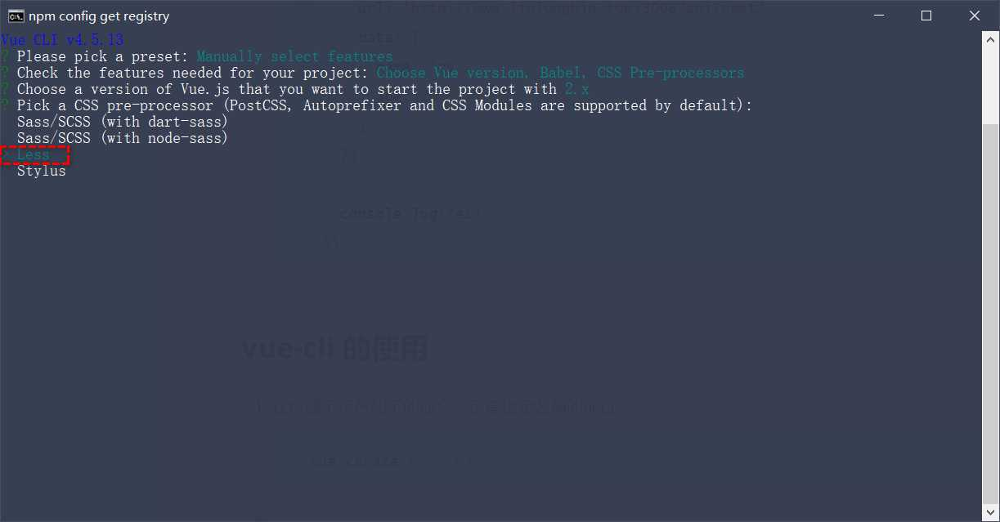

# Vue2.0

**推荐安装的 VScode 中的 Vue 插件**

1. Vue 3 Snippets     https://marketplace.visualstudio.com/items?itemName=hollowtree.vue-snippets
2. Vetur                    https://marketplace.visualstudio.com/items?itemName=octref.vetur

## 什么是vue

1. 构建用户界面
   + 用 vue 往 html 页面中填充数据，非常的方便
2. 框架
   + 框架是一套现成的解决方案，程序员只能遵守框架的规范，去编写自己的业务功能！
   + 要学习 vue，就是在学习 vue 框架中规定的用法！
   + vue 的指令、组件（是对 UI 结构的复用）、路由、Vuex、vue 组件库
   + 只有把上面老师罗列的内容掌握以后，才有开发 vue 项目的能力！

## vue 的两个特性

1. 数据驱动视图：

   + 数据的变化**会驱动视图**自动更新
   + 好处：程序员只管把数据维护好，那么页面结构会被 vue 自动渲染出来！

   

2. 双向数据绑定：

   > 在网页中，form 表单负责**采集数据**，Ajax 负责**提交数据**。

   + js 数据的变化，会被自动渲染到页面上
   + 页面上表单采集的数据发生变化的时候，会被 vue 自动获取到，并更新到 js 数据中

> 注意：数据驱动视图和双向数据绑定的底层原理是 MVVM（Mode 数据源、View 视图、ViewModel 就是 vue 的实例）      

##  MVVM

>MVVM 是  vue 实现数据驱动视图和双向数据绑定的核心原理。MVVM 指的是 Model、View 和  ViewModel， 
>它把每个 HTML 页面都拆分成了这三个部分，如图所示：


在  MVVM 概念中：
**Model** 表示当前页面渲染时所依赖的数据源。 
**View**  表示当前页面所渲染的 DOM 结构。
**ViewModel** 表示 vue 的实例，它是 MVVM 的核心

### MVVM工作原理

> ViewModel 作为  MVVM 的核心，是它把当前页面的数据源（Model）和页面的结构（View）连接在了一起。


当**数据源发生变化**时，会被 ViewModel 监听到，VM 会根据最新的数据源**自动更新**页面的结构
当**表单元素的值发生变化**时，也会被 VM 监听到，VM 会把变化过后最新的值**自动同步**到 Model 数据源中

## vm和vc的解释以及this指向

**（1）什么是vm？什么是vc？**

- VueComponent的实例对象，以后简称vc（也可称之为：组件实例对象）。
- Vue的实例对象，以后简称vm。

**（2）VueComponent组件的本质是什么？**

- school组件本质是一个名为VueComponent的构造函数，且不是程序员定义的，是Vue.extend生成的。
- 我们只需要写或，Vue解析时会帮我们创建school组件的实例对象，即Vue帮我们执行的：new VueComponent(options)。
- 特别注意：每次调用Vue.extend，返回的都是一个全新的VueComponent！！！！

**（3）关于this指向：**

- vc组件配置中：data函数、methods中的函数、watch中的函数、computed中的函数 它们的this均是【VueComponent实例对象】。
- new Vue(options)即vm配置中：data函数、methods中的函数、watch中的函数、computed中的函数 它们的this均是【Vue实例对象】。

------------------------------------------------
版权声明：本文为CSDN博主「这不比博人传燃？」的原创文章，遵循CC 4.0 BY-SA版权协议，转载请附上原文出处链接及本声明。
原文链接：https://blog.csdn.net/HSH541/article/details/124342333

## vue指令

> ==编码规范: 先指令 后绑定 再事件==

1. ### 指令的概念

  > 指令（Directives）是 vue 为开发者提供的模板语法，用于辅助开发者渲染页面的基本结构。 
  > vue 中的指令**按照不同的用途**可以分为如下 6 大类：
  > ①       **内容渲染**指令
  > ②       **属性绑定**指令
  > ③       **事件绑定**指令
  > ④       **双向绑定**指令
  > ⑤       **条件渲染**指令
  > ⑥       **列表渲染**指令
  > 注意：指令是 vue 开发中最基础、最常用、最简单的知识点

### 1. 内容渲染指令

1. `v-text` 指令的缺点：会覆盖元素内部原有的内容！
2. `{{ }}` **插值表达式：在实际开发中用的最多，只是内容的占位符，不会覆盖原有的内容！**
3. `v-html` 指令的作用：可以把带有标签的字符串，渲染成真正的 HTML 内容！

### 2. 属性绑定指令

>  注意：插值表达式只能用在元素的**内容节点**中，不能用在元素的**属性节点**中！

+ 在 vue 中，可以使用 `v-bind:` 指令，为元素的属性动态绑定值；

+ 简写是英文的 `:`

+ 在使用 v-bind 属性绑定期间，如果绑定内容需要进行动态拼接，则字符串的外面应该包裹单引号，例如：

  ```xml
  <div :title="'box' + index">这是一个 div</div>
  ```
  
  > 注意：原生 DOM 对象有 onclick、oninput、onkeyup 等原生事件，替换为 vue 的事件绑定形式后， 分别为：**v-on:click、v-on:input、v-on:keyup**

### 3. 使用js表达式

> 在  vue 提供的模板渲染语法中，除了支持绑定简单的数据值之外，还支持 Javascript 表达式

==在插值表达式和属性绑定指令中,支持js表达式==


### 4. 事件绑定

1. `v-on:` 简写是 `@`

2. 语法格式为：

   ```xml
   <button @click="add"></button>
   
   methods: {
      add() {
   			// 如果在方法中要修改 data 中的数据，可以通过 this 访问到
   			this.count += 1
      }
   }
   ```

3. **`$event` 的应用场景：如果默认的事件对象 e 被覆盖了，则可以手动传递一个  $event。例如：**

   >$event 是  vue 提供的特殊变量，用来表示原生的事件参数对象 event。$event 可以解决事件参数对象 event 
   >被覆盖的问题

   - ==场景1：获取原生DOM事件的事件对象==

     ​	在DOM事件的[回调函数](https://so.csdn.net/so/search?q=回调函数&spm=1001.2101.3001.7020)中传入参数`$event`，可以获取到该事件的事件对象

   - ==场景2：事件注册所传的参数(子组件向父组件传值)==

     在子组件中通过`$emit`注册事件，将数据作为参数传入，在父组件中通过`$event`接收

   ```xml
   <button @click="add(3, $event)"></button>
   
   methods: {
      add(n, e) {
   			// 如果在方法中要修改 data 中的数据，可以通过 this 访问到
   			this.count += 1
      }
   }
   ```

   - **事件参数对象**

   >在原生的 DOM 事件绑定中，可以在事件处理函数的形参处，接收事件参数对象 event。同理，在 v-on 指令 
   >（简写为 @ ）所绑定的事件处理函数中，同样可以接收到事件参数对象 event

4. 事件修饰符：

   >在事件处理函数中调用 event.preventDefault() 或  event.stopPropagation() 是非常常见的需求。因此， 
   >vue 提供了事件修饰符的概念，来辅助程序员更方便的对事件的触发进行控制。常用的 5 个事件修饰符如下：

   + `.prevent`

     > 阻止默认行为
     
     ```xml
     <a @click.prevent="xxx">链接</a>
     ```
     
   + `.stop`

     > 阻止事件冒泡

     ```vue
     <button @click.stop="xxx">按钮</button>
     ```

5. 按键修饰符

   > 在监听键盘事件时，我们经常需要判断详细的按键。此时，可以为键盘相关的事件添加按键修饰符，例如：

   

### 5 . v-model 指令

> vue 提供了 v-model 双向数据绑定指令，用来辅助开发者在不操作 DOM 的前提下，快速获取==表单==的数据。


1. input 输入框
   + type="radio"
   + type="checkbox"
   + type="xxxx"
2. textarea
3. select

#### v-model 指令的修饰符

| 修饰符  | 作用                           | 示例                            |
| ------- | ------------------------------ | ------------------------------- |
| .number | 自动将用户的输入值转为数值类型 | <input  v-model.number="age" /> |
| .trim   | 自动过滤用户输入的首尾空白字符 | <input  v-model.trim="msg" />   |
| .lazy   | 在“change”时而非“input”时更新  | <input  v-model.lazy="msg" />   |


### 5. 条件渲染指令

1. `v-show` 的原理是：动态为元素添加或移除 `display: none` 样式，来实现元素的显示和隐藏
   + 如果要频繁的切换元素的显示状态，用 v-show 性能会更好
2. `v-if` 的原理是：每次动态创建或移除元素，实现元素的显示和隐藏
   + 如果刚进入页面的时候，某些元素默认不需要被展示，而且后期这个元素很可能也不需要被展示出来，此时 v-if 性能更好

>  在实际开发中，绝大多数情况，不用考虑性能问题，直接使用 v-if 就好了！！！

**v-if 指令在使用的时候，有两种方式：**

1. 直接给定一个布尔值 true 或 false

   ```xml
   <p v-if="true">被 v-if 控制的元素</p>
   ```

2. 给 v-if 提供一个判断条件，根据判断的结果是 true 或 false，来控制元素的显示和隐藏

   ```xml
   <p v-if="type === 'A'">良好</p>
   ```


```json

```

####  v-else

> v-if 可以单独使用，或配合 v-else 指令一起使用：

> 注意：v-else 指令必须配合 v-if 指令一起使用，否则它将不会被识别！

#### v-else-if

> v-else-if 指令，顾名思义，充当 v-if 的“else-if 块”，可以连续使用：

> 注意：v-else-if 指令**必须配合** v-if 指令一起使用，否则它将不会被识别！

### 列表渲染指令

>vue 提供了 **v-for** 列表渲染指令，用来辅助开发者**基于一个数组来循环渲染一个列表结构**。v-for 指令需要使 
>用  item in items 形式的特殊语法，其中：

- items 是待循环的数组
- item 是被循环的每一项


#### v-for 中的索引

> v-for 指令还支持一个可选的第二个参数，即当前项的索引。语法格式为 (item, index) in items，示例代码如下：


> 注意：v-for 指令中的 item 项和  index 索引都是形参，可以根据需要进行重命名。例如 (user, i) in userlist

#### 使用 key 维护列表的状态

>当列表的数据变化时，默认情况下，vue 会尽可能的复用已存在的 DOM 元素，从而提升渲染的性能。但这种 
>默认的性能优化策略，会导致有状态的列表无法被正确更新。
>为了给 vue 一个提示，以便它能跟踪每个节点的身份，从而在保证有状态的列表被正确更新的前提下，提升渲 
>染的性能。此时，需要为每项提供一个唯一的 key 属性：

##### key 的注意事项

①       key 的值只能是字符串或数字类型
②       key 的值必须具有唯一性（即：key 的值不能重复）
③       建议把数据项 id 属性的值作为 key 的值（因为 id 属性的值具有唯一性）
④       使用 index 的值当作 key 的值没有任何意义（因为 index 的值不具有唯一性）
⑤		 建议使用 v-for 指令时一定要指定 key 的值（既提升性能、又防止列表状态紊乱）


## 过滤器

>**过滤器（Filters）**是 vue 为开发者提供的功能，常用于**文本的格式化**。过滤器可以用在两个地方：插值表达式 
>和  **v-bind 属性绑定。**
>过滤器应该被添加在 JavaScript 表达式的**尾部**，由**“管道符”**进行调用，示例代码如下：


### 定义过滤器

> 在创建 vue 实例期间，可以在 **filters 节点**中定义过滤器，示例代码如下


### 私有过滤器和全局过滤器

>在  filters 节点下定义的过滤器，称为**“私有过滤器”**，因为它**只能在当前 vm 实例所控制的 el 区域内使用。** 
>如果希望**在多个 vue 实例之间共享过滤器**，则可以按照如下的格式定义**全局过滤器**：


### 连续调用多个过滤器

> 过滤器可以串联地进行调用，例如


### 过滤器的注意点

1. 要定义到 filters 节点下，**本质是一个函数**
2. 在过滤器函数中，**一定要有 return 值**
3. 在过滤器的形参中，可以获取到“管道符”前面待处理的那个值
4. 如果全局过滤器和私有过滤器名字一致，此时按照“**就近原则**”，调用的是”私有过滤器“

### 连续调用多个过滤器


### 过滤器传参

> 过滤器的本质是 JavaScript 函数，因此可以接收参数，格式如下:


### 过滤器的兼容性

过滤器仅在 vue 2.x 和  1.x 中受支持，在 **vue 3.x** 的版本中**剔除了过滤器**相关的功能。 
在企业级项目开发中：

- 如果使用的是 2.x 版本的 vue，则依然可以使用过滤器相关的功能
-  如果项目已经升级到了 3.x 版本的 vue，官方建议使用**计算属性**或**方法**代替被剔除的过滤器功能
  具体的迁移指南，请参考 vue 3.x 的官方文档给出的说明：
  https://v3.vuejs.org/guide/migration/filters.html#migration-strategy

## watch 侦听器

### 1. 侦听器的介绍

> **watch 侦听器**允许开发者监视数据的变化，从而**针对数据的变化做特定的操作。**


### 2. 使用  watch 检测用户名是否可用

> 监听 username 值的变化，并使用 axios 发起 Ajax 请求，**检测当前输入的用户名是否可**用：

```js
监听 username 值的变化，并使用 axios 发起 Ajax 请求，检测当前输入的用户名是否可用： 
watch:    {
// 监听 username 值的变化 
async username(newVal) {
if   (newVal    ===   '')    return
//   使用   axios   发起请求，判断用户名是否可用
    const { data: res } = await axios.get('https://www.escook.cn/api/finduser/'    +    newVal) 
	console.log(res)
	}
}
```

### 3. immediate 选项

```js
默认情况下，组件在初次加载完毕后不会调用 watch 侦听器。如果想让 watch 侦听器立即被调用，则需要使 
用  immediate 选项。示例代码如下：
watch:    {
    username:   {
    //   handler   是固定写法，表示当   username   的值变化时，自动调用   handler   处理函数 
    handler:    async    function   (newVal)    {
        if   (newVal    ===    '')   return
        const   {    data:    res    }   =    await   axios.get('https://www.escook.cn/api/finduser/'    +    newVal) 
        console.log(res)
    },
    //   表示页面初次渲染好之后，就立即触发当前的   watch   侦听器 
    immediate:   true
    } 
}
```

### 4. deep选项

>如果 **watch 侦听的是一个对象**，如果**对象中的属性值发生了变化**，则**无法被监听到**。此时需要使用 deep 选 
>项，代码示例如下：


### 5. 监听对象单个属性的变化

> 如果只**想监听对象中单个属性的变化**，则可以按照如下的方式定义 watch 侦听器：


## axios 的基本使用

1. 发起 GET 请求

   ```js
   axios({
     // 请求方式
     method: 'GET',
     // 请求的地址
     url: 'http://www.liulongbin.top:3006/api/getbooks',
     // URL 中的查询参数
     params: {
       id: 1
     }
   }).then(function (result) {
     console.log(result)
   })
   ```

2. 发起 POST 请求

   ```js
   document.querySelector('#btnPost').addEventListener('click', async function () {
     // 如果调用某个方法的返回值是 Promise 实例，则前面可以添加 await！
     // await 只能用在被 async “修饰”的方法中
     
     // 解构赋值的时候,使用 : 进行重命名
     // 1.调用 axios 之后,使用 async/await 进行简化
     // 2. 使用解构赋值, 从axios 封装的大对象中,把data 属性解构出来
     // 3. 把解构出来的 data 属性, 使用 冒号 进行重命名,一般都重命名为{ data: res}
     const { data: res } = await axios({
       method: 'POST', 
       url: 'http://www.liulongbin.top:3006/api/post',
       data: {
         name: 'zs',
         age: 20
       }
     })
   
     console.log(res)
   })
   ```

   

## 计算属性

### 1.计算属性介绍

>计算属性指的是**通过一系列运算**之后，最终得到一个**属性值**。
>**这个动态计算出来的属性值**可以被模板结构或 methods 方法使用。示例代码如下：


### 2. 计算属性的特点

①     虽然计算属性在**声明的时候**被定义为**方法**，但是计算属性的**本质是一个属性**

② 计算属性会**缓存计算的结果**，只有计算属性**依赖的数据变化时**，才会重新进行运算

## vue-cli

### 1. 单页面应用程序

> **单页面应用程序**（英文名：Single Page Application）简称 SPA，顾名 
> 思义，指的是**一个 Web 网站中只有唯一的一个 HTML 页面**，所有的功能 
> 与交互都在这唯一的一个页面内完成。


### 2. vue-cli的介绍

> **vue-cli 是  Vue.js 开发的标准工具**。它简化了程序员基于 webpack 创建工程化的 Vue 项目的过程

### 3. 安装和使用

>vue-cli 是  npm 上的一个**全局包**，**使用 npm install** 命令，即可方便的把它安装到自己的电脑上：

`npm install -g @vue/cli`

基于 vue-cli 快速生成工程化的 Vue 项目： 

`vue create` **项目的名称(英文)**

### 4. 创建项目的步骤:

1. 
2. 
3. 
4. 
5. 

### vue项目的运行流程

在工程化的项目中，vue 要做的事情很单纯：通过 **main.js** 把  **App.vue** 渲染到 **index.html** 的指定区域中。 

其中：

①  **App.vue** 用来编写待渲染的**模板结构**

②  **index.html** 中需要预留一个 **el 区域**

③  **main.js** 把  App.vue 渲染到了 index.html 所预留的区域中

## vue组件

### 1. 组件化开发概念

> **组件化开发**指的是：根据**封装**的思想，**把页面上可重用的 UI 结构封装为组件**，从而方便项目的开发和维护。

### 2. vue 中的组件化开发

vue 是一个**支持组件化开发**的前端框架。

vue 中规定：**组件的后缀名**是 **.vue**。之前接触到的 App.vue 文件本质上就是一个 vue 的组件。

### 3. vue 组件的三个组成部分

每个 .vue 组件都由 3 部分构成，分别是：

- **template** -> 组件的**模板结构**
- **script** -> 组件的 **JavaScript 行为**
- **style** -> 组件的**样式**

> 其中，**每个组件中必须包含 template 模板结构**，而 **script 行为**和 **style 样式**是可选的组成部分。

#### 3.1 temoplate

> vue 规定：每个组件对应的**模板结构**，需要定义到 **`<template> 节点`**中。

```vue
<template>
	<div>
    <!-- 当前的div就是根节点 -->
  </div>
</template>
```

注意：

- template 是 vue 提供的**容器标签**，只起到**包裹性质的作用**，它不会被渲染为真正的 DOM 
- template 中只能包含唯一的根节点

####  3.2 script

> vue 规定：开发者可以在 <script> 节点中封装组件的 JavaScript 业务逻辑。 
>
> `<script>`节点的基本结构如下:


#### 3.3 style

>vue 规定：组件内的 <style> 节点是**可选的**，开发者可以在 <style> 节点中**编写样式美化当前组件的 UI 结构**。 `style`节点基本结构如下:


##### `.vue `组件中的  data 必须是函数

>vue 规定：.vue 组件中的 data **必须是一个函数**，**不能**直接**指向一个数据对象**。 
>因此在组件中定义 data 数据节点时，下面的方式是**错误的**：

```vue
data:{	// 组件中,不能直接让 data 指向一个数据对象(会报错)
	count:0
}
```

##### 让`style`支持less语法>

> 在 <style> 标签上添加 **lang="less"** 属性，即可使用 less 语法编写组件的样式：

### 4. 组件之间的父子关系


> **左图:**组件在被封装好之后，彼此之间是相互独立的，不存在父子关系
>
> **右图:**在使用组件的时候，根据彼此的嵌套关系，形成了父子关系、兄弟关系

#### 4.1 使用组件的是三个步骤


#### 4.2 通过  components 注册的是私有子组件

>例如：
>在**组件 A** 的 components 节点下，注册了**组件 F**。 
>则组件 F 只能用在组件 A 中；不能被用在**组件 C** 中。

#### 4.3 注册全局组件

> 在  vue 项目的 **main.js** 入口文件中，通过 **Vue.component()** 方法，可以注册全局组件。示例代码如下：


### 5. 组件的 props

>props 是组件的**自定义属性**，在**封装通用组件**的时候，合理地使用 props 可以极大的**提高组件的复用性**！ 
>它的语法格式如下：


#### 5.1 props 是只读的

> vue 规定：组件中封装的自定义属性是**只读的**，程序员**不能直接修改** props 的值。否则会直接报错：
>
> 要想修改 props 的值，可以**把  props 的值转存到  data 中**，因为  data 中的数据都是可读可写的！


#### 5.2 props 的 default 默认值

> 在声明自定义属性时，可以通过 **default** 来**定义属性的默认值**。示例代码如下：


#### 5.3 props 的 ==type== 值类型

> 在声明自定义属性时，可以通过 **type** 来**定义属性的值类型**。示例代码如下


#### 5.4 props 的 ==required== 必填项

>在声明自定义属性时，可以通过 **required** 选项，将属性设置为**必填项**，强制用户必须传递属性的值。示例代 
>码如下：


### 6. 组件之间的样式冲突问题

> 默认情况下，**写在 .vue 组件中的样式会全局生效**，因此很容易造成多**个组件之间的样式冲突问题**。

导致组件之间样式冲突的根本原因是：

①     单页面应用程序中，所有组件的 DOM 结构，都是基于**唯一的 index.html 页面**进行呈现的
		②     每个组件中的样式，都会**影响整个 index.html 页面**中的 DOM 元素

#### 6.1 解决组件样式冲突的问题

> 为每个组件**分配唯一的自定义属性**，在编写组件样式时，通过**属性选择器**来控制**样式的作用域**，示例代码如下：


#### 6.2 style 节点的 `scoped` 属性

> 为了提高开发效率和开发体验，vue 为  **style 节点**提供了 **scoped** 属性，从而防止组件之间的样式冲突问题：

==第一种理解==:

==第二种理解==:

#### 6.3 `/deep/` 样式穿透

>如果给当前组件的 style 节点添加了 scoped 属性，则**当前组件的样式对其子组件是不生效的**。如果想让某些样 
>式对子组件生效，可以使用 **/deep/ 深度选择器**。


### 组件的生命周期

#### 1. 生命周期  & 生命周期函数

**生命周期**（Life Cycle）是指一个组件从**创建** -> **运行** -> **销毁**的整个阶段，**强调的是一个时间段**。 
**生命周期函数**：是由 vue 框架提供的**内置函数**，会伴随着组件的生命周期，**自动按次序执行。**

> 注意：**生命周期**强调的是**时间段**，**生命周期函数**强调的是**时间点。**

#### 2. 组件生命周期函数的分类


#### 3. 生命周期图示

>可以参考 vue 官方文档给出的“生命周期图示”，进一步理解组件生命周期执行的过程： 
>https://cn.vuejs.org/v2/guide/instance.html#生命周期图示

### ==组件之间的数据共享==

#### 1. 组件之间的关系

在项目开发中，组件之间的**最常见的关系**分为如下两种：

**①     父子关系**

**②     兄弟关系**


#### 2. 父子组件之间的数据共享

父子组件之间的数据共享又分为：

①       **父  -> 子**共享数据

②       **子  -> 父**共享数据	

##### 2.1 父组件向子组件共享数据

> 父组件向子组件共享数据需要使用==自定义属性==。示例代码如下：


##### 2.2 子组件向父组件共享数据

> 子组件向父组件共享数据使用**自定义事件**。示例代码如下：


#### 3. 兄弟组件之间的数据共享

> 在==vue2.x 中==，兄弟组件之间数据共享的方案是 ==EventBus==。
>
> **只要有血缘关系就可以实现数据共享**


#### EventBus 的使用步骤

① 创建 **eventBus.js** 模块，并向外共享一个 **Vue 的实例对象** 

② 在数据**发送方**，调用 **bus.$emit**('事件名称', 要发送的数据) 方法**触发自定义事件** 

③ 在数据**接收方**，调用 **bus.$on**('事件名称', 事件处理函数) 方法**注册一个自定义事件**

### ref 引用

#### 1. 什么是 ref 引用

> ref 用来辅助开发者在**不依赖于 jQuery 的情况下**，获取 DOM 元素或组件的引用。 每个 vue 的组件实例上，都包含一个 **$refs 对象**，里面存储着对应的 DOM 元素或组件的引用。默认情况下， **组件的 $refs 指向一个空对象。**


#### 2. 使用 ref 引用 DOM元素

> 如果想要使用 ref **引用页面上的 DOM 元素**，则可以按照如下的方式进行操作：


#### 3. 使用  ref 引用组件实例

> 如果想要使用 ref **引用页面上的组件实例**，则可以按照如下的方式进行操作：


#### 4. 控制文本框和按钮的按需切换

> 通过布尔值 **inputVisible** 来控制组件中的文本框与按钮的按需切换。示例代码如下： 


#### 5. 让文本框自动获得焦点

>当文本框展示出来之后，如果希望它立即获得焦点，则可以为其添加 ref 引用，并调用原生 DOM 对象的 
>**.focus()** 方法即可。示例代码如下：


#### 6. this.$nextTick(cb) 方法

>组件的 **$nextTick(cb)** 方法，会把 cb 回调**推迟到下一个 DOM 更新周期之后执行**。通俗的理解是：等组件的 
>DOM 更新完成之后，再执行 cb 回调函数。从而能保证 cb 回调函数可以操作到最新的 DOM 元素。


### 动态组件

#### 1. 概念:动态组件指的是动态切换组件的显示与隐藏。

#### 2. 实现动态组件的渲染

> vue 提供了一个内置的 <component> 组件，**专门用来实现动态组件的渲染**。示例代码如下：


#### 3. 使用 keep-alive 保持状态

>默认情况下，切换动态组件时**无法保持组件的状态**。此时可以使用 vue 内置的 **<keep-alive>** 组件保持动态组 件的状态。示例代码如下：


#### 4. keep-alive 对应的生命周期函数

当组件**被缓存**时，会自动触发组件的 **deactivated** 生命周期函数。

当组件**被激活**时，会自动触发组件的 **activated** 生命周期函数。


#### 5. keep-alive 的  include 属性

> include 属性用来指定：只有**名称匹配的组件**会被缓存。多个组件名之间使用**英文的逗号**分隔：

```vue
<!-- keep-alive 可以把内部的组件进行缓存,而不是销毁组件 -->

<!-- 在使用keep-alive 的时候, 可以通过 include 指定哪些组件需要被缓存 -->

<!-- 或者,通过 exclude 属性指定哪些组件爱你不需要被缓存,但是不能同时使用这两个属性 -->
```


### 插槽

#### 1. 插槽的概念

>**插槽（Slot）**是 vue 为**组件的封装者**提供的能力。允许开发者在封装组件时，把**不确定的、希望由用户指定的** 
>**部分**定义为插槽。


#### 2. 体验插槽的基础用法

> 在封装组件时，可以通过 <slot> 元素定义插槽，从而为用户预留内容占位符。示例代码如下：


##### 2.1 没有预留插槽的内容会被丢弃

> 如果在封装组件时**没有预留任何 <slot> 插槽**，则用户提供的任何**自定义内容**都**会被丢弃**。示例代码如下：


##### 2.2 后备内容

> 封装组件时，可以为预留的 <slot> 插槽提供**后备内容**（默认内容）。如果组件的使用者没有为插槽提供任何 
> 内容，则后备内容会生效。示例代码如下：


#### 3. 具名插槽

>  如果在封装组件时**需要预留多个插槽节点**，则需要为每个 <slot> 插槽指定**具体的 name 名称**。这种**带有具体** 
> **名称的插槽**叫做“具名插槽”。示例代码如下：


##### 3.1 为具名插槽提供内容

> 在向具名插槽提供内容的时候，我们可以在一个 <template> 元素上使用 **v-slot** 指令，并以 v-slot 的参数的 
> 形式提供其名称。示例代码如下：


##### 3.2 具名插槽的简写形式

> 跟  v-on 和  v-bind 一样，v-slot 也有缩写，即把参数之前的所有内容 (**v-slot:**) 替换为字符 #。例如 **v-slot**:header 
> 可以被重写为 **#**header：


#### 4. 作用域插槽

>在封装组件的过程中，可以为预留的 <slot> 插槽绑定 props 数据，这种**带有 props 数据的 <slot>** 叫做“**作用** 
>**域插槽**”。示例代码如下：


##### 4.1 使用作用域插槽

> 可以使用 **v-slot:** 的形式，接收作用域插槽对外提供的数据。示例代码如下：


##### 4.2 解构赋值 Prop

> 作用域插槽对外提供的数据对象，可以使用**解构赋值**简化数据的接收过程。示例代码如下：


### 自定义指令

#### 1. 自定义指令的介绍

> vue 官方提供了 v-text、v-for、v-model、v-if 等常用的指令。除此之外 vue 还允许开发者自定义指令。

#### 2. 自定义指令的分类

vue 中的自定义指令分为两类，分别是：

- **私有**自定义指令
- **全局**自定义指令

#### 3. 私有自定义指令

> 在每个 vue 组件中，可以在 **directives** 节点下声明**私有自定义指令**。示例代码如下：


#### 4. 使用自定义指令

> 在使用自定义指令时，需要加上 `v- `前缀。示例代码如下：


#### 5. 为自定义指令动态绑定参数值

> 在 template 结构中使用**自定义指令**时，可以通过等号（**=**）的方式，为当前指令**动态绑定参数值:**


#### 6. 通过 binding 获取指令的参数值

> 在声明自定义指令时，可以通过形参中的**第二个参数**，来接收指令的参数值：


#### 7. update 函数

>bind 函数**只调用 1 次：**当指令第一次绑定到元素时调用，**当 DOM 更新时 bind 函数不会被触发。 update** 函 
>数会在**每次 DOM 更新时**被调用。示例代码如下：


#### 8. 函数简写

> 如果 **insert** 和**update** 函数中的==逻辑完全相同==，则**对象格式**的自定义指令可以简写成**函数格式：**


#### 9. 全局自定义指令

> 全局共享的自定义指令需要通过“**Vue.directive()**”进行声明，示例代码如下：

​	

## 路由

### 路由的概念和原理

#### 1. 什么是路由

> 路由（英文：router）就是**对应关系**。

#### 2. SPA 与前端路由

>SPA 指的是一个 web 网站只有唯一的一个 HTML 页面，**所有组件的展示与切换**都在这唯一的一个页面内完成。 
>此时，**不同组件之间的切换**需要通过**前端路由**来实现。

结论：在 SPA 项目中，不同功能之间的切换，要依赖于前端路由来完成！

#### 3. 什么是前端路由

> 通俗易懂的概念：**Hash 地址**与**组件**之间的**对应关系。**

#### 4. 前端路由的工作方式

①       用户**点击了**页面上的**路由链接**

②       导致了 **URL 地址栏**中的 **Hash 值**发生了变化

③       **前端路由监听了到 Hash 地址的变化**

④ 前端路由把当前 **Hash 地址对应的组件**渲染都浏览器中


#### 5. 前端路由的原理

- 步骤1: 
  - 通过 <component> 标签，结合` comName `动态渲染组件。示例代码如下：

- 步骤2：
  - 在 App.vue 组件中，为 <a> 链接添加对应的 hash 值：
- 步骤3:
  - 在 `created` 生命周期函数中，监听浏览器地址栏中 **hash 地址的变化**，动态切换要展示的组件的名称：

###  vue-router 的基本使用

#### 1. 什么是  vue-router

> **vue-router** 是  vue.js 官方给出的**路由解决方案**。它只能结合 vue 项目进行使用，能够轻松的管理 SPA 项目 
> 中组件的切换。
>
> vue-router 的官方文档地址：https://router.vuejs.org/zh/

#### 2. vue-router 安装和配置的步骤

①     安装 vue-router 包

**②     创建路由模块**

③     导入并挂载路由模块

④     声明**路由链接**(router-Link)和**占位符**(router-View)

##### 2.1 在项目中安装  vue-router

> 在 vue2 的项目中，安装 vue-router 的命令如下：


##### 2.2 创建路由模块

> 在 **src** 源代码目录下，新建 **router/index.js** 路由模块，并初始化如下的代码：


##### 2.3 导入并挂载路由模块

> 在 src**/main.js** 入口文件中，导入并挂载路由模块。示例代码如下：


##### 2.4 声明路由链接和占位符

> 在  src/App.vue 组件中，使用 vue-router 提供的 <router-link> 和  <router-view> 声明路由链接和占位符：


##### 3. 声明路由的匹配规则

> 在 src/router/index.js 路由模块中，通过 **routes 数组**声明路由的匹配规则。示例代码如下：


==单独的根路径 '/' 和空路径'' 效果一样==

### vue-router 的常见用法

#### 1. 路由重定向

>**路由重定向**指的是：用户在访问**地址 A** 的时候，**强制用户跳转**到地址 C ，从而展示特定的组件页面。 
>通过路由规则的 **redirect** 属性，指定一个新的路由地址，可以很方便地设置路由的重定向：


#### 2. 嵌套路由

> 通过路由实现**组件的嵌套展示**，叫做嵌套路由。


#### 3.1 声明子路由链接和子路由占位符

> 在 **About.vue** 组件中，声明 tab1 和 tab2 的**子路由链接**以及**子路由占位符**。示例代码如下：


#### 3.2 通过  children 属性声明子路由规则

> 在 src/router/index.js 路由模块中，导入需要的组件，并使用 **children 属性**声明子路由规则：


#### 4. 动态路由

##### 4.1 动态路由的概念

>动态路由指的是：把 Hash 地址中**可变的部分**定义为**参数项**，从而**提高路由规则的复用性**。 
>在  vue-router 中使用**英文的冒号（:）**来定义路由的参数项。示例代码如下：


4.2 `$route.params` 参数对象

> 在**动态路由**渲染出来的组件中，可以使用 this.**$route.params** 对象访问到**动态匹配的参数值**


##### 4.3 使用  props 接收路由参数

> **为了简化路由参数的获取形式**，`vue-router` 允许在**路由规则**中**开启 props** 传参。示例代码如下：


#### 5. 声明式导航  & 编程式导航

在浏览器中，**点击链接**实现导航的方式，叫做**声明式导航**。例如：

- 普通网页中点击 **<a> 链接**、vue 项目中点击 `<router-link>` 都属于声明式导航

在浏览器中，调用 **API 方法**实现导航的方式，叫做**编程式导航**。例如：

- 普通网页中调用 **location.href** 跳转到新页面的方式，属于编程式导航

##### 5.1 vue-router 中的编程式导航  API

> vue-router 提供了许多编程式导航的 API，其中最常用的导航 API 分别是：

①     `  this.$router.push('hash 地址’)`

- 跳转到指定 hash 地址，并**增加**一条历史记录

②       `this.$router.replace('hash 地址')`

- 跳转到指定的 hash 地址，并**替换掉当前的**历史记录

③      ` this.$router.go(数值 n)`

- 实现导航历史前进、后退

##### 5.2 $router.push

> 调用 this.**$router.push()** 方法，可以跳转到指定的 hash 地址，从而展示对应的组件页面。示例代码如下：


##### 5.3 $router.replace

> 调用 this.**$router.replace()** 方法，可以跳转到指定的 hash 地址，从而展示对应的组件页面。

push 和  replace 的区别：

- push 会**增加一条历史记录**
- replace 不会增加历史记录，而是**替换掉当前的历史记录**

##### 5.4 $router.go

> 调用 this.**$router.go()** 方法，可以在浏览历史中前进和后退。示例代码如下：


##### ==5.5 $router.go 的简化用法==

> 在实际开发中，一般只会前进和后退一层页面。因此 vue-router 提供了如下两个便捷方法：

①       $router.**back**()

- 在历史记录中，**后退**到上一个页面

②       $router.**forward**()

- 在历史记录中，**前进**到下一个页面

##### 6. 导航守卫

> **导航守卫**可以**控制路由的访问权限**。示意图如下：


###### 6.1 全局前置守卫

> 每次发生路由的**导航跳转**时，都会触发**全局前置守卫**。因此，在全局前置守卫中，程序员可以对每个路由进行 
> **访问权限**的控制：


###### 6.2 守卫方法的  3 个形参

> **全局前置守卫**的回调函数中接收 3 个形参，格式为：


###### 6.3 next 函数的  3 种调用方式

> 参考示意图，分析 next 函数的 3 种调用方式最终导致的结果：


当前用户**拥有**后台主页的访问权限，直接放行：next()

当前用户**没有**后台主页的访问权限，**强制其跳转到登录页面**：next('**/login**') 

当前用户**没有**后台主页的访问权限，**不允许跳转到后台主页**：next(**false**)

###### 6.4 控制后台主页的访问权限


# 	前端工程化与webpack

## 前端工程化

> **前端工程化指的是**：在企业级的前端项目开发中，把前端开发所需的工具、技术、流程、经验等进行规范化、
> 标准化。
> 	企业中的 Vue 项目和 React 项目，都是基于工程化的方式进行开发的。
> 	**好处：前端开发自成体系，有一套标准的开发方案和流程。**

### 前端工程化的解决方案

目前主流的前端工程化解决方案：

- webpack（ https://www.webpackjs.com/ ）
- parcel（ https://zh.parceljs.org/ ）

## webpack

### webpack基本使用

#### 1.什么是 webpack

概念：webpack 是前端项目工程化的具体解决方案。
主要功能：它提供了友好的前端模块化开发支持，以及代码压缩混淆、处理浏览器端JavaScript 的兼容性、性
能优化等强大的功能。
好处：让程序员把工作的重心放到具体功能的实现上，提高了前端开发效率和项目的可维护性。
注意：目前 Vue，React 等前端项目，基本上都是基于 webpack 进行工程化开发的。

#### 2. 创建列表隔行变色项目

① 新建项目空白目录，并运行 npm init –y 命令，初始化包管理配置文件 package.json
② 新建 src 源代码目录
③ 新建 src -> index.html 首页和 src -> index.js 脚本文件
④ 初始化首页基本的结构
⑤ 运行 npm install jquery –S 命令，安装 jQuery
⑥ 通过 ES6 模块化的方式导入 jQuery，实现列表隔行变色效果

#### 3. 在项目中安装 webpack

在终端运行如下的命令，安装webpack 相关的两个包：

`npm install `

#### 4. 在项目中配置 webpack

##### ① 在项目根目录中，创建名为 webpack.config.js 的 webpack 配置文件，并初始化如下的基本配置：

##### ② 在 package.json 的 scripts 节点下，新增 dev 脚本如下：

##### 4.1 mode的可选值

mode 节点的可选值有两个，分别是：
① development

- 开发环境
- 不会对打包生成的文件进行代码压缩和性能优化

打包速度快，适合在开发阶段使用
② production

- 生产环境
- 会对打包生成的文件进行代码压缩和性能优化
- 打包速度很慢，仅适合在项目发布阶段使用 

##### 4.2 webpack.config.js 文件的作用

webpack.config.js 是 webpack 的配置文件。webpack 在真正开始打包构建之前，会先读取这个配置文件，
从而基于给定的配置，对项目进行打包。

> 注意：由于 webpack 是基于 node.js 开发出来的打包工具，因此在它的配置文件中，支持使用 node.js 相关
> 的语法和模块进行 webpack 的个性化配置。 

##### 4.3 webpack 中的默认约定

在 webpack 4.x 和 5.x 的版本中，有如下的默认约定：
① 默认的打包入口文件为src -> index.js
② 默认的输出文件路径为dist -> main.js

> 注意：可以在 webpack.config.js 中修改打包的默认约定 

##### 4.4 自定义打包的入口与出口

在 webpack.config.js 配置文件中，通过 **entry 节点**指定**打包的入口**。通过 **output 节点**指定打包的出口。
示例代码如下：

### webpack插件

#### 1. webpack 插件的作用

通过安装和配置第三方的插件，可以拓展webpack 的能力，从而让 webpack 用起来更方便。最常用的
webpack 插件有如下两个：

##### ① webpack-dev-server

- 类似于 node.js 阶段用到的 nodemon 工具
- 每当修改了源代码，webpack 会自动进行项目的打包和构建

##### ② html-webpack-plugin

- webpack 中的 HTML 插件（类似于一个模板引擎插件）
- 可以通过此插件自定 制index.html 页面的内容 

#### 2. webpack-dev-server

>  webpack-dev-server 可以让 webpack 监听项目源代码的变化，从而进行自动打包构建。

##### 2.1 安装 webpack-dev-server

###### 运行如下的命令，即可在项目中安装此插件：

`npm install webpack-dev-server@3.11.2 -D`

##### 2.2 配置 webpack-dev-server

###### ① 修改 package.json -> scripts 中的 dev 命令如下：

###### ② 在 package.json 的 scripts 节点下，新增 dev 脚本如下：

###### ③ 在浏览器中访问 http://localhost:8080 地址，查看自动打包效果

> 注意：webpack-dev-server 会启动一个实时打包的 http 服务器

##### 2.3 打包生成的文件哪儿去了？

###### ① 不配置 webpack-dev-server 的情况下，webpack 打包生成的文件，会存放到实际的物理磁盘上

- 严格遵守开发者在 webpack.config.js 中指定配置

 根据 output 节点指定路径进行存放

###### 	② 配置了 webpack-dev-server 之后，打包生成的文件存放到了内存中

- 不再根据 output 节点指定 的路径，存放到实际的物理磁盘上
- 提高了实时打包输出的性能，因为内存比物理磁盘速度快很多

##### 2.4 生成到内存中的文件该如何访问？

> webpack-dev-server 生成到内存中的文件，默认**放到了项目的根目录中**，而且是**虚拟的、不可见的**。

- 可以直接用 **/** 表示**项目根目录**，**后面跟上要访问的文件名称**，即可访问内存中的文件
- 例如 **/bundle.js** 就表示要访问 webpack-dev-server 生成到内存中的 bundle.js 文件

#### 3. html-webpack-plugin

>html-webpack-plugin 是 **webpack 中的 HTML 插件**，可以通过此插件**自定制** index.html **页面的内容**。
>**需求：**通过 html-webpack-plugin 插件，将 src 目录下的 index.html 首页，**复制到项目根目录中一份！**

##### 3.1 安装 html-webpack-plugin

运行如下的命令，即可在项目中安装此插件：
`npm install html-webpack-plugin@5.3.2 -D`

##### 3.2 配置 html-webpack-plugin


###### 3.3 解惑 html-webpack-plugin

① 通过 HTML 插件复制到项目根目录中的 index.html 页面，**也被放到了内存中**
		② HTML 插件在生成的 index.html **页面**，**自动注入**了打包的 bundle.js 文件

#### 4. devServer 节点

> 在 webpack.config.js 配置文件中，可以通过 **devServer** 节点对 webpack-dev-server 插件进行更多的配置，
> 示例代码如下：


> 注意：凡是修改了 webpack.config.js 配置文件，或修改了 package.json 配置文件，**必须重启实时打包的服**
> **务器**，否则最新的配置文件无法生效！

### webpack中的loader

#### 1. loader概述

> 在实际开发过程中，webpack 默认只能打包处理以 .js 后缀名结尾的模块。其他**非 .js 后缀名结尾的模块**，
> webpack 默认处理不了，**需要调用 loader 加载器才可以正常打包**，否则会报错！

loader 加载器的作用：**协助 webpack 打包处理特定的文件模块**。比如：

-  css-loader 可以打包处理 .css 相关的文件
-  less-loader 可以打包处理 .less 相关的文件
-  babel-loader 可以打包处理 webpack 无法处理的高级 JS 语法

#### 2. loader 的调用过程


#### 3. 打包处理 css 文件

① 运行 npm i **style-loader@3.0.0 css-loader@5.2.6** -D 命令，安装处理 css 文件的 loader
		② 在 webpack.config.js 的 **module** -> **rules** 数组中，添加 loader 规则如下：


> 其中，**test** 表示匹配的**文件类型**， use 表示对应**要调用的 loader**
> 注意：

- use 数组中指定的 loader **顺序是固定的**
-  多个 loader 的调用顺序是：**从后往前调用**
  webpack 中的 loader

#### 4.打包处理 less 文件

① 运行 npm i **less-loader@10.0.1 less@4.1.1** -D 命令
		② 在 webpack.config.js 的 **module** -> **rules** 数组中，添加 loader 规则如下


#### 5. 打包处理样式表中与 **url 路径相关**的文件

① 运行 npm i **url-loader@4.1.1 file-loader@6.2.0** -D 命令
		② 在 webpack.config.js 的 **module** -> **rules** 数组中，添加 loader 规则如下：


其中 **?** 之后的是 **loader 的参数项：**

- limit 用来指定**图片的大小**，单位是字节（byte）
- 只有 **≤** limit 大小的图 片，才会被转为base64 格式的图片

#### 6. 打包处理 js 文件中的高级语法

webpack 只能打包处理**一部分**高级的JavaScript 语法。对于那些 webpack 无法处理的高级 js 语法，需要借
助于 **babel-loader** 进行打包处理。例如 webpack 无法处理下面的 JavaScript 代码：


##### 6.1 安装 babel-loader 相关的包

运行如下的命令安装对应的依赖包：
npm i **babel-loader@8.2.2 @babel/core@7.14.6 @babel/plugin-proposal-decorators@7.14.5** -D

在 webpack.config.js 的 **module** -> **rules** 数组中，添加 loader 规则如下：


##### 6.2 配置 babel-loader

> 在项目根目录下，创建名为 babel.config.js 的配置文件，定义 Babel 的配置项如下：

```js
module.exports = {
    //声明babel可用的插件
    plugins:[['@babel/plugin-proposal-decorators',{legacy:true}]]
}

```

详情请参考 Babel 的官网 https://babeljs.io/docs/en/babel-plugin-proposal-decorators

## 打包发布

### 1.为什么要打包发布

**项目开发完成之后**，需要使用webpack **对项目进行打包发布**，主要原因有以下两点：
① 开发环境下，打包生成的文件**存放于内存中**，无法获取到最终打包生成的文件
② 开发环境下，打包生成的文件**不会进行代码压缩和性能优化**
**为了让项目能够在生产环境中高性能的运行**，因此需要对项目进行打包发布。

### 2. 配置 webpack 的打包发布

在 package.json 文件的 scripts 节点下，新增 build 命令如下：


**--model** 是一个参数项，用来指定 webpack 的**运行模式**。production 代表生产环境，会对打包生成的文件
进行**代码压缩**和**性能优化。**

> 注意：通过 --model 指定的参数项，会**覆盖** webpack.config.js 中的 model 选项。

### 3. 把 JavaScript 文件统一生成到 js 目录中

在 webpack.config.js 配置文件的 output 节点中，进行如下的配置：


### 4.把图片文件统一生成到 image 目录中

> 修改 webpack.config.js 中的 **url-loader** 配置项，新增 **outputPath** 选项即可指定图片文件的输出路径：


### 5. 自动清理 dist 目录下的旧文件

为了在每次打包发布时**自动清理掉 dist 目录中的旧文件**，可以安装并配置**clean-webpack-plugin** 插件：


## Source Map

### 1. 什么是 Source Map

>**Source Map 就是一个信息文件，里面储存着位置信息**。也就是说，Source Map 文件中存储着压缩混淆后的
>代码，所对应的**转换前的位置**。
>有了它，出错的时候，除错工具将**直接显示原始代码，而不是转换后的代码**，能够极大的方便后期的调试。

### 2.解决默认 Source Map 的问题

>开发环境下，推荐在 webpack.config.js 中添加如下的配置，即可保证运行时报错的行数与源代码的行数
>保持一致：


### 3. 只定位行数不暴露源码

在生产环境下，如果**只想定位报错的具体行数**，且**不想暴露源码**。此时可以将**devtool** 的值设置为:**nosources-source-map**

### 4. 定位行数且暴露源码

在生产环境下，如果**想在定位报错行数的同时，展示具体报错的源码**。此时可以将 **devtool** 的值设置为**source-map**

### 5. Source Map 的最佳实践

① 开发环境下：

- 建议把 devtool 的值设置为  **eval-source-map**

- 好处：可以精准定位到具体的错误行

② 生产环境下：

- 建议**关闭 Source Map** 或将 devtool 的值设置为 **nosource s-source-map**
- 好处：防止源码泄露，提高网站的安全性 