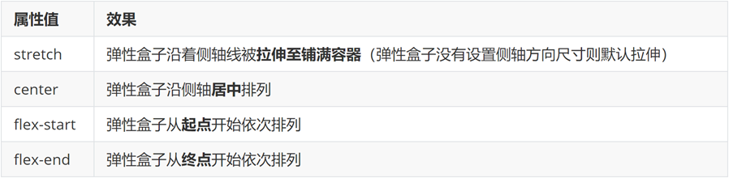
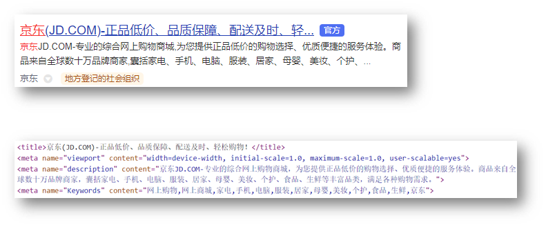
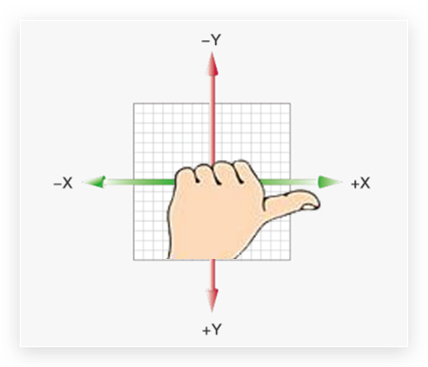

# CSS(层叠样式表)

##  ==CSS三大特性==

- 继承性

  > 子元素会继承父元素的样式

  注意:标签自带的样式除外:如:a标签,默认是蓝色

- 层叠性

  > 为相同的元素设置样式时有如下特点

  - 特点
    - 相同的属性会覆盖:后面的css属性覆盖前面的css属性
    - 不同的属性会叠加:不同的css属性都生效

- 优先级

  > 也叫权重,当一个标签使用了多种选择器时,基于不同种类的选择器的匹配规则

  - **技巧:选择器选中标签范围越大,优先级/权重 越低**

  - 公式:**通配符选择器 < 标签选择器 < 类选择器 < id选择器 < 行内样式 < !important**

  - 优先级-叠加计算规则

    > 如果是**复合选择器**,则需要权重叠加计算

    公式:(**行内**样式,**id**选择器个数,类选择器个数,**标签**选择器个数)

    规则:

    - **从左向右**一次比较选个数,**同一级**个数**多**的优先级**高**,如果个数相同,则向后比较
    -  !important权重最高
    - 继承权重最低

## CSS：层叠样式表（Cascading Style Sheets）

- css可用来为网页创建样式表，通过样式表可以对网页进行装饰
- 叠层：将网页想象成一层一层的结构，层次高的将会覆盖层次低的
- css可以分别为网页的各个层次设置样式
- 样式：外在表现

- CSS语法

  - 选择器和声明块

    - 选择器

      - 通过选择器可以选中页面指定的元素，并且将声明块中的样式应用到选择器对应的元素上

    - 声明块

      - 声明块紧跟在选择器的后边，使用一定{}括起来

      - 声明块中实际上就是一组一组名值对结构，这一组一组的名值我们称为声明

      - 在一个声明块中可以写多个声明，多个声明之间使用";"隔开，声明的样式名和样式值之间使用":"来连接

        - ```css
          p{			color:red;
          fontsize:50px;
          }
          ```

- 内联样式

  - 将CSS样式编写到元素的style标签当中，这种样式我们称为内联样式

  - 内联样式里的语法

    - <标签名 属性名="样式名:样式值;"(样式)

    - 例：

      ```css
      <p style="color:red;">锄禾日当午，汗滴禾下土</p>
      /* 诺有多个属性之间用分号隔开 */
      ```

      

  - 内联样式缺点：只对当前的元素中的内容起作用，不方便复用

  - 内联样式属于结构与表现耦合，不方便后期的维护，不推荐使用

    

- 内部样式表

  - 将CSS样式编写到head中的style标签里

  - 将样式表编写的style标签中，然后通过CSS选择器选中指定元素

  - 然后可以同时为这些元素一起设置样式，这样可以使样式进一步的复用

  - 将样式表编写到style标签中，也可以使表现和结构进一步分离，（推荐使用方式）

  - 格式（例）

    - 其中p表示选中页面里面的所有p元素，大括号里的是样式，是设置给p选择器对应的所有的p元素(在当前页面下的p元素)

    - ```css
      <style type="text/css">
      	p{
              color:颜色;
              font-size:数值;
      	 }
      </style>
      ```

      

- 外部样式表（推荐使用CSS文件）

  - 将样式表统一编写到外部的CSS文件中，然后通过link标签来将外部的CSS文件引入到当前页面中，这样外部文件中的CSS样式将会应用到当前页面中

  - 将CSS样式统一编写到外部的样式表中，完全使结构和表现分离，可以使样式表可以在不同的页面中使用，最大限度的使样式可以进行复用

  - 将样式统一写在样式表中，然后通过link标签引入，可以利用浏览器的缓存加快用户访问的速度

    - 语法

      ```css
      <link rel="stylesheet" type="text/css" href="style.css" />
      ```

      

- CSS注释

  - 作用和HTML类似，只不过它必须编写在style标签中，或者是CSS文件中
  - 格式：/*要注释的内容*/

- 内联和块元素

  - 块元素

    - （div标签）
      - 块元素就是会独占一行的元素，无论内容有多少，都会独占一整行
      - div标签没有任何语义，就是一个纯粹的块元素，并且不会为它里边的元素设置任何的默认样式
      - div用途：主要用来页面布局

  - 内联元素（行内元素）

    - 行内元素：只占自身大小的元素，不会占用一行
    - 常见的内联元素
      - a
      - img
      - iframe
      - span
    - span用途：没有任何语义，span专门用来选中文字，然后为文字设置样式，

  - 块元素和内联元素的区别

    - 块元素主要用来做页面中的布局
    - 内联元素主要用来选中文本设置样式

  - 注意：一般情况下只使用块元素去包含内联元素，而不使用内联元素去包含一个块元素

  - 补充

    - a元素可以包含任意元素，除了他本身

    - P元素不可以包含任何其他的块元素

      ---

      

## **常用选择器**

- 元素选择器
  - 作用：通过元素选择器可以选择页面中所有指定元素
  - 语法：标签名{}
  
- id选择器
  - 作用：通过元素的id属性值选中唯一的一个元素
  - 语法：#id属性值
  
- 类选择器
  - 作用：通过元素的class属性值选中一组元素
  - 语法：.class属性值{}
    - (不要漏了点)
  - class属性的优点
    - class属性可以重复拥有class属性值的元素，我们说他们是一组元素
  - 可以同时为元素设置多个class属性值，多个值之间用空格隔开
  
- 选择器分组（并集选择器）
  - 作用：分组可以同时选中多个选择器对应的元素
  - 语法：选择器1，选择器2，选择器N{}
  
- 通配选择器
  - 作用：可以用来选中页面中的所有元素
  - 语法：*{}
  
- 复合选择器（交集选择器）
  - 作用：可以选中同时满足多个条件的元素
  - 语法：选择器1选择器2选择器N{}
  - 对于id选择器来说，不建议使用复合选择器
  
  > 注意:如果交集选择器中有标签选择器,则**标签选择器必须书写在最前面**
  
- 子元素和后代元素选择器

  - 后代元素选择器
    - 作用：选中指定元素的后代元素
    - 语法：祖先元素 后代元素{}
  - 子元素选择器
    - 作用：选择元素的所有儿子(不包括孙子)
    - 语法：父元素>子元素
  - 元素之间的关系：
    - 父元素，直接包含子元素的元素
    - 子元素，直接被父元素包含的元素
    - 祖先元素，直接或间接包含后代元素的元素
    - 后代元素，直接或间接被祖先元素包含的元素，子元素也是后代元素
    - 兄弟元素，拥有相同父元素的元素叫做兄弟元素

- 伪类选择器

  - 伪类专门用来表示元素的一种特殊的状态
    
    - 例如：访问过的超链接、普通的超链接、获取焦点的文本框
  - :link
    
    - :link伪类表示普通的链接（没访问过的链接）
  - :visited
    - :visited伪类表示访问过的链接
    - 补充
      - 浏览器是通过历史记录来判断一个链接是否访问过
      - 由于涉及到了用户隐私问题，所有使用visited伪类只能用来设置字体的颜色
  - :hover
    
    - :hover伪类表示鼠标移入的状态
  - :active
    - :active表示的是超链接被点击时的状态
    - 补充
      - :hover和:active也可以为其他元素设置
      - IE6中，不支持对超链接以外的元素设置:hover和:active
    - 其他伪类
      - :focus:
        - :focus伪类表示获取焦点（焦点就是点击输入框时闪动的一个输入光标）
          - 补充：input标签可以创建一个文本输入框
      - ::selection(兼容大部分浏览器的编写方式)
        - :伪类表示选中的元素
        - 注意：在火狐中需要用另一种方式编写::moz-selection
      
    - 拓展:伪类-超链接
    
      | 选择器   | 作用         |
      | -------- | ------------ |
      | :link    | 访问前       |
      | :visited | 访问后       |
      | :hover   | 鼠标悬停     |
      | :active  | 点击时(激活) |
    
      

- 伪元素选择器

  > 作用:创建**虚拟**元素(伪元素),用来摆放**装饰性**的内容

  | 选择器    | 说明                                    |
  | --------- | --------------------------------------- |
  | E::before | 在E元素**里面**最**前**面添加一个伪元素 |
  | E::after  | 在E元素**里面**最**后**面添加一个伪元素 |

  > 注意点:
  >
  > - **必须**设置**content:""**属性,用来设置**伪元素的内容**,如果没有内容,则引号**留空**即可
  > - 伪元素默认是**行内**显示模式
  > - **权重**和**标签选择器**相同

- 属性选择器

  - 作用：可以根据元素中的属性或属性值来选取指定元素
  - 语法
    - （方括号里写的是属性）[属性名]选取含有指定属性的元素
    - [属性名="属性值"]选取含有指定属性值的元素
    - [属性名^="属性值"]选取属性值以指定内容开头的元素
    - [属性名$="属性值"]读取属性值以指定内容结尾的元素
    - [属性名*="属性值"]读取属性值以包含指定内容的元素
  - title属性
    - 这个属性可以给任何标签指定
    - 当鼠标移入到元素上时，元素中的title属性值将会作为提示文字显示

- 子元素的伪类(结构伪类选择器)

  - :first-child
    
    - :first-child可以选中第一个子元素
  - :last-child
    
    - :last-child可以选中最后一个子元素
  - :nth-child可以选中任意位置的子元素
    - 该选择器后边可以指定一个参数,指定要选中第几个子元素,（参数用括号括起来）
    - even表示偶数位置的子元素
    - odd表示奇数位置的子元素
    - 公式用法::nth-child(公式)
    
      | 功能                | 公式      |
      | ------------------- | --------- |
      | 偶数标签            | 2n        |
      | 奇数标签            | 2n+1;2n-1 |
      | 找到5的倍数的标签   | 5n        |
      | 找到5个以后的标签   | n+5       |
      | 找到第5个以前的标签 | n-5       |
      
      ```css
      span:nth-child(0n+1)
      /*表示子元素中第一个且为 span 的元素，与 :first-child 选择器作用相同。*/
      
      span:nth-child(1)
      /*表示父元素中子元素为第一的并且名字为 span 的标签被选中*/
      
      span:nth-child(-n+3)
      /*匹配前三个子元素中的 span 元素。*/
      ```
      
      
    
  - :first-of-type、:last-of-type、:nth-of-type
    - 和first-child这些非常类似,只不过child,是在所有的子元素中排列
    - 而type,是在当前页面类型的子元素中排列
  
- 兄弟元素选择器

  - 后一个兄弟元素选择器
    - 作用：可以选中一个元素后紧挨着的指定的兄弟元素（必须具有相同的父元素）
    - 语法：前一个 + 后一个
  - 选中后边的所有兄弟元素
    - 语法：前一个~后边所有

- 否定伪类

  - 否定伪类可以帮助我们选择不是其他东西的某件东西
  - 语法：
    - :not(选择器){}

- 样式的继承

  - 继承是指应用在一个标签上的那些CSS样式会同时被应用到其内嵌标签上
  - 并不是所有的样式都会被子元素继承
    
    > 如果标签自己有样式则生效自己的样式,不继承,如a标签默认下是蓝色

- 伪类的顺序

  - 涉及到a的伪类一共有四个

    - :link
    - :visited
    - :hover
    - :active
    - 而这四个选择器的优先级是一样的

  - 顺序：（爱恨情仇口诀:love hate）

    ---

    

## 长度单位

- 像素 px
  - 像素使我们网页中使用最多的一个单位，一个像素就相当于我们屏幕中的一个小点，我们的屏幕实际上就是由这些像素点构成的，但是这些像素点不能直接看见
  - 不同显示器一个像素的大小也不相同，像素越清晰，像素就越小
  
- 百分比 %
  - 也可将单位设置成百分比的形式，这样浏览器将会根据其父元素的样式来计算该值
  - 使用百分比的好处：当父元素的属性值发生变化时，子元素也会按照比例发生改变
  - 在我们创建一个自适应的页面时，经常使用百分比作为单位
  
- em
  - em和百分比类似，它是相对于当前元素的字体大小来计算的
  - 1em = 1font-size
  - 使用em时，当字体大小发生改变时，em也会随之改变
  - 当设置字体相关的样式时，经常会使用em
  
- rem
  
  - rem是相对于根元素（html）的字体大小来计算
  
- 颜色表示方式

  - | 颜色表示   | 属性值        | 说明                           | 使用场景               |
    | ---------- | ------------- | ------------------------------ | ---------------------- |
    | 颜色关键字 | 颜色英文单词  | red,green,blue                 | 学习测试               |
    | rgb表示法  | rgb(r,g,b)    | 表示三原色,取值:0~255          | 了解                   |
    | rgba       | rgba(r,g,b,a) | a表示透明度,取值:0~1           | 开发使用               |
    | 十六进制   | #RRGGBB       | #000000,#ffcc00,简写:#000,#fc0 | 开发使用(从设计稿复制) |

    - HSL值 HSLA值

      - H 色相（0 ~ 360）
      - S 饱和度 颜色的浓度 0% ~ 100%
      - L 亮度，颜色的亮度  0% ~ 100%

## 字体的有关样式

- 字体颜色
  
  - 使用color设置
  
- 字体大小
  - 浏览器中一般默认的文字大小都是16px
  - 在页面中，每个文字都是处在一个看不见的框中
  - 我们设置font-size实际上是设置格的高度，并不是字体大小
  - 根据字体的不同，显示不同的效果
  
- 字体本身
  - 通过font-family可以指定文字的字体
  - 当采用某种字体时，如果浏览器支持则使用该字体，否则使用默认字体
  - 该样式可以同时指定多个字体，多个字体之间使用逗号分开
    - 采用多个字体时，浏览器会优先使用前边的字体，如果前边没有就尝试下一个
  - 浏览器使用的字体默认就是计算机中的字体，如果计算机中有就用，没有就不用
  
- 字体的分类

  - 在网页中将字体分成5大类
    - serif（衬线字体）
    - sans-serif（非衬线字体）
    - monospace（等宽字体）
    - cursive（草书字体）
    - fantasy（虚幻字体）
  - 可以将字体设置为这些大的分类，当设置为大的分类以后，浏览器会自动选择指定的字体并应用样式
  - 一般会将字体的大分类，指定为font-family中的最后一个字体

- 字体的其他样式

  - font-style
    - 可以用来设置文字的斜体
      - 可选值
        - normal，默认值，文字正常显示
        - italic，文字会以斜体显示
          - 大部分浏览器都不会对倾斜和斜体作区分，一般用italic
        - oblique，文字会以倾斜的效果显示
  - font-weight
    - 可以用来设置文本的加粗效果
    - 可选值
      - 400/700
      - normal，默认值
      - bold，文字加粗显示
  - font-variant
    - 可以用来设置小型大写字母
      - 可选值
        - normal，默认值
        - small-caps， 文本以小型大写字母显示
          - 小型大写字母：将所有字母都以大写形式显示，但是小写字母的大写比大写字母的大小要小
  - font
    - 使用该样式还可以同时设置字体相关的所有样式
    - 可以将字体的样式的值，统一写在font样式中，不同的值之间使用空格隔开
    - 简写语法
    
      ```html
      font:是否倾斜 是否加粗 字号/行高 字体 <!--(必须按照书写)-->
      例:div{
      	font:italic 700 30px/2 楷体;
      }
      <!--
      注意:字号和字体值必须书写,否则font属性不生效-->
      ```
    
    - 好处：使用简写属性会有一个比较好的性能

- 行间距（行间距 = 行高 - 字体大小）

  - 在CSS中并没有为我们提供一个直接设置行间距的方式，我们只能通过设置行高来间接设置行间距，行高越大行间距越大

  - 行高类似于单线本，线与线之间的距离就是行高

  - 网页中的文字实际上也是写在一个看不见的线中，而文字会默认在行高中垂直居中显示

  - line-height

    - 通过line-height可以间接设置行高
    - 可接收的值
      - 1.直接接收一个大小
      - 2.可以指定一个百分数，则会相对于字体去计算行高
      - 3.可以直接传一个数值，则行高会设置字体大小相应的倍数

  - 对于单行文本来说，可以将父元素行高设置为和父元素的高度一致，这样可以使单行文本在父元素中垂直居中

    - 例子

      

  - 在font中也可以指定行高

    - 在字体大小后可以添加"/"（斜杠），来指定行高，该值是可选的，如果不指定则会使用默认值

      - 注意

        - 当不设置默认值时,行高不能指定在font属性前,除非在font属性设置行高

        - 错误示范

          ```css
          选择器{
              line-height:50px;/*该值会被默认值覆盖*/
          	/*在font中也可以指定行高
              	在字体大小后可以添加/行高，来指定行高，该值是可选的，如果不指定则会使用默认值
              */ 
              font： 30px “微软雅黑”;
          }
          ```

## Emmet写法

> 代码的简写方式,用以快速生成标签或样式

- html

  | 说明         | Emmet       |
  | ------------ | ----------- |
  | 类选择器     | 标签名.类名 |
  | id选择器     | 标签名#id名 |
  | 同级标签     | div+p       |
  | 父子级标签   | div>p       |
  | 多个相同标签 | span*3      |
  | 有内容的标签 | div{内容}   |

- css:大多数简写方式为属性单词的**首字母**

## 显示模式

1. 块级元素

   > 特点:
   >
   > 独占一行
   >
   > 宽度默认是父级的100%
   >
   > 添加宽高属性生效

2. 行内元素

   > 特点:
   >
   > 一行共存多个;
   >
   > 宽高属性不生效;
   >
   > 宽高由内容撑开

3. 行内块元素

   > 特点:
   >
   > 一行共存多个;
   >
   > 宽高属性生效;
   >
   > 宽高默认由内容撑开

   转换显示模式:

   | 属性值       | 效果   |
   | ------------ | ------ |
   | block        | 块级   |
   | inline-block | 行内块 |
   | inline       | 行内   |

## CSS书写顺序:

1. 盒子模型属性
2. 文字样式
3. 圆角,阴影等修饰属性

## 文本样式

- text-transform

  - 可以用来设置文本的大小写
  - 可选值
    - none 默认值，正常显示
    - capitalize 单词的首字母大写，浏览器通过空格（单独的边界）识别单词
    - sppercase 所有的字母都大写
    - lowercase 所有字母都小写

- text-decoration

  - 可以用来设置文本的修饰

  - 可选值

    - none：默认值，部添加任何修饰，正常显示
    - underline 为文本添加下划线
    - overline 为文本添加上划线
    - line-through 为文本添加删除线

  - 超链接会默认添加下划线，也就是超链接的text-decoration的默认值是underline

    - 如果需要去除超链接的下划线则需要将该样式设置为none

      - 例如

        ```css
        /*超链接会默认添加下划线，也就是超链接的text-decoration的默认值是underline
        	如果需要去除下划线则需要将该样式设置为none
        */
        	text-decoration：none；
        ```

        

- letter-spacing

  - 可以指定字符间距

- word-spacing

  - 可以设置单词之间的距离
  - 实际上就是设置词与词之间空格的大小

- text-align

  - 用于设置文本或者图片的对齐方式(给父元素加)
  - 可选值
    - left，默认值，文本靠左对齐
    - right，文本靠右对齐
    - center，文本居中对齐
    - justify，两端对齐（浏览器通过调整文本之间的空格大小，来达到一个两端对齐的目的）

- text-indent

  - 可以用来设置首行缩进

  - 当给它指定一个正值时，会自动向右缩进指定的元素（这个值一般都会使用em作为单位）

    > 提示:这里的1em = 1个font-size的值

  - 如果为它指定一个正值，则会向右移动指定的像素

  - 如果为它指定一个负值，则会向左移动指定的像素

  - 通过这种方式可以将一些不想显示的文字隐藏起来

- （css3新增）文本行内块和行内垂直对齐

  属性名：vertical-align

  

- text-overflow 属性规定当文本溢出包含元素时发生的事情。

  -  **属性值**

    | 值       | 描述                                 | 测试                                                         |
    | :------- | :----------------------------------- | :----------------------------------------------------------- |
    | clip     | 修剪文本。                           | [测试](https://www.w3school.com.cn/tiy/c.asp?f=css_text-overflow) |
    | ellipsis | 显示省略符号来代表被修剪的文本。     | [测试](https://www.w3school.com.cn/tiy/c.asp?f=css_text-overflow&p=2) |
    | *string* | 使用给定的字符串来代表被修剪的文本。 |                                                              |

- white-space

  - ```css
    /*white-space
    	可选值：
    		normal 正常
    		nowrap 不换行
    		pre 保留空白
    */
    
    /*通常在文本后加省略号的方法*/
    	选择器{
        white-space: nowrap;
        overflow: hidden;
        text-overflow: ellipsis;    
         /*三者缺一不可*/
    }
    ```

- css3中的display: -webkit-box的用法

  - 常用-webkit-box布局的属性：

    ```css
    /*-webkit-box-orient：在父元素设置,子元素的排列方式*/
    值：vertical(垂直)/horizontal(水平)/inline-axis(默认值,横向排列,映射为 horizontal)/block-axis(沿着块轴来排列子元素,映射为 vertical)/inherit(从父元素继承 box-orient 属性的值)
    
    /*-webkit-line-clamp用来限制在一个块元素显示的文本的行数。必须结合display: -webkit-box; 和 -webkit-box-orient 属性使用。*/
    
    其他用到的属性：
    
    overflow: hidden; （溢出隐藏）
    text-overflow: ellipsis; （当对象内文本溢出时显示省略标记（…））
    ```


- `user-select`:

  > 作用:设置或检索是否允许用户选中文本

  ```css
  语法:
  user-select：none |text| all | element
  取值：
  
  /*none：文本不能被选择
  
  text：可以选择文本
  
  all：当所有内容作为一个整体时可以被选择。如果双击或者在上下文上点击子元素，那么被选择的部分将是以该子元素向上回溯的最高祖先元素。
  
  element：可以选择文本，但选择范围受元素边界的约束*/
  ```

- `word-wrap`:自动换行

  ```css
  /*单词太长的话就可能无法超出某个区域，允许对长单词进行拆分，并换行到下一行*/
  p {word-wrap:break-word;}
  ```

  

  ---

## 图片样式

> `object-fit` 属性用于规定应如何调整  或 <video> 的大小来适应其容器

`object-fit` 属性可接受如下值：

- `fill` - 默认值。调整替换后的内容大小，以填充元素的内容框。如有必要，将拉伸或挤压物体以适应该对象。
- `contain` - 缩放替换后的内容以保持其纵横比，同时将其放入元素的内容框。
- `cover` - 调整替换内容的大小，以在填充元素的整个内容框时保持其长宽比。该对象将被裁剪以适应。
- `none` - 不对替换的内容调整大小。
- `scale-down` - 调整内容大小就像没有指定内容或包含内容一样（将导致较小的具体对象尺寸）

### 图片自适应宽高:

- 高度自适应:给元素宽设置100%,高度auto,反之一样

### 黄金比例:

*矩形黄金比例：0.618*		

## **盒子模型**

- 盒子：CSS处理网页时，它认为每个元素都包含在一个不可见的盒子里

- ### 一个盒子分成四个部分

  - 内容区（content）

  - 内边距（padding）

    - 指的是盒子的内容区与盒子边框之间的距离

    - 一共有四个方向的内边距，可以通过：

      - padding-top、padding-right、padding-bottom、padding-left来设置四个方向的内边距

    - 内边距会影响盒子的可见框的大小，元素的背景会延伸到内边距

    - 使用padding可以同时设置四个边框的样式，规则和border-width一致

      - 设置内边距的两种方式

        - 方式一

          ```css
          /*分别设置*/
          padding-top：100px；
          padding-right：100px；
          padding-bottom：100px；
          padding-left：100px；
          ```

        - 方式二（例子）

          - 

            ```css
            /*padding:上 右 下 左*/
            padd..:上 左右 下
            padd..:上下 左右
            ```
            
        
      
    - 注意：子元素都默认在内容区里，不会延伸到内边距

  - 边框（border）

    - width
      - 使用width来设置盒子内容区的宽度
    - height
      - 使用height来设置盒子内容区的高度
      - width和height只是设置盒子内容区的大小，而不是盒子的整个大小
      - 盒子可见框的大小由内容区，内边距和边框共同决定（三者缺一不可）
    - 为元素设置边框时必须指定的三个样式
      - border-width：边框的宽度
        - 使用border-width可以分别指定四个边框的宽度
        - 如果在border-width指定了四个值，
          - 则四个值会分别设置给上右下左，按照顺时针的方向设置的
          - 如果指定三个值，则会分别设置给 上 左右 下
          - 两个值时，则分别设置给 上下 左右
          - 一个值时，则四边形全都是该值
          - 除了border-swidth，CSS中还选择了四个border-xxx-width
            - xxx的值可能是top right bottom left
            - 专门用来设置指定的宽度
      - border-color：边框颜色
        - 和宽度一样，color也提供四个方向的样式，可以分别指定颜色
        - 语法：border-xxx-color
      - border-style：边框的样式
        - 可选值
          - none 没有边框
          - solid 实线
          - dotted 点状边框
          - dashed 虚线
          - double 双线
        - style也可以分别指定四个边的边框样式，规则和width一致，
        - 同时它也提供border-xx-style四个样式，来分别设置四个边
    - 边框简写属性
      - 设置边框
        - 大部分的浏览器中，边框的宽度和颜色都是有默认值，而边框的样式默认值都是none
      - border
        - 边框的简写样式，通过它可以同时设置四个边框的样式，宽度，颜色，（而且没有任何的顺序）
          - 注意：border一指定就是同时指定四个边，不能分别指定
      - border-top、border-right、border-bottom、border-left可以单独设置四个边的样式，规则和border一样，只不过它只对一个边生效
        - 语法：border-xxx

  - 外边距（margin）

    - 外边距指的是当前盒子与其他盒子之间的距离
      
      - 它不会影响可见框的大小
    - 盒子有四个外边距
      - margin-top
      - margin-right
      - margin-bottpm
      - margin-left
      - 由于页面中的元素都是靠上摆放的，所以注意当我们设置上外边距时，会导致盒子自身的位置发生改变
      - 而如果是设置右和下外边距会改变其他盒子的位置
      - 外边距也可以设置也可以设置为一个负值，则元素会往反方向移动
      - margin还可设置为auto，一般只设置给水平方向的margin
        - 如果只指定左外边距或右外边距的margin为auto，则会将外边距设置为最大值
        - 垂直方向外边距如果设置为auto，则外边距默认就是
        - 如果将left和right同时设置为auto，则会将两侧的外边距设置为相同的值
          - 就可以使子元素在父元素中水平居中（版心居中）
          - 以使子元素在父元素中水平居中
        - 外边距同样可以使用简写属性margin，可以同时设置四个方向的外边距，规则和padding一样
      
    - 负外边距可以拉伸元素的宽度
    
      > 前提:该元素没有设置宽高

- 盒子的尺寸（css3）

  - 默认情况下，盒子可见框的大小由内容区，内边距和边框共同决定
    - box-sizing用来设置盒子尺寸的计算方式，（设置width和height的作用）
      - 可选值
        - content-box 默认值:[padding](https://baike.baidu.com/item/padding/10293503?fromModule=lemma_inlink)和[border](https://baike.baidu.com/item/border/4805608?fromModule=lemma_inlink)不被包含在定义的[width](https://baike.baidu.com/item/width/992401?fromModule=lemma_inlink)和height之内。对象的实际宽度等于设置的width值和border、padding之和，即 ( Element width = width + border + padding)
        - border-box 宽度和高度用来设置整个盒子的可见框的大小，width和height指的是内容区 + 内边距 + 边框的大小

- **盒子模型-尺寸计算**

  > 盒子的大小由内容区，内边距和边框共同决定

  - 默认情况:
    - 盒子尺寸=内容尺寸+border尺寸+内边距尺寸
  - 结论:给盒子加border/padding会**撑大**盒子
  - 解决
    - 手动做减法,减掉border/padding的尺寸
    - ==内减模式==:box-sizing:border-box

- 元素的水平方向的布局

  - 一个元素在其父元素中，水平布局必须要满足以下的等式
    - margin-left+border-padding-left+width+padding-right+border-right+margin-right = 其父元素内容区的宽度 （必须满足）
      - 如果相加结果使等式不成立。则等式会自动调整为auto的那个值以使等式成立

- 外边距问题-合并现象

  > 场景:垂直排列的兄弟元素,上下margin合并

  - 现象:取两个margin中较大值生效

- 浏览器默认样式

  - 浏览器为了在页面中没有样式时，也可以有一个比较好的显示效果，
    - 所以为很多的元素都设置了一些默认的margin和padding，而它的这些默认样式，正常情况下我们是不需要使用的
  - 所以我们往往在编写样式之前需要将浏览器中的默认的margin和padding统统的去掉

- 内联元素的盒子

  - 内容区：内联元素不能设置width和height
  - 内边距
    - 内联元素可以设置水平方向，且影响页面布局
    - 可以设置垂直方向，但是不会影响页面布局
  - 边框
    - 内联元素可以设置边框，但是垂直的边框不会影响到页面的布局
  - 外边距(行内元素-内外边距问题)
    - 支持水平外边距
    - 不支持垂直外边距

- 轮廓阴影和圆角（css3）

  - （轮廓）outline：用来设置元素的轮廓线，用法和border一样

    - 不同点：轮廓不会影响可见框的大小

    > outline-style 属性可以设置轮廓得样式，属性得可选值如下所示：

    | 值      | 描述                                                        |
    | ------- | ----------------------------------------------------------- |
    | none    | 默认值，没有轮廓                                            |
    | dotted  | 定义点状的轮廓                                              |
    | dashed  | 定义虚线轮廓                                                |
    | solid   | 定义实线轮廓                                                |
    | double  | 定义双实线轮廓，两条实线之间的宽度等同于 outline-width 的值 |
    | groove  | 定义 3D 凹槽轮廓，具体效果取决于 outline-color 的值         |
    | ridge   | 定义 3D 凸槽轮廓，具体效果取决于 outline-color 的值         |
    | inset   | 定义 3D 凹边轮廓，具体效果取决于 outline-color 的值         |
    | outset  | 定义 3D 凸边轮廓，具体效果取决于 outline-color 的值         |
    | inherit | 从父元素继承轮廓样式的设置                                  |

  - （阴影）box-shadow

    - ```css
       /* 
          box-shadow用来设置元素的阴影效果，阴影不会影响页面布局
            属性值:x轴偏移量 Y轴偏移量 模糊半径 扩散半径 颜色 内外阴影
       */
       ```
       
      > ​	注意:
      >
      > - x轴偏移量和y轴偏移量必须书写
      > - 默认是外阴影,内阴影需要添加inset

  - 圆角

    作用：设置元素的外边框为圆角。
    
    属性名：**border-radius**
    
    属性值：数字+px / 百分比
    
    提示：属性值是圆角半径
    
    - 多值写法
  
  - visibility
    - 可以用来设置元素的隐藏和显示的状态
      - 可选值
        - visible 默认值，元素默认会在页面中显示
        - hidden 元素会隐藏不显示
          - 使用“visibility：hidden；”隐藏的元素虽然不会在页面中显示，但是它的位置会依然保存
  
- 盒子模型-元素溢出

  > 作用:控制溢出元素内容

  - 属性名:overflow

  - 属性值

    | 属性值     | 效果                                    |
    | ---------- | --------------------------------------- |
    | **scroll** | **溢出隐藏**                            |
    | scroll     | 溢出滚动(无论是否溢出,都显示滚动条位置) |
    | auto       | 溢出滚动(溢出才显示滚动条位置)          |

- 外边距问题 - 塌陷问题

  > 场景:**父子级**的标签,**子级**的添加 **上外边距** 会产生**塌陷**问题

  - 现象:导致父级一起向下移动
  
  - 解决方法:
    
    1. 取消子集margin,父级设置padding
    
    2. **给父元素加overflow：hidden；**
    3. **给父元素加边框 border**
    4. **给父级或者子级设置display:inline-block;**
    5. **给父级或者子级设置float**
    6. **给父级或者子级设置position: absolute;**

## 文档流(标准流)

- 文档流在网页中的最底层,它指的是标签咋页面中默认的**排布规格**,例如:块元素独占一行,行内元素可以一行显示多个

- 元素在文档流中的特点

  - 块元素

    - 1.块元素在文档流中会独占一行，块元素会自上向下排列，
    - 2.块元素在文档流中默认宽度是父元素的100%
    - 3.块元素在文档流中的高度默认被内容撑开

  - 内联元素

    - 1.内联元素在文档流中只占自身的大小，会默认从左向右排列，

    - 如果一行中不足以容纳所有的内联元素，则换到下一行，继续自左向右

    - 2.在文档流中，内联元素的宽度和高度默认都被内容撑开

    - 当元素的宽度值为auto时，此时指定内边距不会影响可见框的大小，而是会自动修改宽度，以适应内边距

      ---

      

## **浮动（了解）**

- 块元素在文档流中默认垂直排列，所以这三个div自上而下依次排开，
  
- 如果希望块元素在页面中水平排列，可以使块元素脱离文档流
  
- 使用float来使元素浮动，从而脱离文档流
  - 可选值
    - none，默认值，元素默认在文档流中排列
    - left，元素会立即脱离文档流，向页面的左侧浮动
    - right，元素会立即脱离文档流，向页面的右侧浮动
  - 当为一个元素设置浮动以后（float属性是一个非none的值），
    - 元素会立即脱离文档流，脱离以后，它下边的元素会立即向上移动
    - 元素浮动以后，会尽量向页面的左上或者是右上漂浮，直到遇到父元素或者其他的浮动元素
    - 如果浮动元素上边是一个没有浮动的块元素，则浮动元素不会超过块元素
    - 浮动的元素不会超过它上边的兄弟元素，最多最多一边齐

- 浮动的元素不会盖住文字，文字会自动环绕在浮动元素的周围，所以我们可以通过浮动来设置文字环绕图片的效果

- 在文档流中，元素的宽度默认占父元素的全部

- 当块元素设置浮动以后，会完全脱离文档流，
  
- 块元素脱离文档流以后，高度和宽度都被内容撑开
  
- 内联元素的浮动
  
- 内联元素脱离文档流以后会变成块元素
  
- 高度塌陷问题以及解决方案

  - 方法一:额外标签法

    > 在父元素内容的最后添加一个块级元素,设置css属性`clear:both`

  - 方法二:单伪元素法

    ```css
    .clearfix::after{
        content:"";
        display:block;
        clear:both'
    }
    ```

  - **三:双伪元素法(推荐)**

    ```css
    .clearfix::before,	/*before:解决外边距塌陷问题*/
    .clearfix::after{
        content:"";
        display:block;
        clear:both'
    }
    ```

    

  - 四:overflow

    > 父元素添加css属性`overflow:hidden`

  ---


## ==flex布局==

> Flex 布局也叫**弹性布局**，是浏览器**提倡的布局模型**，非常适合**结构化**布局，提供了强大的空间分布和对齐能力。
>
> Flex 模型不会产生浮动布局中脱标现象，布局网页更简单、更灵活。

设置方式：给**父**元素设置 **display: flex**，子元素可以自动挤压或拉伸

组成部分：

* 弹性容器

  > 弹性容器可以继承父元素宽度,弹性盒子不会继承弹性容器的宽

* 弹性盒子

  > 弹性盒子加宽高生效
  >
  > 【注意】设为Flex布局以后，子元素的float、clear和vertical-align属性将失效。

* 主轴：默认在**水平**方向

* 侧轴 / 交叉轴：默认在**垂直**方向

### 主轴对齐方式

属性名：**justify-content**

> 补充:`space-around的视觉效果:弹性盒子之间的间距是两端间距的2倍`

### 侧轴对齐方式

* align-items：当前弹性容器内**所有**弹性盒子的侧轴对齐方式（给**弹性容器**设置）==前提是弹性盒子没有高度==
* align-self：单独控制**某个弹性盒子**的侧轴对齐方式（给**弹性盒子**设置）



### 修改主轴方向

**主轴默认在水平方向，侧轴默认在垂直方向**

属性名：**flex-direction**


### 弹性伸缩比

作用：控制弹性盒子的主轴方向的尺寸。

属性名：**flex**

属性值：整数数字，表示占用**父级剩余尺寸的份数**。

> 注意:默认情况下:主轴方向尺寸是靠内容撑开,侧轴默认拉伸

### 弹性盒子换行

弹性盒子可以自动挤压或拉伸，默认情况下，所有弹性盒子都在一行显示。

属性名：**flex-wrap**

属性值

* wrap：换行
* nowrap：不换行（默认）

### 行内对齐方式

> 注意:==对单行的弹性盒子不生效==

属性名：**align-content** 

## 关于网站制作的步骤以及技巧

### 网页制作思路

1. 布局思路:先整体再局部,从外到内,从上到下,从左到右
2. css实现思路
   1. 画盒子,调整盒子范围  -> 宽高背景色
   2. 调整盒子位置 -> flex布局,内外边距
   3. 控制图片,文字内容样式

## 网页头部SEO三大标签

SEO：搜索引擎优化，提升网站百度搜索排名

提升SEO的常见方法：

1. 竞价排名
2. 将网页制作成html后缀
3. 标签语义化（在合适的地方使用合适的标签）
4. ……

网页头部 SEO 标签：

* title：网页标题标签
* description：网页描述
* keywords：网页关键词



```html
<!-- meta:desc -->
<meta name="description" content="小兔鲜儿官网，致力于打造全球最大的食品、生鲜电商购物平台。">
<!-- meta:kw -->
<meta name="keywords" content="小兔鲜儿,食品,生鲜,服装,家电,电商,购物">
<title>小兔鲜儿-新鲜、惠民、快捷！</title>
```

### logo制作技巧

logo功能:

- 单击跳转到首页
- **搜索引擎优化:提升网站百度搜索排名**

实现方法:

- 标签结构:h1>a>网站名称(搜索关键字)

- css样式:

  ```css
  .logo a{
      display: block;
      width: 195px;
      height: 41px;
      background-image: url(../images/logo.png);
      /* 隐藏文字 */
      font-size: 0;
  }
  ```

### 导航制作技巧(nav)

导航功能

- 单击跳转页面

实现方法:

- 标签结构:例:`ul > li * 3 > a`
- 优势:避免**堆砌a**标签,网站搜索排名**降级**

## **定位**

> 定位指的是将指定的元素摆放到页面的任意位置,通过定位可以任意的摆放元素

- 通过position属性来设置定位

  - 可选值：
    - static，默认值，元素没有开启定位
    - relative，开启元素的相对定位
    - absolute，开启元素的绝对定位
    - fixed，开启元素的固定定位（也是绝对定位的一种）

- 当开启了元素的定位(position属性值是一个非static的值) 时

  - 可以通过left right bottom四个属性来设置元素的偏移量
    - left:元素相对其定位位置的左侧偏移量
    - right:元素相对于其定位位置的右侧偏移量
    - top:元素相对于其定位位置的上边的偏移量
    - bottom:元素相对于其定位位置下边的偏移量
    - 通常偏移量只需要使用两个就可以对一个元素进行定位，
  - 一般选择水平方向的一个偏移量和垂直方向的偏移量来为一个元素进行定位

- 相对定位

  - 相对定位的特点
    
    >  当元素的position属性设置为relative时，则开启了元素的相对定位
    
    1. *改变位置的参照物是 自己原来的位置*
    2. 不脱标,占位
    3. 标签显示模式特点:不变
    
  
- 绝对定位

  - 绝对定位特点
    1. *脱标，不占位*
    2. *参照物：先找最近的已经定位的祖先元素；如果所有祖先元素都没有定位，参照浏览器可视区改位置*
    3. *显示模式特点改变：宽高生效（具备了行内块的特点

- 固定定位（特殊一种绝对定位）

  > 当元素的positi属性设置fixed时，则开启了元素的固定定位

  特点:

  1. 脱标,不占位

  2. *参照物：浏览器窗口*
  3. *显示模式特点 具备行内块特点*

  - IE6不支持固定定位

-  **用定位的方式让元素水平垂直居中**

  ```css
  1. 设置绝对定位
  2. 水平,垂直偏移量为50%
  3. 子级向左,上移动自身尺寸的一半
  4. 左上外边距为自身尺寸的一半
  5. transform:translate(-50%,-50%)
  ```

- **元素的层级**

  - 如果定位元素的层级是一样的，则下边的元素会盖住上边的（上边和下边指的是结构）
  - 特点:后来者居上
  - **通过z-index属性可以用来设置元素的层级,默认取值为0**

- 总结:工作中常用子绝父相和固定定位

- （补充）

  - ```css
    /*
    	水平布局
    		left + margin-left + border-left + padding-left + width + padding-right + border-right + margin-rioght + right = 父元素内容区的宽度 
    	
    	当我们开启了绝对定位：
    		水平方向的布局等式就需要添加left 和 right 两个值
    			此时规则和之前一样只是多添加了两个值：
    				当发生过度约束：
    					如果9个值中没有auto 则自动调整right值以使等式满足
    					如果有auto，则自动调整auto的值以使等式满足以使等
    				-可设置及auto的值
    					margin width left right
    
    				-因为left 和 right的值默认是auto，所以如果不知道left和right						则等式不满足时，会自动调整这两个值
    		
    			垂直方向布局的等式的值也必须要满足
    				top + margin-top + border-top + padding-top + height + padding-bottom + border-bottom + bottom = 父元素内容区的高度 （视口高度）
    */
    ```

  

  ---

  

## 背景

- 使用background-image来设置背景图片
  - 语法：background-image:url(相对路径)
  - 如果背景图片大于元素，默认会显示图片的左上角
  - 如果背景图片和元素一样大，则会将背景图片全部显示
  - 如果背景图片小于元素大小，则会默认将背景图片平铺以充满元素

- 可以同时为一个元素指定背景颜色和背景图片，
  - 这样背景颜色将会作为背景图片的底色
  - 一般情况下设置背景图片时都会都会同时指定一个背景颜色

- background-repeat用于设置背景图片的重复方式
  - 可选值
    - repeat，默认值，背景图片会双方向重复（平铺）
    - no-repeat，背景图片不会重复，有多大显示多大
    - repeat-x,背景图片沿水平方向重复
    - repeat-y，背景图片沿垂直方向重复

- background-position
  - 属性值:水平方向位置 垂直方向位置
  
  - 关键字
  
    | 关键字 | 位置 |
    | ------ | ---- |
    | right  | 右侧 |
    | left   | 左侧 |
    | center | 居中 |
    | top    | 顶部 |
    | bottom | 底部 |
  
  - 坐标(数字+px,正负都可以)
  
    水平:正数向右;负数向左

    垂直:正数向下;负数向上
  
    > 提示
    >
    > - **关键字**取值写法可**颠倒**取值顺序
    > - 可以只写一个关键字,**另一个方向**默认**居中**;**数字**只写一个值表示**水平**方向,垂直方向**居中**
  
- background-attachment
  - background-attachment用来设置背景图片是否就页面一起滚动
    - 可选值
      - scroll，默认值，背景图片随着窗口滚动
      - fixed，背景图片会固定在某一位置，不随页面滚动
  - 不随窗口滚动的图片，我们一般都是设置给body，可不设置给其他元素

- background-clip

  > 设置背景的范围

  - ​	可选值：
    ​		border-box 默认值，背景会出现在边框的下边
    ​		padding-box 背景不会出现在边框，只出现在内容区和内边距
    ​		content-box 背景图片只会出现在内容区

- background-size 设置背景图片的大小

  第一个值表示宽度,第二个值表示高度
  如果只有一个，则第二个值默认是 auto
  		cover 图片的比例不变 将元素填满
  		contain 图片的比例不变，将图片在元素中完整显示

  > 注意:如果盒子大小和图片大小一样,效果都一样

- 简写属性
  - background
    - 通过该属性可以同时设置所有背景相关的样式

    - 没有顺序的要求，谁在前谁在后都行

    - 也没有数量的要求，不写的样式就使用默认值

    - ```css
      /*
      注意：
      	background-size 必须以跟在background-position的后边的形式，并且使用/隔开
      		background-position/background-size
      */
      ```

## css精灵

> CSS 精灵，也叫 **CSS Sprites**，是一种网页**图片应用处理方式**。把网页中**一些背景图片**整合到**一张图片**文件中，再**background-position** 精确的定位出背景图片的位置。

- 优点：减少服务器被请求次数，减轻服务器的压力，提高页面加载速度

- 实现步骤：

  1. 创建盒子，**盒子尺寸**与**小图**尺寸**相同**

  2. 设置盒子**背景图**为精灵图

  3. 添加 **background-position** 属性，改变**背景图位置**

     ​       3.1 使用 PxCook 测量小图片**左上角坐标**

     ​       3.2 取**负数**坐标为 background-position 属性值（向左上移动图片位置）


## 字体图标

字体图标：**展示的是图标，本质是字体**

作用：在网页中添加**简单的、颜色单一**的小图标

优点

* **灵活性**：灵活地修改样式，例如：尺寸、颜色等

* **轻量级**：体积小、渲染快、降低服务器请求次数

* **兼容性**：几乎兼容所有主流浏览器

* **使用方便**：先下载再使用

  #### 下载字体

  iconfont 图标库：<https://www.iconfont.cn/> 

#### 使用字体

1. 引入字体样式表（iconfont.css） 

2. 标签使用字体图标类名
   * iconfont：字体图标基本样式（字体名，字体大小等等）
   * icon-xxx：图标对应的类名

#### 上传矢量图

作用：项目特有的图标上传到 iconfont 图标库，生成字体

上传步骤：上传 → 上传图标 → 选择 svg 矢量图，打开 → 提交 → 系统审核

## 过渡

作用：可以为一个元素在不同状态之间切换的时候添加**过渡效果**

属性名：**transition（复合属性）**

属性值：**过渡的属性  花费时间 (s)**

提示：

* 过渡的属性可以是具体的 CSS 属性
* 也可以为 all（两个状态属性值不同的所有属性，都产生过渡效果）
* transition 设置给元素本身

### 透明度opacity

作用：设置**整个元素的透明度**（包含背景和内容）

属性名：opacity

属性值：0 – 1

* 0：完全透明（元素不可见）
* 1：不透明
* 0-1之间小数：半透明

### 光标类型cursor

作用：鼠标悬停在元素上时指针显示样式

属性名：cursor


## 框架集

- 框架集和内联框架的作用类似，都是用于一个页面中引入其他的外部的页面

  - 框架集可以同时引入多个页面，而内联框架只能引入一个
  - 在h5标准中国，推荐使用框架集，而不使用内联框架

- 使用frameset来创建一个框架集，注意frameset不能和body出现在同一个页面中

  - 所以要使用框架集，页面中就不可以使用body标签

- 属性

  - rows，指定框架集中的所有的框架，一行一行的排列
  - cols，指定框架集中的所有的框架，一列一列的排列
  - 这两个属性frameset必须选择一个，并且需要在属性中指定每一部分所占的大小
  - frameset中也可以再嵌套frameset

- frameset和iframe一样，它里边的内容都不会被搜索引擎所检索，

  - 所以如果搜索引擎检索到的页面是一个框架页的话，它是不能去判断里边的内容的

- 使用框架集则意味着页面中不能有自己的内容，只能引入其他的页面，而我们每单独加载一个页面

  - 浏览器都需要重新发送一次请求，引入几个页面就需要发送几次请求，用户的体验比较差
  - 如果非得用建议使用frameset而不使用iframe

- IE6png的修复

  - 在IE6中对图片格式png24支持度不高，

  - 如果使用的图片格式是png24，则会导致透明效果无法正常显示

  - 解决方法

    - 1.可以使用png8来代替png24，即可解决问题，

    - 但是使用png9代替png24以后，图片的清晰度会有所不同

    - 2.使用JavaScript来解决问题

      - （待查阅）

        

## CSS Hack（了解）

- 条件Hack
  - 有一些情况，有一些特殊的代码我们只需要在某些特殊的浏览器中执行，
    - 而在其他的浏览器中不需要执行吗，这时就可以使CSS Hack来解决该问题
  - CSS Hack实际上指的是一个特殊的代码，这段代码只在某些浏览器中可以识别，
    - 而其他浏览器不能识别，通过这种方式，来为一些浏览器设置特殊的代码
  - 条件Hack，条件hack只对IE浏览器有效，其他的浏览器都会将它识别为注释
    - IE10及以上的浏览器已经不支持这种方式
- 属性Hack
  - 在选择器前添加* html 则该选择器只有IE6可识别
  - 在样式前添加下划线，则该样式只有IE6及以下的浏览器才能识别
  - 添加了*的样式只有IE7及以下的浏览器认识
  - 在样式最后添加一个\0只有IE8及以上的浏览器才能识别
    -  CSS Hack不到万不得已的情况尽量不要使用
- 引入reset.css用来清除浏览器的默认样式
- id class和文件的命名规范

  - 命名时尽量使用英文，如果不会可以使用拼音
    - 但是不要英文和拼音混用
  - 命名格式
    - 驼峰命名法
      - 首字母小写，每个单词的开头字母大写
      - 例子：aaaBbbCcc helloWorld
    - 也可以所有的字母都小写，单词之间使用_或-链接
      - aaa_bbb_ccc aaa-bbb-ccc
- cursor可以用来设置鼠标移入的形状
- IE6的双倍边距bug

  - 在IE6中，当为一个向左浮动的元素设置左外边距，或者为一个向右浮动的元素设置右外边距时，这个外边距将会是设置的值得2倍
  - ~~解决方法~~
    - 添加一个样式来解决ie6的双倍边距问题
    - 对于一个浮动元素来说设置display:inline没有任何意义
      - 但是该属性可以解决IE6的双倍边距问题

# 移动web

## 平面转换

### 简介

作用：为元素添加动态效果，一般与过渡配合使用

概念：改变盒子在平面内的形态（位移、旋转、缩放、倾斜）


平面转换也叫 2D 转换，属性是 **transform**

### 平移

```css
transform: translate(X轴移动距离, Y轴移动距离);
```

* 取值
  * 像素单位数值
  * 百分比（参照**盒子自身尺寸**计算结果）
  * **正负**均可
* 技巧
  * translate() **只写一个值**，表示沿着 **X** 轴移动
  * 单独设置 X 或 Y 轴移动距离：translateX() 或 translateY()

### 定位居中

* 方法一：margin


* 方法二：平移 → 百分比参照盒子自身尺寸计算结果 


### 旋转

```css
transform: rotate(旋转角度);
```

* 取值：角度单位是 **deg** 
* 技巧
  * 取值正负均可
  * 取值为正，顺时针旋转
  * 取值为负，逆时针旋转
  
  > 注意:旋转会改变xyz轴的指向

### 转换原点

> 默认情况下，转换原点是盒子中心点 

```css
transform-origin: 水平原点位置 垂直原点位置;
```

取值：

* **方位名词**（left、top、right、bottom、center）
* 像素单位数值
* 百分比

### 多重转换

多重转换技巧：先平移再旋转

```css
transform: translate() rotate();
```

* 多重转换原理：以第一种转换方式坐标轴为准转换形态
  * 旋转会改变网页元素的坐标轴向
  * 先写旋转，则后面的转换效果的轴向以旋转后的轴向为准，会影响转换结果

### 缩放

```css
transform: scale(缩放倍数);
transform: scale(X轴缩放倍数, Y轴缩放倍数);
```

* 技巧
  * 通常，只为 scale() 设置一个值，表示 X 轴和 Y 轴等比例缩放
  * 取值大于1表示放大，取值小于1表示缩小

### 倾斜

```css
transform: skew();
```

取值：角度度数 deg

## 渐变

渐变是多个颜色逐渐变化的效果，一般用于设置盒子背景 

分类：

* 线性渐变

* 径向渐变

### 线性渐变

```css
background-image: linear-gradient(
  渐变方向,
  颜色1 终点位置,
  颜色2 终点位置,
  ......
);

/*补充:透明:transparent*/
```

取值：

* 渐变方向：可选
  * to 方位名词
  * 角度度数
* 终点位置：可选
  * 百分比

### 径向渐变

```css
background-image: radial-gradient(
  半径 at 圆心位置,
  颜色1 终点位置,
  颜色2 终点位置,
  ......
);
```

取值：

* 半径可以是2条，则为椭圆
* 圆心位置取值：像素单位数值 / 百分比 / 方位名词

## 空间转换

###  空间转换简介

* 空间：是从坐标轴角度定义的 X 、Y 和 Z 三条坐标轴构成了一个立体空间，Z 轴位置与视线方向相同。
* 空间转换也叫 3D转换
* 属性：transform


### 平移

 ```css
transform: translate3d(x, y, z);
transform: translateX();
transform: translateY();
transform: translateZ();
 ```

> 取值与平面转换相同
>
> 默认情况下，Z 轴平移没有效果，原因：电脑屏幕默认是平面，无法显示 Z 轴平移效果

### 视距

作用：指定了观察者与 Z=0 平面的距离，为元素添加透视效果

透视效果：近大远小、近实远虚

属性：(添加给父级，取值范围 800-1200)

```css
perspective: 视距;
```


### 旋转

* Z 轴：rotateZ()

* X 轴：rotateX()
* Y 轴：rotateY()

### 左手法则

作用：根据旋转方向确定取值正负

使用：左手握住旋转轴, 拇指指向正值方向, 其他四个手指弯曲方向为旋转正值方向 



### rotate3d-了解

* rotate3d(x, y, z, 角度度数) ：用来设置自定义旋转轴的位置及旋转的角度
* x，y，z 取值为0-1之间的数字

### 立体呈现

作用：设置元素的子元素是位于 3D 空间中还是平面中

属性名：transform-style

属性值：

* flat：子级处于平面中
* preserve-3d：子级处于 3D 空间

> 补充:**立方体每个面都有独立的坐标轴，互不影响 **

#### 呈现立体图形步骤

1. **父元素**添加**transform-style:preserve-3d**
2. 子级**定位**
3. 调整子盒子的**位置(位移或旋转)**

### 缩放

```css
transform: scale3d(x, y, z);
transform: scaleX();
transform: scaleY();
transform: scaleZ();
```

## css cubic-bezier()函数

> 在animation和transition两个属性中，cubic-bezier是控制变化的速度曲线

### cubic-bezier称为三次贝塞尔曲线，主要是生成速度曲线的函数，规定是`cubic-bezier(<x1>,<y1>,<x2>,<y2>)`

#### 常用曲线:

1. linear，即cubic-bezier(0,0,1,1) / cubic-bezier(1,1,0,0)
2. ease，即cubic-bezier(0.25,0.1,0.25,1)。
3. ease-in，即cubic-bezier(0.42,0,1,1)
4. ease-out，即cubic-bezier(0,0,0.58,1)
5. ease-in-out

```css
1、linear，即cubic-bezier(0,0,1,1) / cubic-bezier(1,1,0,0)
2、ease，即cubic-bezier(0.25,0.1,0.25,1)。
3、ease-in，即cubic-bezier(0.42,0,1,1)
4、ease-out，即cubic-bezier(0,0,0.58,1)
5、ease-in-out，即这里写代码片
```


## 动画

* 过渡：实现两个状态间的变化过程
* 动画：实现多个状态间的变化过程，动画过程可控（重复播放、最终画面、是否暂停）

### 动画实现步骤

1. 定义动画

```css
/* 方式一 */
@keyframes 动画名称 {
  from {}
  to {}
}

/* 方式二 */
/*百分比表示的是动画时长的百分比*/
@keyframes 动画名称 {
    /*当动画开会状态样式 根 盒子默认样式相同,可以省略动画开始状态的*/
  0% {}
  10% {}
  ......
  100% {}
}
```

2. 使用动画

```css
animation: 动画名称 动画花费时长;
```

### animation复合属性


提示：

* 动画名称和动画时长必须赋值
* 取值不分先后顺序
* 如果有两个时间值，第一个时间表示动画时长，第二个时间表示延迟时间

```css
 		/* linear：匀速 */
        animation: 动画名 1s linear;
----------------------------------------------------------------
        /* steps：分步动画，工作中，配合精灵图实现精灵动画,也是属于速度曲线的一种 */
		animation: 动画名 1s steps(3);
----------------------------------------------------------------
        /* 如果有两个时间，第一个是动画时长，第二个是延迟时间 */
        animation: 动画名 1s 2s;

        /* 重复次数，infinite：无限循环 */
        animation: 动画名 1s infinite;

        /* alternate：反向 */
        animation: 动画名 1s infinite alternate;

        /* 动画执行完毕时的状态， forwards：结束状态； backwards：开始状态（默认） */
        animation: 动画名 1s forwards;
        animation: 动画名 1s backwards;
```


### animation拆分写法


### 精灵动画

* 核心


* 制作步骤

  1.准备显示区域

  盒子尺寸与一张精灵小图尺寸相同

  2.定义动画

  移动背景图（移动距离 = 精灵图宽度）

  3.使用动画

  steps(N)，N 与精灵小图个数相同 

### 多组动画

```css
animation: 
  动画一,
  动画二,
  ... ...
;
```

### 屏幕分辨率

分类：

* 物理分辨率：硬件分辨率（出厂设置）
* 逻辑分辨率：软件 / 驱动设置

结论：**制作网页参考 逻辑分辨率** 


### 视口

作用：显示 HTML 网页的区域，用来约束 HTML 的尺寸

```html
<!DOCTYPE html>
<html lang="en">
<head>
  <meta charset="UTF-8">
  <meta http-equiv="X-UA-Compatible" content="IE=edge">

  <!– 视口标签 -->
  <meta name="viewport" content="width=device-width, initial-scale=1.0">

  <title>Document</title>
</head>
<body>
  
</body>
</html>
```

* width=device-width：视口宽度 = 设备宽度
* initial-scale=1.0：缩放1倍（不缩放）

### 二倍图

概念：设计稿里面每个元素的尺寸的倍数

作用：防止图片在高分辨率屏幕下模糊失真

使用方法：


### 适配方案

* 宽度适配：宽度自适应
  * 百分比布局
  * Flex 布局

* 等比适配：宽高等比缩放
  * rem
  * vw

## rem

### 简介

* rem单位，是相对单位
* rem单位是相对于HTML标签的字号计算结果
* 1rem = 1HTML字号大小

### 媒体查询

媒体查询能够检测视口的宽度，然后编写差异化的 CSS 样式

当某个条件成立, 执行对应的CSS样式


```css
@media (width:320px) {
  html {
    background-color: green;
  }
}
```

### rem 布局

目前rem布局方案中，将网页等分成10份， HTML标签的字号为视口宽度的 1/10。


### flexible.js

flexible.js 是手淘开发出的一个用来适配移动端的 js 库。

核心原理就是根据不同的视口宽度给网页中 html 根节点设置不同的 font-size。

## less

Less是一个CSS预处理器, Less文件后缀是.less。扩充了 CSS 语言, 使 CSS 具备一定的逻辑性、计算能力

注意：浏览器不识别 Less 代码，目前阶段，网页要引入对应的 CSS 文件

VS Code 插件：Easy LESS，保存 less文件后自动生成对应的 CSS 文件


### 注释

* 单行注释
  * 语法：// 注释内容
  * 快捷键：ctrl + /
* 块注释
  * 语法：/* 注释内容 */
  * 快捷键： Shift + Alt + A

### 运算

* 加、减、乘直接书写计算表达式
* 除法需要添加 小括号 或 .
* 表达式存在多个单位以第一个单位为准


### 嵌套

作用：快速生成后代选择器


提示：用 & 表示当前选择器，不会生成后代选择器，通常配合伪类或伪元素使用


### 变量

概念：容器，存储数据

作用：存储数据，方便使用和修改

语法：

* 定义变量：@变量名: 数据; 
* 使用变量：CSS属性：@变量名;

```less
// 定义变量
@myColor: pink;
// 使用变量
.box {
  color: @myColor;
}
a {
  color: @myColor;
}
```

### 导入

作用：导入 less 公共样式文件

语法：导入: @import “文件路径”;

提示：如果是 less 文件可以省略后缀

```less
@import './base.less';
@import './common';
```

### 导出

写法：在 less 文件的第一行添加 // out: 存储URL

提示：文件夹名称后面添加 /

```less
// out: ./index.css
// out: ./css/
```

### 禁止导出

写法：在 less 文件第一行添加:  // out: false 


## vw适配方案

### vw和vh基本使用

vw和vh是相对单位，相对视口尺寸计算结果

* vw：viewport width（1vw = 1/100视口宽度 ）
* vh：lviewport height ( 1vh = 1/100视口高度 )

### vw布局

vw单位的尺寸 = px 单位数值 / ( 1/100 视口宽度 ) 

## 响应式布局方案

- 媒体查询
- Bootstrap框架

### 媒体查询

#### 基本写法


* max-width：最大宽度（小于等于）
* min-width：最小宽度（大于等于）

#### 书写顺序

* min-width（从小到大）
* max-width（从大到小）

#### 媒体查询完整写法


#### 关键词 / 逻辑操作符

* and
* only
* not

#### 媒体类型

媒体类型用来区分设备类型

* screen：屏幕设备
* 打印预览：print
* 阅读器：speech
* 不区分类型：all

#### 媒体特性

* 视口宽高：width / height
* 视口最大宽高：max-width ；max-height
* 视口最小宽高：min-width；min-height
* 屏幕方向：orientation
  * protrait：竖屏
  * landscape：横屏

#### 媒体查询-外部CSS


### Bootstrap

#### 简介

Bootstrap 是由 Twitter 公司开发维护的前端 UI 框架，它提供了大量编写好的 CSS 样式，允许开发者结合一定 HTML 结构及JavaScript，快速编写功能完善的网页及常见交互效果。 

中文官网: <https://www.bootcss.com/> 

#### 使用步骤

##### 下载

下载：Bootstrap V5中文文档 → 进入中文文档 → 下载 →下载 Bootstrap 生产文件


##### 使用

1. 引入 Bootstrap CSS 文件 	

```html
<link rel="stylesheet" href="./Bootstrap/css/bootstrap.min.css">
```

2. 调用类名： container 响应式布局版心类

```html
<div class="container">测试</div>
```

#### 栅格系统

> [Bootstrap](https://so.csdn.net/so/search?q=Bootstrap&spm=1001.2101.3001.7020) 提供了一套响应式、移动设备优先的流式栅格系统，随着屏幕或视口（viewport）尺寸的增加，系统会自动分为最多12列。

作用：响应式布局

栅格化是指将整个网页的宽度分成12等份，每个盒子占用的对应的份数

例如：一行排4个盒子，则每个盒子占 3份 即可（12 / 4 = 3）


##### 工作原理

Bootstrap栅格系统通过一系列的行（row）与列（column）的组合来创建页面布局，你的内容就可以放入这些创建好的布局中。栅格系统的工作原理如下：

- “行（row）”必须包含在 .container （固定宽度）或 .container-fluid （100% 宽度）中，以便获得合适的对齐方式（alignment）和内边距（padding）。
- 通过“行（row）”在水平方向创建一组“列（column）”。
- 内容应当放置在“列”中，并且，只有“列”可以作为行”的直接子元素。
- 系统预定义了一些栅格类，比如 .row 和 .col-xs-4（超小屏幕下，占 4 列宽度）。可以用这些栅格类来快速创建栅格布局。同时，还提供了强大的mixin，用于生成更具语义的布局。
- 通过为“列”设置 padding 属性，从而创建列与列之间的间隙。通过为第一个列和最后一个列设置负值 margin 来抵消 padding 的影响。
- 通过指定1到12的值来表示列跨越的范围。比如，可以使用三个 .col-xs-4 来创建三个等宽的列。
  如果一“行”中包含了的“列”大于 12，多余的“列”所在的元素将被作为一个整体另起一行排列。
- 栅格类应用于屏幕宽度大于或等于分界点大小的设备，即针对小屏幕的栅格类，对大屏幕依然起作用。比如，在一个元素上应用 .col-md-* 栅格类，它不仅会影响中等屏幕，而且如果该元素没有应用任何 .col-lg-* 类，它也会影响大屏幕设备。

##### 隐藏页面元素

| 屏幕尺寸                 | 类                               |
| ------------------------ | -------------------------------- |
| 在所有尺寸的屏幕上隐藏   | `.d-none`                        |
| 只在 xs 尺寸的屏幕上隐藏 | `.d-none .d-sm-block`            |
| 只在 sm 尺寸的屏幕上隐藏 | `.d-sm-none .d-md-block`         |
| 只在 md 尺寸的屏幕上隐藏 | `.d-md-none .d-lg-block`         |
| 只在 lg 尺寸的屏幕上隐藏 | `.d-lg-none .d-xl-block`         |
| 只在 xl 尺寸的屏幕上隐藏 | `.d-xl-none`                     |
| 在所有尺寸的屏幕上显示   | `.d-block`                       |
| 只在 xs 尺寸的屏幕上显示 | `.d-block .d-sm-none`            |
| 只在 sm 尺寸的屏幕上显示 | `.d-none .d-sm-block .d-md-none` |
| 只在 md 尺寸的屏幕上显示 | `.d-none .d-md-block .d-lg-none` |
| 只在 lg 尺寸的屏幕上显示 | `.d-none .d-lg-block .d-xl-none` |
| 只在 xl 尺寸的屏幕上显示 | `.d-none .d-xl-block`            |

* row 类：行，可以让内容在一行排（flex布局）

>  调用class类名提示扩展
>
> 

#### 全局样式

##### 按钮


类名

* btn：默认样式
* btn-success：成功
* btn-warning：警告
* ……
* 按钮尺寸：btn-lg / btn-sm

#### 表格


表格类：

* table：默认样式
* table-striped：隔行变色
* table-success：表格颜色
* ……

#### 组件

1.引入样式表

2.引入 js 文件

3.复制结构，修改内容

#### 字体图标

##### 下载

导航 / Extend：图标库 → 安装 → 下载安装包 → [bootstrap-icons-1.X.X.zip](https://github.com/twbs/icons/releases/download/v1.10.3/bootstrap-icons-1.10.3.zip)

##### 使用

1. 复制 fonts 文件夹到项目目录
2. 网页引入 bootstrap-icons.css 文件
3. 调用 CSS 类名（图标对应的类名）

```html
<i class="bi-android2"></i>
```

